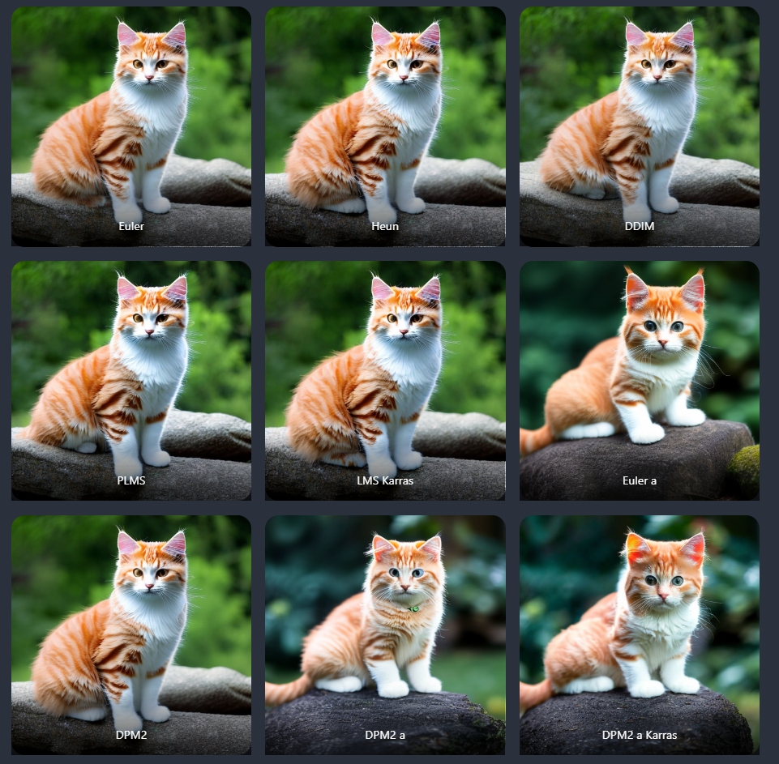
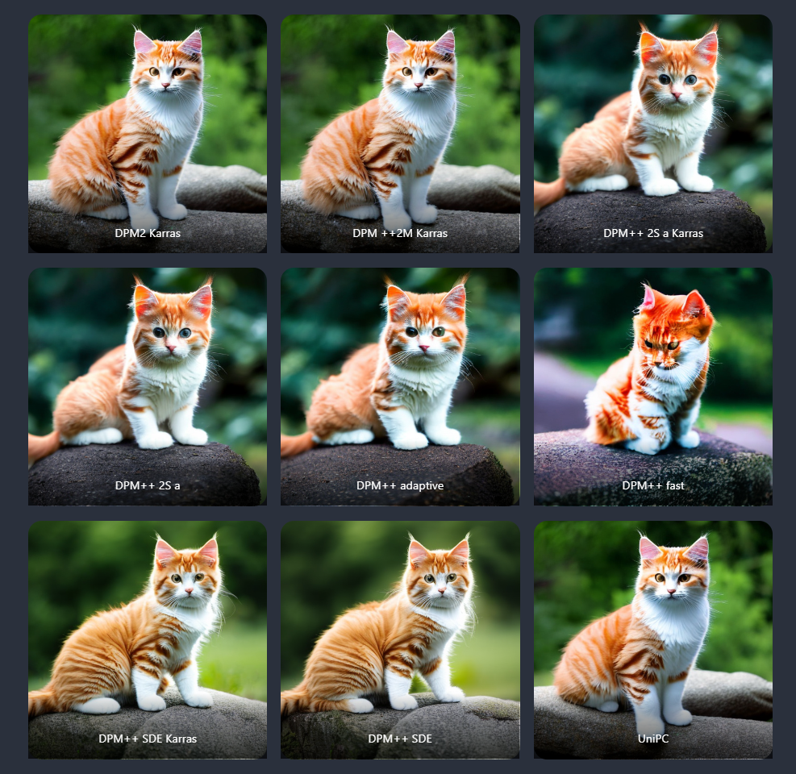
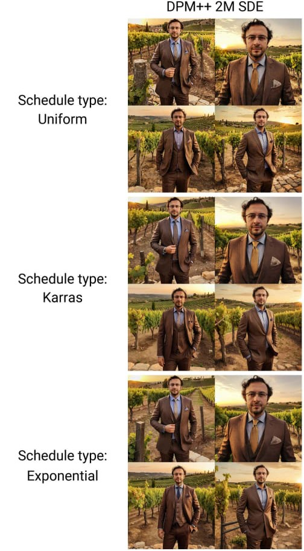
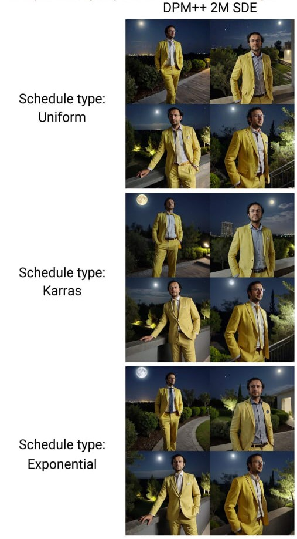
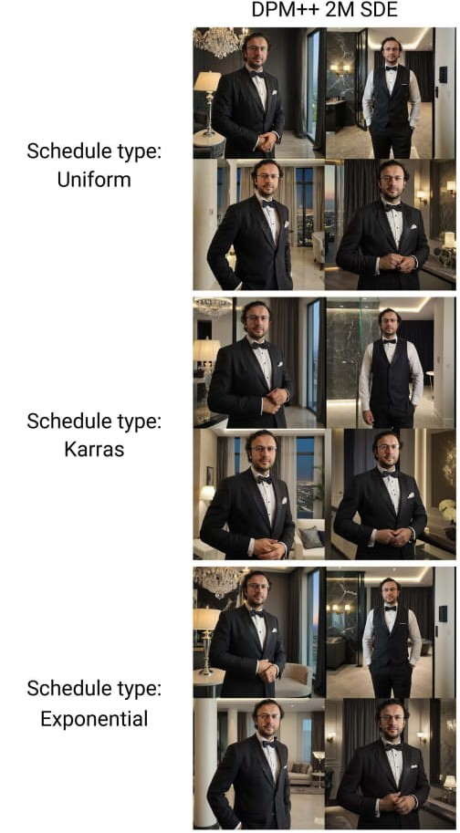
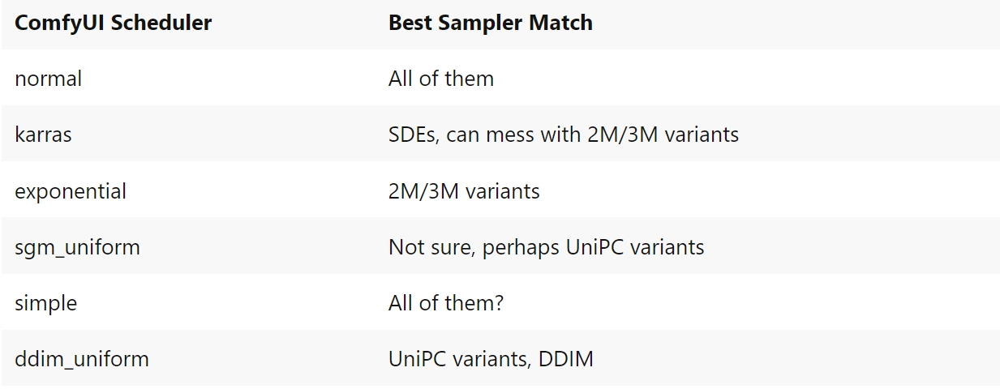
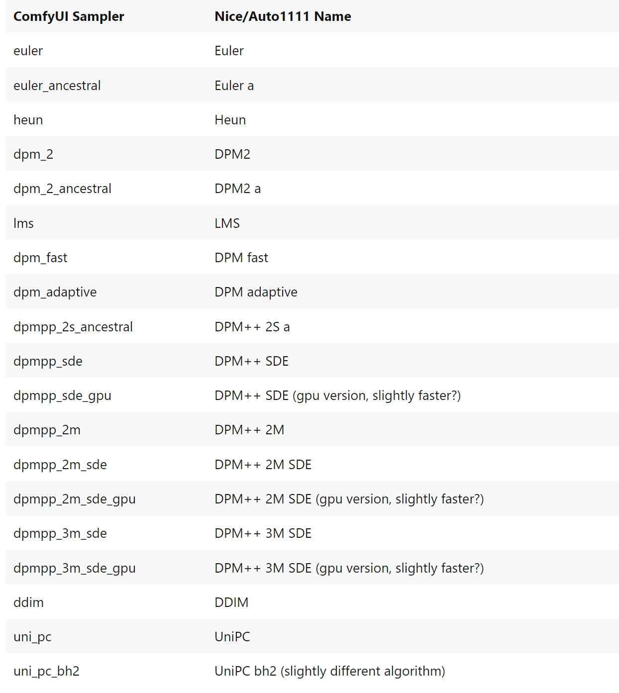
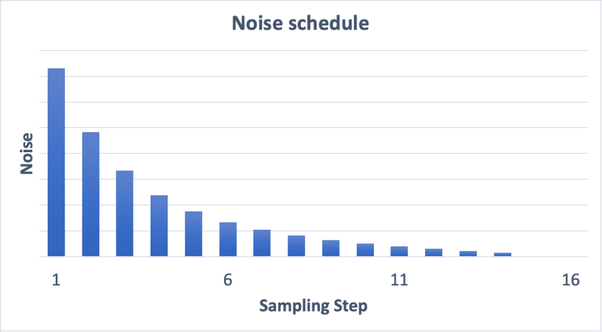
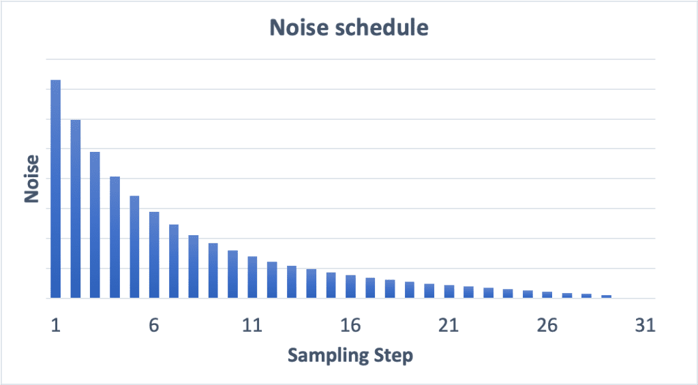

# 1-9. 问题答疑，报错归纳解决

> [https://stable-diffusion-art.com/samplers/](https://stable-diffusion-art.com/samplers/)
> 

> [https://www.felixsanz.dev/articles/complete-guide-to-samplers-in-stable-diffusion](https://www.felixsanz.dev/articles/complete-guide-to-samplers-in-stable-diffusion)
> 

# 开头

根据我们对学员的调查，以及多位同学的反应，

很多同学都是小白入门，没有webui的基础。

对很多参数都是一知半解。

我们这一节课，来讲一下我们常用到的基础参数。

希望能够帮助同学们了解基础原理，这样在后面调节参数的时候才能更加有条不紊。

# 采样器

降噪的过程叫做采样，使用采样的方法叫做 采样器/采样方法，

采样只是stable diffusion 模型的一部分，

不同的采样方式，他们的架构是一样的，只不过他们有不同的方法带出这个降噪的过程。

通常他们的区别在于速度和准确率。

目前采样器大致归纳为两种主要的方法：

1. 概率模型，例如 DDPM、DDIM、以及 DPM 系列模型。

      这类生成模型，是根据模型估计的概率分布，来生成结果，就像用相      机捕捉风景照片一样，通过捕捉概率中的可能性，来形成图像。

1. 数值方法，例如 Euler、Heun和 LMS。这些方法在每一步，都致力于解决一个具体的数学问题，逐渐构建出解决方案，就像画家在画布上一步步绘制风景，每一步都在细致地添加新的细节。

如果降噪是线性的，我们的图像每一步都会改变相同的量，从而产生突变。

其中负斜率的噪声调度程序可以首先去除大量噪声，以加快进度，然后减少噪声去除量，以**微调**图像中的小细节。

### **老式的经典的old-school  ODE：Euler** 、**Heun** 、**LMS**

**老式的经典的old-school  ODE 求解器：(ordinary differential equation 常微分方程）**

采样过程通常通过解决逆扩散过程来完成，所以是从右往左看，

- **Euler** – 最简单，最直接的采样器。它在数学上与欧拉求解，常微分方程的方法相同，是**deterministic** 确定性的，这代表了，在采样过程中不会添加任何随机噪声。

- **Heun** – 是 Euler 方法的更精确的改进，它需要 在每个步骤中执行两个任务，是二阶采样器。

它首先使用线性近似进行预测，然后使用非线性近似进行校正。

相当于它需要在每个步骤中预测两次噪声，因此准确率更高，但是速度也变慢了一倍。

- **LMS** (Linear multi-step method 线性多步法) 是解决常微分方程的标准方法。

`PLMS`是使用数值而不是概率方法（`PLMS`- `P`= ）的近亲`LMS`

它是使用，前一步的信息，来减少下一步中的噪音。它更复杂，但精度会更高，且对计算要求更高（速度更慢）。

### DDIM

### DDIM 和 PLMS

DDIM（Denoising Diffusion Implicit Model 去噪扩散隐式模型）和 PLMS（Pseudo Linear Multi-Step method 伪线性多步法）是原始 stable diffusion 1.0 附带的采样器。

DDIM 是首批为扩散模型设计的采样器之一。PLMS 是 DDIM 的更新、更快的替代方案。

它们通常被视为已经过时且不再被广泛使用。

DDIM 从名字上看，它使用的是 隐式概率模型。

这种差异，在更少的步骤中产生了更好的结果，使其成为一个，更快的采样器，而质量损失很小。

DDIM 每一步的图像生成方式：

1. 最终图像。
2. 指向当前步骤图像的图像方向
3. 随机噪声

### lcm

这个采样器野心很大，想要大很少步数的情况下，生成很好的效果。所以即使通过1步就生成图像，

但是不代表他效果好。

所以，LCM 采样器会将，噪声重新添加到图像中，然后再次进行去噪。以下是流程：

1. 应用 LCM 模型来获取“最终”图像。
2. 添加背景噪声以匹配噪声表 (sigma)。
3. 应用 LCM 模型来获得更好的“最终”图像。
4. 重复 2 和 3，直到噪音计划结束。

### **ancestral 采样器**

**ancestral 采样器：——缺点是图像不会收敛~~（如果您的目标是获得稳定、可重现的图像，则不应使用这种采样器）~~**

收敛性指的是，当采样算法达到一个阶段，继续进行更多步骤，不会再改善结果时，我们就认为图像已经达到了收敛状态。

**Euler a** 不收敛. (采样步数 2 – 40)

**Euler** 收敛. (采样步数 2 – 40)

使用**Euler** a 生成的图像在高采样步长下不会收敛。相比之下，**Euler** 生成的图像收敛得很好

- **Euler a：**与 **Euler** 类似。但在每个步骤中，它都会减去，比应减去的噪声更多，然后加一些随机噪声以匹配噪声。去噪后的图像取决于前面步骤中添加的特定噪声。

- **DPM2 a**
- **DPM++ 2S a**

**为了可重复性，最好使图像收敛 image converge**。

如果要产生细微的变化，可以改变种子

### dpm

### DPM 和 DPM2

**DPM**（Diffusion probabilistic model solver 扩散概率模型求解器），顾名思义，是**概率的。方程并不**`Euler`像、`Heun`、`LMS`的情况那样，通过确定性数值方法求解，

而是通过近似方法来解决问题，以 尽可能准确地进行采样。

DPM2 中的`2`表示它们是二阶的。也就是说，它们同时使用**预测器**和**校正器**来准确地推断结果。

在`DPM++ 2S`，`DPM++ 2M` 中的`2` 也是一样的意思

DPM2它整体性能优于 Euler，但同样以速度慢两倍为代价。

**DPM adaptive** 表现优异，是具有，自适应噪声调度的一阶 DPM 求解器。

其核心特点是能够根据所面临的问题难度，自动调整处理步骤的大小。

它会忽略设置的步数，并自适应地确定自己的步数。由于它不能保证在采样步骤数内完成，因此速度可能会很慢。（它是所有采样器中速度最慢的一个）。

**DPM fast** 是 DPM 求解器的一种变体，具有统一的噪声调度。它精确到一阶。

因此它的速度比 DPM2 快两倍。但他收敛效果不好

**DPM++**是2022年发布的，专为扩散模型设计的新采样器，是对 DPM 的改进。它们代表了具有类似架构的，求解器系列。

它 采用了一种混合方法，它结合了确定性和概率方法进行采样，以及后续的噪声减少。

在 Automatic1111 中，并没有单独实现这个采样器，而是将它与其他方法相结合。

**DPM++ 2s**

`S`。每一步只进行`Single step`一次**计算**，因此速度更快。

**DPM++ sde**

`SDE`变体采用了随机微分方程。这类微分方程的使用，使得噪声的建模方式更为复杂和精确，它能够利用之前步骤中的信息。

**DPM++ 2m**

`M`代表的是`Multi step`，这种方法在每一步中执行**多次计算**，同时考虑到前几步获得的信息。这相当于以更长时间为代价实现更准确、更高质量的收敛。

DPM++采样器的收敛性（越低越好）

**DPM++ 3m sde：DPM采样器的一代算法**

原则上，这种方法能够生成更高质量的图像，但相应的代价是处理速度较慢。

而且由于采用了随机方法，SDE 变体永远不会达到收敛状态。

因此，增加处理步骤的数量并不会提高图像质量，而是会产生更多样化的结果。

### uni pc

### UniPC

[UniPC](https://unipc.ivg-research.xyz/) (Unified Predictor-Corrector)是2023年发布的新型采样器，受到ODE求解器中预测-校正方法的启发，可以在5-10步内实现高质量的图像生成。

他包含了2部分。一部分是unified predictor (UniP)，另一部分是unified corrector (UniC)。

UniPC 的收敛速度比 Euler 慢一点，但也不算太慢。

### 结论

从速度上看：

从最终效果上看：

DPM++ fast 效果最差。ancestral 都没有收敛。

ancestral 倾向于收敛到小猫的图像，而 deterministic 倾向于收敛到猫的图像。

只要它们看起来不错，就没有正确答案。

~~相同步数的情况下：~~

- ~~Euler_a = Euler = DPM++2M = LMS Karras (高阶时图像质量下降) >~~
- ~~LMS = DPM++ 2M Karras = Heun (较慢) = DPM++ 2S a (较慢) = DPM++ 2S a Karras >~~
- ~~DDIM = PLMS = DPM2（较慢）= DPM 2 Karras>~~
- ~~DPM 快速 = DPM2 a（较慢）~~

~~特征总结：~~

- ~~快速、新颖、收敛：DPM++ 2M、DPM++ 2M Karras~~
- ~~快，不收敛：Euler_a、DPM2 a Karras~~
- ~~其他值得考虑的：DPM2 a、LMS、DPM++ 2S a Karras~~
- ~~错误：LMS Karras（在步数多的情况下）~~
- ~~较旧、速度较快，但最终质量可能较低：Euler、LMS、Heun~~
- ~~慢速：DDIM、PLMS、DPM2、DPM 2 Karras、DPM Fast、DPM2 a~~

1. 如果你想得到 快速、融合、新颖且质量不错的图片，那么最好的选择是
- **DPM++ 2M Karras，**20 – 30 步
- **UniPC** 有 20-30 个步骤。
1. 如果你想要高质量的图像，并且不关心融合，那么好的选择是
    - **DPM++ SDE Karras** 有 10-15 步（注意：这是一个较慢的采样器）
    - **DDIM** 有 10-15 个步骤。
2. **创造力和灵活性**
ancestral 随机采样器。它们的质量并不差，速度也不慢，只是与众不同。

这些采样器的问题，或者说他的优势是，如果您有一张以 20 步生成图像，那么以 同样的参数来说，50 步生成图像有可能会更好，也有可能会更差。你必须不断进行测试。

当然在这里Euler A，并且DPM++ SDE Karras脱颖而出。可以尝试以 15 步、20 步、25 步生成图像……并查看结果如何变化。
3. 相反，如果你更喜欢稳定、可重复的图像，请避免使用任何带 ancestral 

4. **如果您喜欢简单的东西，比如说二次元动漫。 Euler 和 Heun**和是不错的选择。减少 Heun 的步骤数量以节省时间。例如，只需 8 个步骤就可以创建高质量图像

### （~~Euler、DDIM、PLMS、LMS Karras 和 Heun 采样器评估）~~

首先，让我们将 Euler、DDIM、 和 Heun 作为一个整体来看待，因为它们代表了老式 ODE 求解器或原始扩散求解器。DDIM 的收敛步骤与 Euler 大致相同，但变化更多。这是因为它在采样步骤中注入了随机噪声。

**PLMS**在这次测试中表现不佳。

**LMS Karras**似乎难以收敛，并且已经稳定在较高的基线上。

**Heun**收敛速度更快，但由于它是二阶方法，因此速度要慢两倍。因此，我们应该比较 Heun 的 30 步和 Euler 的 15 步。

# 噪声调度器 noise scheduler

**noise schedule 会告诉采样器每一步应该有多少噪声。**

它是根据应该存在的噪声总量，来估计清晰图像中的噪声。（这就是它的训练方式。）

之前提到过，图片是从噪点逐步变清晰的，在这个过程中，噪声调度器，控制了噪声在每一步采样的程度。

通常噪声在第一步最高，在最后一步逐渐降至零。

采样器算法负责控制去噪的具体操作，“噪声调度器”（noise scheduler）的算法，

负责调控去噪的程度，决定每一步去除多少噪声，以确保整个过程既高效又精准。

举个例子，在进行一个雕刻作品的时候，

在雕刻的初期，使用较大的力度快速敲掉大块的部分，这样可以加快雕刻的整体进展。

而在雕刻的最后阶段，我们需要极其细致和谨慎地处理，以便精确雕琢出细节，防止雕塑出现破损。

而噪声调度器在其中的角色就是，决定每一步用多大的力去雕刻。

### normal

- **特点**：Normal 是一种基础的噪声调度方法，通常用于基线比较。

      它的调度方式较为简单，主要通过线性插值，来控制噪声的添加和移除。

- **适用场景**：与所以采样器都适配

### **Karras**

**Karras noise schedule**

标有“ **Karras** ”的采样器，由 Nvidia 工程师 Tero Karras 所领导的一系列工作。

karras作用是， 在提高输出质量和采样过程中，计算效率。

通过这个数据看到，相比于默认状态下，karras的噪声步长，在接近尾声时较小。

对比图片：和*DPM++ 2M一样，这个采样器在30到50步之间提供非常好的结果，但是Karras版本具有在较少的步骤中提供更好结果的优势，*

前*DPM++ 2M，后DPM++ 2M Karras*

可以和sdes、2m、3m结合

### Exponential（指数的）

Exponential是指数算法，整体表现细节少一些，但是画面更柔和、干净。渲染时间与SDE和2M相接近

**适用场景**：和 2m、3m，以及他们的变体匹配

### sgm uniform

- **特点**：基于Stochastic Gradient Matching的均匀调度器，强调在每一步中均匀地减少噪声。
- **适用场景**：uni pc

### simple

- **特点**：简单调度器使用基础的线性或常数步长来处理噪声，计算简单且速度较快，但精度可能稍差。
- **适用场景**：和所有都匹配

### ddim uniform

ddim_uniform 的行为与参考稳定扩散实现中的 ddim 采样器完全相同，则应该与 ddim 一起使用 ddim_uniform。

### 总结

一般情况下默认normal即可，

karras 在较少的步骤中提供更好结果的，画面细节更多。

其他使用频率不高。

其中 normal 调度器适配所有的 采样器；

karras 适配 sde、2m、3m

# 与webui的区别

有webui基础的小伙伴可能会对comfyui的采样器的名称会有所疑惑，

因为在webui中，采样器和调度器是结合在一起的，而在comfyui中是分开的。

另外comfyui中的dpmpp，在webui中是叫做dpm++，所以在课程中我一般会读作dpm++。

还有ancestral 在 webui中简化成了a。

另外需要强调一下，虽然webui和comfyui即使在相同参数，相同采样器和调度器下，也可以能生成不同的结果。所以他们2个不是互相通用的，在webui生成的图片，想在comfyui中复刻的可能性比较小。

我们通过对比两者生成的图片，并修改采样器和调度器之后。

有过webui基础的同学，会比较困惑

1.一个是在webui中的书写方式不一样，比如euler ancestral 在webui中是简称 euler a，dpmpp 为webui中也是dpm++，

2.webui是把采样器和调度器组合在一起的，比如dpm++ 2m Karras，但是在comfyui中是分开的，这样自由度更高，可选择的组合方式也更多。

3.webui和comfyui 采样和调度并不相同，虽然名称一样，但是经过测试，

除了euler采样器外，其他采样器生成的结果都有所区别，其中 euler a 、dpm++sde Karras这几个采样器的结果在webui 和 comfyui中 区别尤其大。

所以在webui中生成的结果，即使保持一样的参数，在comfyui中可能无法生成一样的图片。

# step

**改变采样步数steps，会改变噪声调度器。**

**实际上，采样步骤数越多，噪声调度器变得更平滑。任意两个步骤之间的噪声也就越小。**

**这有助于减少截断误差 Truncation Errors。**

在每个步骤中，采样器的工作是**生成一个noise level 和 noise schedule 噪声调度器 相匹配的图像**

对比下面图片，可以清楚的看到，不同的步数下，噪点的变化。

初始噪声很高，最后5步噪声都很低。

也意味着初始步骤，控制图像的整体构图，后续步骤完善细节。

15 个采样步骤的噪声

30 个采样步骤的噪声

# **参数：CFG**

CFG是(classifier-free guidance scale)， 无分类器 指导。

什么是无分类器指导？

要理解无分类器，首先必须理解它的前身，**分类器指导 Classifier guidance**。

它是是一种将 **图像标签** 放入扩散模型的方法。你可以使用标签来引导扩散过程。

**classifier guidance scale 是控制扩散过程，是如何紧密遵循标签的，参数。**

假设有 3 组图像，标签分别为**猫、狗**和**人**。

如果我什么都不输入，也就是无引导的情况下，模型将从每组的总体中抽取样本，也就是说，会出现 有猫有狗 还有人 的图片。

它也可能会抽取适合两个标签的图像，例如，一个男孩抚摸一只狗。

分类器引导。左：无引导。中：小引导尺度。右：大引导尺度。

如果 分类器引导 的数值调很高，我让他找一只猫，它就不会出现狗和人。

分类器引导的前提必须要有一个额外的模型，根据以上的案例，这个模型必须包含 猫、狗、人。否则它就不能出现 我们需要的对象图片。

无分类器指导，就是一种不用分类器的方式，去获得 分类器引导的方法，

分类器引导 使用的是一个额外的引导模型，

而 无分类器引导 使用的是图像标题， 去训练 条件扩散模型。

他们把分类器部分，作为 **噪声预测器 U-Net 的条件**，从而获得了无分类器（即不需要单独的图像分类器）的图像生成指导。

**CFG 尺度控制着文本提示对传播过程的控制程度**

效果与分类器指导类似。让我们考虑三个提示：一只猫、一只狗和一个人，由下面的三组图像呈现。你在提示中输入：一只猫

- 左图 CFG 比例为 -1，则忽略提示。生成猫、狗和人类的几率相等。
- 如果 CFG 量表为中等 (7-10)，则遵循提示。您总是会得到一只猫。
- 您可以获得高 CFG 尺度的清晰的猫图像。

如果你觉得还是很难理解，你就简单的把 无分类器指导 也就是CFG的参数看成“创造力与prompt”的比例。

较低的数字给stable diffusion 更多的自由来展现创意，而较高的数字则迫使它严格遵循prompt。

- CFG 2 – 6：可能不遵循prompt，但具有创意，可以在做图丧失灵感的时候，考虑使用。
- CFG 7 – 10：对于大多数prompt来说推荐使用。在创意和引导生成之间取得良好平衡。
- CFG 10 – 15：当您确信您的prompt足够好/具体时。
- CFG 16 – 20：一般不推荐使用，除非prompt详细描述得很好；可能影响整体性和质量。
- 二次元风格CFG可以调的高一些以获得更丰富的色彩和质感表达，一般在7~12，也可以尝试12~20
- 写实风格CFG大都很低，一般在4~7，写实模型对CFG很敏感，稍微调多一点可能就会差别很大，所以可以以0.5为步进来细微调节

cfg与采样器的关系

# ~~prompt~~

用于交换每个其他步骤的便捷语法
`[cow|horse] in a field` 

On step 1, prompt is "cow in a field." 

Step 2 is "horse in a field." 

Step 3 is "cow in a field" and so on.

`()`在提示中使用会增加模型对所包含单词的注意力，反之`[]`则会减少注意力。您可以组合多个修饰符：

如果你想要使用一些特征来形容这个词，使用反斜杠 backslash 来转义: `anime_\(character\)`.

> [https://github.com/AUTOMATIC1111/stable-diffusion-webui/wiki/Features#stable-diffusion-20](https://github.com/AUTOMATIC1111/stable-diffusion-webui/wiki/Features#stable-diffusion-20)
> 

# seed

seed种子是随机生成的数列。

在 Stable Diffusion 的噪声生成器并不是真正的随机，所以，这意味着，它将从相同的种子数中重现噪声模式。

这就会，开辟了很多潜在的用法：

- 种子、提示词、和其他参数都相同的情况下，是可以重现生成的图像
- 你可以通过稍微更改提示词，或参数来对图像进行细微调整，而不会显着改变图像的整体构图

比如说：种子都是438233955，关键词都是 portrait of a girl，并修改部分的表情关键词，可以得到以下

微调关键词来保持画面和角色的一致性。

只有表情有所变化，其他的明显特征比如：头发、衣服、背景都保持的比较好。

除此之外，

还可以在保持种子一致的情况下，保持构图的一致，修改整体氛围，相同风景下的不同季节：

同样风景下，修改了艺术风格：

- 某些种子更有可能生成，具有特定颜色或构图的图像。

我们可以了解这些种子并使用它们，可以提高 输出图像的概率。

比如，在不同种子的测试下，我得到了这张图。

在之后的工作中，我抽到了我觉得整体满意的图片，但是我想修改一下整体配色。

那我们需要保持完全相同的prompt 和 参数，然后修改种子。

比如说8002的种子生成的图片，可以明显的看到 服装是偏红色和金色。

我们把8002 的种子应用过来，就可以得到 红色的服装和金色的配饰。

这就是种子的多种应用方式了。

# comfyui优势

另外，comfyui比webui有优势的一点是，我们可以

load 加载 之前的工作流，随调随用。

演示//

comfyui无需像webui一样，每次都要重新调整。大大增加了效率。

# 结尾

经过这节课程，相信同学们对于这些基础参数 已经有所了解了，

课下可以多多练习，多多测试不同的参数，这样更加有利于我们对stable diffusion的理解。

如果大家还有其他的问题，欢迎在社区交流。