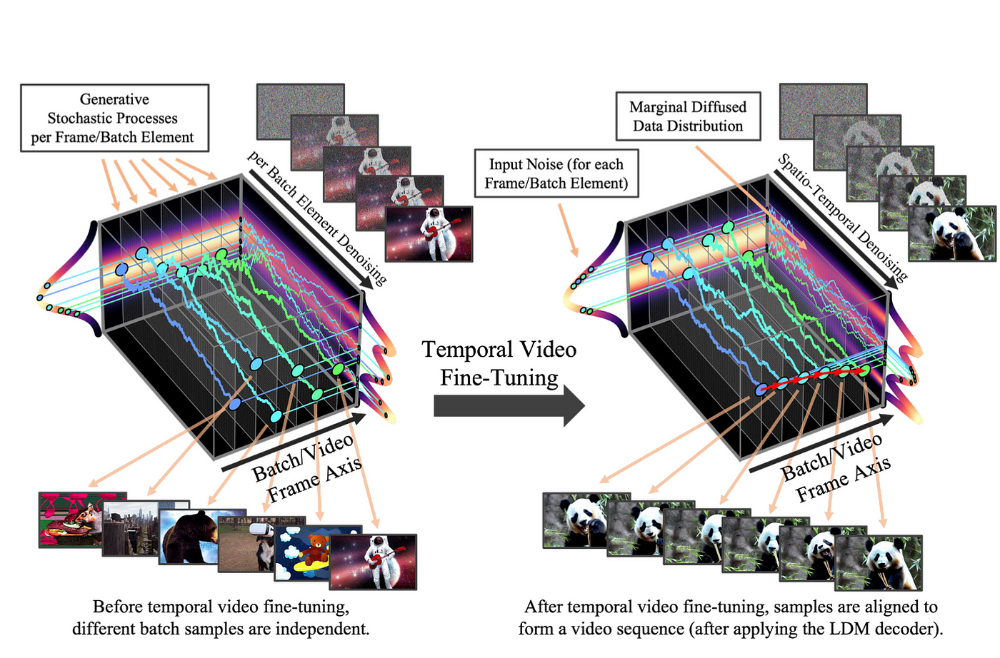
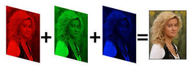
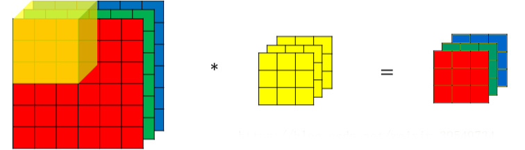
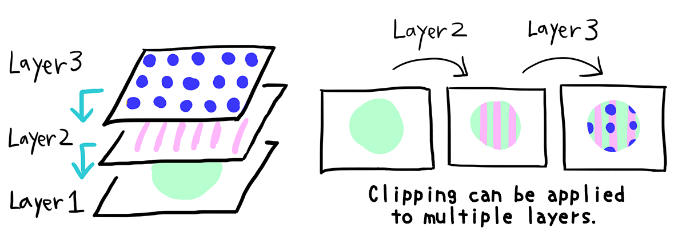

# 1-4. 模型解码：探索文生图的基础原理与应用

.png)

# 开头

这是文生图

这也是文生图工作流，

这同样是文生图工作流，

他们为什么表现形式不一样？他们的原理相同吗？

他们是如何搭建的呢？哪种方式最好用，效率最高呢？

那么今天，我们就要正式进入ComfyUI的操作学习了，这不仅是一个新的开始，也是我们深入探索AI如何将文字转化为图像的奇妙旅程。

在本节课中，我们首先会探索Stable Diffusion的底层逻辑，这是理解整个图像生成过程的关键。

然后，我们将手把手教学文生图工作流的多种搭建方式，

最后，我们根据理解，分析，找到最适合我们，效率最高的解法

# 目录+课程内容

## 搭建逻辑

在搭建我们一个工作流之前，我们先看看sd的底层逻辑，根据官网的图片，我们简单理解成sd有三个步骤，他们分别解决三个不同的问题：1.理解翻译我们输入的语言；2.在潜空间把文字变成图片；3.把生成的图片解压发给我们。

**问题一：那么计算机如何理解我们输入的语言的呢**
首先我们需要理解一个前提是 我们和计算机不共通一种语言，所以中间必然需要一个翻译，目前在AI主流的这个翻译 就是clip语言，全称是

contrastive language-image pre-training文字图像成对预训练。

它把我们的自然语言 翻译成电脑可以理解的内容，这样计算机就知道明白了。

[CLIP: Connecting text and images](https://openai.com/research/clip)

clip可以除了可以连接文本和图像外，还能用于各种视觉和语言任务，如：视觉问答、图像分类、图像生成、文本分类等

“ clip ”是OpenAI 开发的一个“学习文本和图像关系”的模型，并通过 ChatGPT 获得关注。稳定扩散使用剪辑根据咒语（提示）解释所需的图像。

稳定扩散包含 12 层剪辑以形成最终图像。每层从不同的角度解释每个咒语（提示）。

例如，第一层（第 1 层）大致理解提示中的信息，并采取基于它生成图像的基本步骤。另一方面，**层次越深，解释就越详细。**

具体来说，如果你收到咒语（提示）“1Girl”，第一层将回忆起类别“人类”。在随后的层次中，它逐渐变得更加具体： “。“黑发烫发的日本女人””和女人”、“日本女人”、“黑发日本女人

许多人虽然看到过“CLIP终止层数”选项，但是认为许多人并不真正了解它的含义。

**CLIP是将你的提示文本转换为数值表示。**

就是把我们输入的提示词以简单的方式被数字化，然后通过各层传递。

这意味着CLIP有很多层，在第一层之后，可以得到提示词的数值表示，将其输入到第二层，继续输入到第三层，依此类推，直到到达最后一层，这就是CLIP值为1的情况。

**如果CLIP值为2，就是我们提前停止，并使用倒数第二层的提示词数字化输出。**

我们发现**CLIP值越大**，提前停止的越快，我们提示词被数字化的层数越少，**提示词的相关性越小。**

我们来看一个实例：杰作、最佳品质、蓝眼睛、月亮、萝莉、棕色头发、鄙夷、高跟鞋、猫爪动作、迷你裙

**数值越小，与提示词越接近**

**问题二：文字是怎么变成图片的**

这里有两个关键步骤。

潜空间核心是u-net，因为结构像u，所以叫u-net，作用是确保它能够理解并处理图像和噪声。

具体过程就是把图片逐步均匀地从高斯分布当中采样噪声，以此形成训练集。

然后通过噪点与关键词对应，来反推出图片

你可以把它简单理解为：一个小孩，你需要给他看婴儿书，教他认识书上的红苹果、青苹果、黄苹果，经过不断的重复，他才能把对应图片和苹果品种互相联系起来。

随后你提问，哪个是红苹果呀，他就能正确的指出红苹果的图片。

**编码和解码**

最后生成的图片如何展现出来就要通过编码和解码。

一张原始噪声图如果不经过编码，他的数据维度非常大，学过ps的同学可能知道一张图有三个通道，代表了一个像素点，有RGB三种颜色来描述它。

一张512*512的图片，要表示它就需要512*512*512个数据，数据太大造成的算力也很大。

所以就需要引入latent diffusion model自编码器（也就是webui里的VAE），它可以把512*512的三通道 变成64*64的四通道，这样的训练和推理都少了很多的成本。

举个例子：我们可以把编码器简单理解为发送大量文件时，我们需要把文件先压缩再传输，这就是我们的encode，对方收到文件需要解压查看，这个解压就是我们的decode。

# 调出节点方式

分析完原理后，我们来到onethingai破壳丹塔，来逐步搭建我们第一个工作流，如何调出想要的节点呢，方式用2种

1. 右键选择 add node，找到我们对应的节点，如果你是再云端使用comfyui，那么已经安装好我们需要的所有节点了，你的节点栏会和我一样多。如果是本地的同学，节点栏会少很多，需要自行安装所需节点，具体安装方法在第三节课。
    
    这里我们选择我们需要的节点，以text文本为例，在conditioning条件中，找到clip text encode，就能调出我们的clip了
    
    
    

2.第二种调取节点的方式是 双击空白处，在搜索栏 搜索想要的节点，比如我直接输入clip,选择clip text encode就能直接调出了。

我比较建议用第二种方式，更加快捷，效率更高。

## 搭建文生图

### 搭建方法一

好了，现在我们来搭建一个文生图的工作流，新手可以按照底层逻辑的顺序来搭建

首先调出clip, clip 选项有很多，我们选择第一个 clip text encode，其他的clip我们会在后面的课程讲解到。

我们输入正向提示词后，可以再复制一个clip text encode，输入反向提示词，那我们如何区别他们的，可以通过颜色。

单击右键后找到color，设置即可，通常我们会把正向提示词设置为绿色，反向为红色。

如果觉得还不够直观，点击conditioning“点”直接往外拉，松手之后就有对应的可以连线的节点，选择ksample，可以看到连接到了positive，也就是正向提示词，negative是方向提示词。

具体参数讲解：

接着，我们以同样的方式链接checkpoint，选择unCLIP Checkpoint loader, 选择合适的模型，我这边使用的是麦橘

接着，点击latent，调出VAEDecode。

最后在image后面调出preview image/save image，save image会自动保存图片，相反，preview image只能展示图片，需要手动保存。

连接上所有线条就可以生图了，如果你忘记连线，就会报错，并提示哪里没有连接上。重新连接上，点击生成，成功！

- 加lora、VAE、
    
    
    
    
    
    - 加controlnet
        
        （输入到controlnet中的图片{由对应的预处理器把图片处理成controlnet能识别的图像}+controlnet模型）作为条件输入潜空间
        
        
        
        
        
        
        
        
        
        安装预处理器插件
        
        
        
        
        
        
        

### 搭建方法二

是不是觉得上面的流程很冗长，接下来就推荐一种插件**efficiency-nodes-comfyui**，它能够帮助我们更加快速的搭建文生图的工作流。

我们来看看readme是如何讲解的，其中

script是放大脚本，会在后面专门的课程讲到。

那么我们也来搭建一下，双击空白处，在搜索栏中输入efficient,调出efficient loader，和ksampler efficient，并一一对应连接，点击生成，成功！

怎么样，是不是比上一种方式快多了？

# 结尾

看到这里，相信你也会搭建文生图工作流 了，快跟着一起搭建吧，多加练习才能孰能生巧。

之后，我们也会介绍更多专属破壳丹塔，更加高效便捷的独家搭建方式，保证你看了物超所值，持续关注吧。

期间如果你有任何问题，请在社群联系我们，会有专门的老师为你解答

# clip层数

将 CLIP 层视为不同层次的细节。跳过的层越多，提示的解释就越广泛。

提示将决定跳过因素如何影响您的生成。例如，像“一只黑狗”这样的简单提示不会发生太大变化，无论您跳过多少层，这是因为它已经很广泛了。

但是，随着你跳过的层数越来越多，‘悉尼歌剧院前的一只长着白尾巴、戴着插着黄色羽毛的红帽子、骑着蓝色自行车的黑狗’会开始发生显著变化。

这个数字越高，图像收敛后你基本上跳过的“细化”步骤就越多。

这意味着CLIP有很多层，在第一层之后，可以得到提示词的数值表示，将其输入到第二层，继续输入到第三层，依此类推，直到到达最后一层，这就是CLIP值为1的情况。

如果CLIP值为2，就是我们提前停止，并使用倒数第二层的提示词数字化输出。

（在Python中，你可以使用 -n 语法从数组末尾引用项。因此，数组中的最后一项为 -1，倒数第二项为 -2，等等）

我们发现CLIP值越大，提前停止的越快，我们提示词被数字化的层数越少，提示词的相关性越小。

# latent

[深度学习中的潜在空间-CSDN博客](https://blog.csdn.net/lsb2002/article/details/135052116)