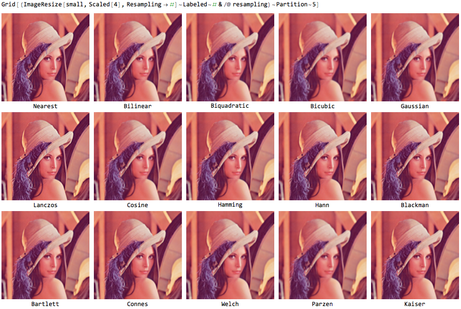
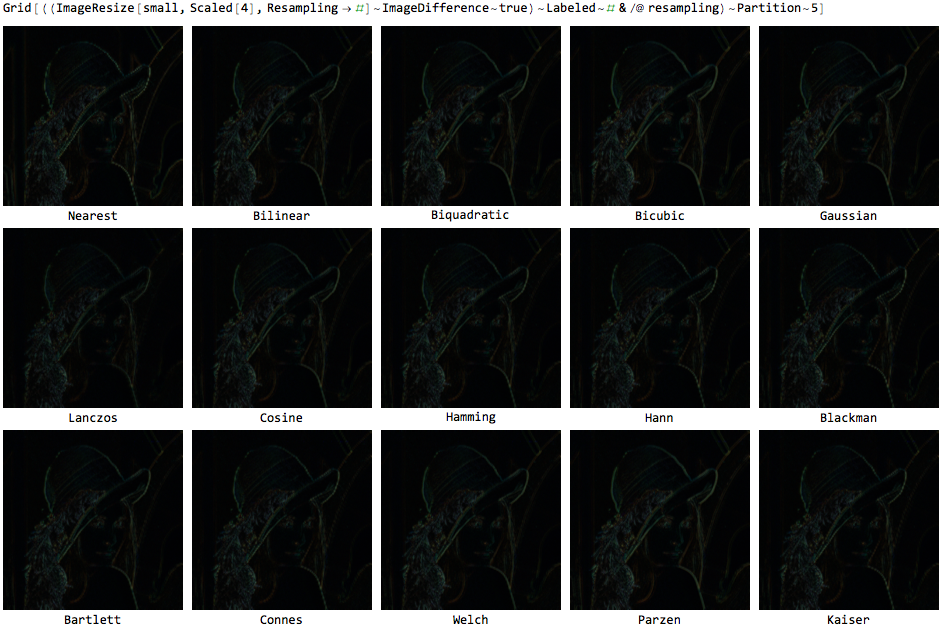

# 1-5. 图生图

# 开头

.png)

这都是图生图，怎么样，你能够想到 那么简单基础的工作流，有那么多的转变方式吗？

他们分别应用在不同的场景下，能产生不同的效果。

本节课将教会你 多种ComfyUI 图生图工作流 的搭建

话不多说，开始实际操作吧

# 图生图

调出上节课生成的文生图工作流，

我们来思考一下，如果我们需要插入图片，需要放置在哪里呢？

根据原理图，我们可以了解到，文本和图片都是属于conditioning条件输入，所以可以推断出 text文本输入 和 image图片输入 是在一起的，

所以我们调出load image，位置放在text的同一级，

如何把图片发送到潜空间还记得吗？我们需要一个encode编码器了。

可以看到text文本输入，自带了一个encode编码器，而载入的图片是没有自带编码器的，所以我们需要手动调出。

双击空白处输入encode既可以了，然后把图片和采样器连接起来。这就完成了！

我们来跑跑看，启动!  成功！

想要再抽卡，就再点击一次启动，可以点击多次启动，comfyui会排队等待出图。

如果出图到一半，你觉得不如预期效果，或者不想要继续了，可以点击 cancel 删除

还记得上节课讲文生图的时候，另一种更加快捷的工作流搭建吗，是使用了efficient插件，我们调出这个工作流，同样的步骤调出load image 和 encode。

然后大家可以选择一下模型、采样方式、采样步数等信息。点击生成，工作流成功运行了！

## 控图

这里需要强调一下这个denoise可以把他理解成webui里面的局部重绘fudu，

当denoise为数值越小，生成的画面与输入的画面相差越小，

演示当denoise为 1 和 0.1 时候的区别，

想要保持整体画面不变的话，记得保持在0.5以下

这样我们可以精准的控制图片

## 扩图

图生图除了可以通过denoise控图，还可以通过修改尺寸来扩图,我们只需要增加一个outpainting，来连接我们的图片，然后再给到encode。

我们点击生成来看看可以得到什么？

如果denoise是1的话，重绘幅度很大，导致了与原图差距太大了，

所以这个时候我们可以增加一个蒙版，让他只重绘增加的范围，调出 set latent noise mask 放置在latent和smapler采样之间，再连接mask，目的是只重绘mask的范围，这里记得还要把denoise调整到1，点击启动，就成功啦！

如果这时候你发现你生成的图片蒙版边缘衔接的不自然，可以适当增加羽化。

## 高清放大

图生图除了控图、扩图的功能外，还有可以利用xl进行高清放大。

我们先来生成一张图片，也就是先搭建一个文生图的工作流

接着把生成的图片发给xl模型，也就是搭建一个图生图的工作流，修改模型为xl模型，denoise0.3

这个有一个问题？图片的尺寸怎么输入呢？我们需要调出一个upscale **image** by，把图片放大2倍，

我们可以看到放大方法有多种样式，不同的插值函数有不同的效果。

Nearest效果有较粗糙的特征，甚至出现锯齿状的线条。

Bicubic, biquadratic  没有锯齿状问题，但模糊。

在所有方法方法中，Lanczos 是从视觉效果最好。所以我们选择最后一个。

[workflo图生图放大高清.json](workflo%25E5%259B%25BE%25E7%2594%259F%25E5%259B%25BE%25E6%2594%25BE%25E5%25A4%25A7%25E9%25AB%2598%25E6%25B8%2585.json)

## 转绘

另外图生图还可以做风格转绘，我们可以尝试一下把 游戏版古墓丽影lara 转绘成 3d版本

先调出一个图生图的工作流，输入我们的图片，

.jpg)

选择一个合适的底模，我这里用realisticvision，

输入关键词：

Masterpiece,best quality,super details,intricate details,realistic,photography,
1 girl, walking on the street, poor street, Tomb Raider, Lara，

denoise为0.3

同时调出upscale image，修改放大方式、尺寸1280*1024，crop裁剪设置成中心，生成图片看看效果，怎么样，直接把游戏的效果转成3d了吧。

# 结尾

以上，就是本节课提到的所有图生图工作流搭建

包括 扩图，控图，转绘和高清放大

经过这一轮的练习，相信大家对图生图的作用有了基础的了解，

课下需多多练习，孰能生巧，

下节课我们将学习局部重绘的多种方式