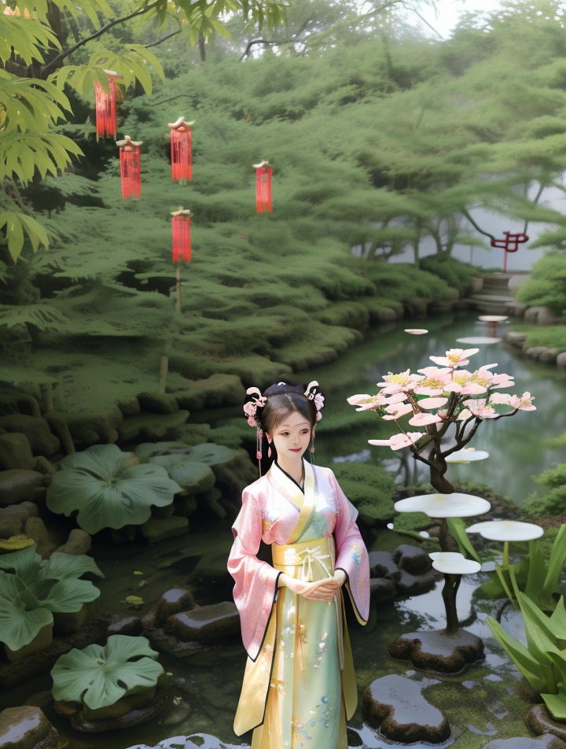
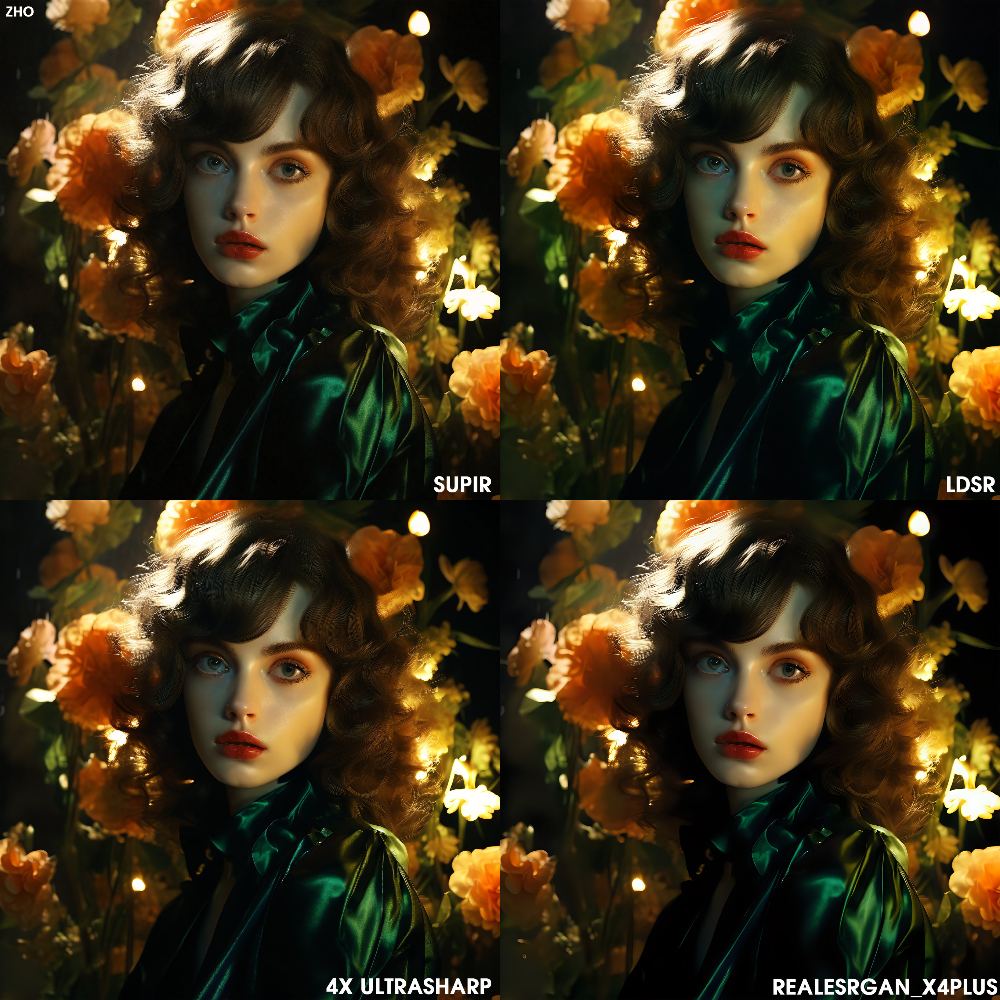

# 1-7. 高清放大与UltimateSDUpscale的双重力量

[workflow高清放大.json](workflow%25E9%25AB%2598%25E6%25B8%2585%25E6%2594%25BE%25E5%25A4%25A7.json)

[workflow高清放大啊啊啊.json](workflow%25E9%25AB%2598%25E6%25B8%2585%25E6%2594%25BE%25E5%25A4%25A7%25E5%2595%258A%25E5%2595%258A%25E5%2595%258A.json)

# 开始

如果你熟练使用SD webui，那你一定会经常使用到高清放大功能，有高清修复、tile、附加功能等等方式，这些功能可以帮助我们生产更高质量的照片，

那么comfyui也是一样，而且除了上述的功能外，ComfyUI还有新的插件,来帮助我们高清放大，效果也会比webui，更好，速度也会更快。

在本节课前，需要注意：因为高清放大的过程会比较慢，这节课云端的同学尽量选择4090或者3090，这样等待的时间会比较短。

# 内容

## 脚本 high res-fix script（方便使用，效果和基础方法差不多，和webui同）

还记得我们之前讲过https://github.com/LucianoCirino/efficiency-nodes-comfyui，在github中readme 介绍的案例中有一步脚本放大

就是在script 脚本上，连接一个 high resolution fix 高分辨率修复节点，我们在webui中也经常使用到他

我们来制作一下工作流，看看效果怎么样

首先打开一个efficient文生图 工作流,，可以看到script就是脚本的意思，

点击脚本连线，在空白处松手，

有多种节点可以和脚本连接，比如我们在webui中测试模型时候，经常使用的xy轴，另外还有noise control 噪点控制脚本，high resolution fix 和 tiled upscaler 都是属于放大脚本。

点击选择high resolution fix

可以看到有很多参数。有2种放大类型，当我们选择pixel像素，放大算法就可以选择我们常用的4x ultra sharp，

如果放大类型选择latent类型时，下面的放大算法 有多种选择，根据选择的模型，在放大算法种选择xl模型，还是1.5模型。

另外还可以调整放大步数，denoise重绘幅度等。可调整的参数更多，说明可调整的细节越多，可控性就越强，表现效果就越好

我们来复制一个工作流，一个是latent放大，一个为像素放大，进行比较看看效果

正向：

1girl\(Eyes\(Deep amber,crystal clear,long and delicate eyelashes\),Nose\(Elevated,a slightly upturned nose tip\),Lips\(Rosy color,defined lip line\),Hairstyle\(Black hair,smooth and shiny,slightly wavy at the ends\),Skin\(Fair,blemish-free,as delicate as porcelain\),Clothing\((gold long feathered dress,intricate floral filigree,gorgeous):1.5,walking,(look at viewer,floating hair,outdoor,upper body):1.53\),
Background\((full moon,grassland):1.5,sky,forest,lake\),
masterpiece,best quality,unreal engine 5 rendering,movie light,movie lens,movie special effects,detailed details,HDR,UHD,8K,CG wallpaper

反向：

blurry,low quality,bad anatomy,sketches,lowres,normal quality,worstquality,signature,watermark,cropped,bad proportions,out of focus, (worst quality, low quality:1.4),monochrome,zombie,(interlocked fingers),(worst quality, low quality:2),monochrome,zombie,overexposure,watermark,text,bad anatomy,bad hand,extra hands,extra fingers,(extra digit and hands and fingers and legs and arms:1.4),(deformed fingers:1.2),(long fingers:1.2),(bad-artist-anime),extra legs,lowres, bad anatomy, bad hands, text, error, missing fingers, extra digit, fewer digits, cropped, worst quality, low quality, normal quality, jpeg artifacts, signature, watermark, username

固定种子为种子：**3309445942**

## controlnet tile

脚本放大除了 high resolution fix 修复放大，还有 tiled upscaler 分块放大 ，

在tiled upscaler里面**还可以**使用controlnet，

相对于，单独**应用**controlnet来说，比较方便，同时还可以选择放大倍数。

我们来试验一下，

先复制一个刚刚的工作流， 

fangzai在旁边，并把原来的工作流control+m 关掉，

载入图片，

修改seed：1080756577315912 并固定，

把脚本改成 tiled upscaler，可以看到下面有controlnet 的开关，打开开关，选择tile模型

同时把放大倍数放大到3倍，

这个可以根据需要，进行选择 分块的尺寸，默认为512

tile的策略改成padded，特点是在少步数的时候，表现效果也不错，节约时间。

对应的步数改小一点20。denoise可以大一点，选择1，让tile进行发挥

记得我们还要在ksampler中，把denoise调整小一点，0.3左右

这时候我们需要手动另外搭建一个controlnet tile来进行对比，

复制上面的工作流，删除脚本放大，

调出apply contronel，两头conditioning连接到正向提示输入，

调出对应tile模型，

连接图片，

因为上面tiled upscaler中放大了3倍，所以我们也外接一个upscale latent by 放大三倍，这样能够保证参数是一致的

其他关键词等参数不做修改，

记得把重绘幅度调大到1，让tile进行发挥，

最后连接 image comparer作比较，

点击生成

结论：可以看到在脚本tiled upscaler分块放大中，非常容易出现多余的人物，

因为我们tile分布的尺寸是512，而1.5 模型的训练尺寸也是512，所以导致每一步分割的尺寸都会收到提示词的影响，生成一个人物。但是可以通过正反向提示词来避免这个问题。

除此之外，整体人物效果是很不错的，人物脸部精细，光影也不错。

controlnet tile的表现力比tiled upscaler分块放大的表现力好。

## 基础方法upsacle image

另外介绍一个比较基础的放大图片，之前在图生图的章节提及过,

首先复制图生图工作流，在vae encode 上面增加一个 upscale image by，

放大方式选择lanczos，固定好种子，denoise0.3

点击生成，可以看到效果比较一般

另外还可以把upscale image by 改成upscale image using model，

点击生成效果也是一般，所以在制作工作流时候，我们都需要与 高级采样步数 结合一起使用，

## upscale image (using model)+高级采样,通过潜空间空间放大

这样做的目的是节约时间，假设生成一张图的总步数是20，那么前面15步是在生成图片信息，后面5步是在丰富细节。

所以我们可以根据这个特征，控制前面步数节省时间，再中间步数进行放大，最后几步还可以更换xl模型再一步丰富细节。

首先我们来复制一个文生图工作流，把ksampler 换成高级的采样器 ksampler adv efficient，

修改步数为8步，cfg为2，开始步数和结束步数为0 和8 ，固定种子为：3309445942，

并打开reture with leftover noise

生成的图片使用 upscale image using model 进行放大，

再复制一个采样器，调整步数为14， 开始和结束步数是9-14，目的是把上一步 把刚刚生成的低质量的图片，通过 upscale image using model 进行放大，再输入这个采样器做接下去的工作。

把各个节点进行连接，记得图片放大后，进入潜空间前，需要连接vae encode，

整理一下，进行组块

第三步同样把图片进行upscale imag using model ，并在此基础上增加upscale image by 0.5，连接encode，

这时候我们可以增加一个xl模型，使得效果更好，并于采样器连线，步数为20，cfg7，开始结束步数分别为14-20，关掉reture with leftover noise，

整理一下线条,

打开image comparer，对比最后图片和第一步的图片效果，点击生成！

怎么样，效果还行把。

总的来说，这种方法有点是，节省时间，但是还是步骤复杂了点，接下来我会再介绍2种步骤简单，效果也还不错的放大插件

## Ultimate SD Upscale 高清放大（省显存，效果还不错，容易出现连接缝）

其中一个插件名称叫utimate sd upscale，我们进readme看看作者是怎么介绍的。

[https://github.com/ssitu/ComfyUI_UltimateSDUpscale](https://github.com/ssitu/ComfyUI_UltimateSDUpscale)

好的，那我们来复刻一下该工作流

先搭建一个文身图工作流，选择好模型，输入提示词

正向：close up photo of a white lion,best quality,side profile, bright eyes,

方向：text watermark,

调整相关参数

下一步增加controlnet tile

最后调出ultimate sd upscale，我们可以看到上半部分就是ksampler采样的参数，

其中重绘幅度默认为0.2，我们可以适当提高到0.3效果会好一些，

下半部分是分块渲染的参数。

因为是分块渲染的，有时候会出现接缝的情况，这时候就需要打开seam fix mode 接缝修复模式，调整 seam fix padding 接缝修复分区

最后点击生成。怎么样，效果还不错吧

最推荐

## supir upscle（效果好，速度快，但有重绘幅度/有时会虚化）

另一款好用又简单的插件叫做 https://github.com/kijai/ComfyUI-SUPIR

[https://github.com/kijai/ComfyUI-SUPIR](https://github.com/kijai/ComfyUI-SUPIR)

输入一张图片，使用upscale image using model，

后面再接一个upscale image by，原基础上放大0.5

再调出supir upscale，修改模型、步数、noise，增加关键词，就可以出图了，我们再连接一个image comparer，对比看看效果，

flux高清放大

# 总结

最后我们总结一下，

这节课讲到了6种高清放大的方式，

每种方式有不同的特点，其中脚本的方法使用比较方便，他和 webui 的表现是一样的，controlnet tile 重点是重回幅度需要调大，

upscale image using model 和 controlne tile 一样，最好和其他放大方式一起，结合使用，效果会更好，

ultimate sd upscale优势是省显存，效果不错，但是容易出现连接缝，

supir upscale 的效果也比较好，速度也快，但有时会有虚化的缺点。

每种方式都是自己的特点，可以结合使用，发挥ai的最大功能。

## 潜空间放大(con重绘会变形）——不讲

当内容作为粗稿，对其增加细节的时候，适用于潜空间放大，让图像细节变得更加丰富。

原理：将图像转为latent，并将其放大，在进入ksampler再次进行生成，它能够让图片增加很多的细节

注意：

1.ksampler上的denoise一般不能低于0.5，低于0.5的话会因为图片没有足够的收敛，会出现崩坏的情况

2.通过潜空间的图像不要过大，

3.模型和需要放大的图像同风格

