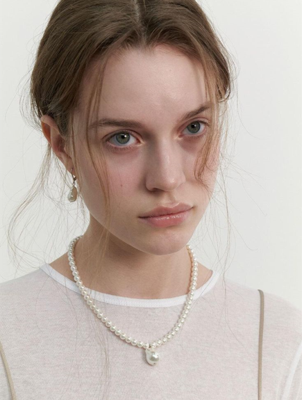

# 1-8. after detailer与修脸插件

[workflow脸部修复.json](workflow%25E8%2584%25B8%25E9%2583%25A8%25E4%25BF%25AE%25E5%25A4%258D.json)

# 开始

当我们费劲心思写好提示词，选好底模，Lora的时候

点击生成，发现生成出来的图，10张里有9张是崩坏的

尤其是人像脸部，怎么解决呢？

熟悉webui的小伙伴肯定想到了 《面部修复插件》

目前，脸部修复的插件表现也是参差不齐

所以，本节课将介绍这 2 款比较好用的脸部修复插件。

# 内容

## comfyI2I——mask ops + **inpaint segments + Combine and Paste**

首先介绍的插件的名字叫comfyI2I，我们可以到github了解一下，它的功能非常齐全，比如说有**Color Transfer** 颜色引用，还有这节课要学习的**Mask Ops，inpaint segments，Combine and Paste，**我们需要把这三个功能串起来，应用的脸部修复

[GitHub - ManglerFTW/ComfyI2I: ComfyI2I is a set of custom nodes for ComfyUI that help with image 2 image functions.](https://github.com/ManglerFTW/ComfyI2I?tab=readme-ov-file)

首先来到我们的comfyui，调出mask ops，可以看到前面需要连接，图片和mask蒙版，

我们输入一张图片。

mask我们可以通过手动涂抹，也可以选择自动识别脸部，这里给大家介绍一款专门应用在人像蒙版上的自动检测，叫做bbox detector，选择调出，同时他需要链接上ultra lytics detecter

让他帮助我们自动检测脸部，选择脸部模型。image 连线

接下来拉出 蒙版图片，点击生成看看，是否能够检测到。

检测出蒙版后，接下来需要调出 inpaint segments，它的作用就是根据蒙版的边界来分割/裁剪 蒙版与图片，并进行放大。

放大的尺寸可以通过resize width / height 来调整。默认是768*768.

**这里有个关键的数据kind类型，记得要把它换成rgb**

**rgb：红绿蓝** **由红绿蓝三种颜色组成，由着三种颜色组合表示不同颜色，取值分别为0-255.**

**rgba：红绿蓝透明**  **在rbg的基础上加了alpha透明度，取值在0-1之间。**

接着输出我们的图片， 点击生成看一下结果。

可以看到脸部范围被放大了，其余的部分被裁剪掉了

下一部，我们就要把 脸部的图片重新修复生成，那就是调出图生图的工作流了。

设置好参数，注意denoise，最好再0.5以下，我设置0.35

正向：

perfect quality, hyper details,white girl, an attractive woman，eyebrow, pale skin ， brown hair,  holding phone, white ribbon， pearls，white background，

反向：

(worst quality:2),(low quality:2),(normal quality:2),dot,mole,lowres,normal quality,monochrome,grayscale,lowres,text,error,cropped,worst quality,low quality,jpeg artifacts,ugly,duplicate,morbid,mutilated,out of frame,extra fingers,mutated hands,poorly drawn hands,poorly drawn face，

设置好之后点击生成，运行成功后，我们需要进行下一步，把脸合并回去。

调出combine and paste， 根据要求，连好线条。

最后再把image comparer打开进行对比。

点击生成。怎么样，效果还不错把。

这款插件虽然步骤多，但是非常有利于我们学习这个换脸的原理，效果也非常好用，有适用性强的优点，它适合多场景使用，包括后面的 人像摄影、animediff等都可以用到，缺点就是步骤比较多。

## face detailer脸部修复

除此之外，目前主流的修脸插件是face detailer，

我们先来github上看一下，这个插件叫 impact pack，有非常多的功能，其中face detailer是其中一个我们用的比较多的

[GitHub - ltdrdata/ComfyUI-Impact-Pack](https://github.com/ltdrdata/ComfyUI-Impact-Pack?tab=readme-ov-file)

我们可以看到操作案例第一个就是脸部修复，

前面部分就是文生图部分，后面部分是脸部修复，怎么样，看起来不难吧，我们来实践一下。

首先第一步制作一个文生图工作流，并设置参数。

正向：

1girl,solo,black hair,cherry blossoms,hair bun,chinese clothes,branch,dress,flower,tree,single hair bun,outdoors,
(((colored background))),(((high saturation))),(((colored splash surround))),colored bubbles,(((glitter))),lora:abel五彩斑斓:0.8,

反向：

White clothes,paintings,sketches,(worst quality:2),(low quality:2),(normal quality:2),dot,mole,lowres,normal quality,monochrome,grayscale,lowres,text,error,cropped,worst quality,low quality,jpeg artifacts,ugly,duplicate,morbid,mutilated,out of frame,extra fingers,mutated hands,poorly drawn hands,poorly drawn face,mutation,deformed,blurry,dehydrated,bad anatomy,bad proportions,extra limbs,cloned face,disfigured,gross proportions,malformed limbs,missing arms,missing legs,extra arms,extra legs,fused fingers,too many fingers,long neck,username,watermark,signature,(mole:1.4),NSFW,watermark,

并固定好种子：603281524058853

第二步就是把它发送给face detailer， 那我们先调出face detailer，

我们需要接入2个模型，分别是 detecte 检测模型，它帮助我们确定,需要修改优化的部位；另一个模型是sam 模型。调出ultra lytics detector provider 检测加载器 ，选择你想要 识别部位的 模型，可以选择脸部、手部、还是整体。但是整体的表现力不够好，不建议大家使用。

把其余部分进行连线，可以连在efficient loader，也可以连在ksampler后面，两者是一样的

最后调出image comparer 对比效果。点击生成。可以看到脸部细化的还不错。

我们还可以在后面接一个手部的细化。

复制一份face detailer脸部修复的节点和模型，并把识别部位改成hand，

连线的时候有点远，可以通过添加reroute，并单击右键，调出reroute 的类型，这样的会方便很多。

最后调出image comparer 对比效果。表现比较一般。

我们可以调出mask的图片，查看一下手部识别是否到位，与脸部识别的区别是什么

可以看到识别的是精准的，但是为什么生成的手部图片效果不佳呢？

原因是手部识别需要结合controlnet，比如depth、openpose等使用。具体对controlnet的内容，我们会放在第二章节学习。

我们再来github上看一下，作者还有推荐refine的功能，就是在修脸结束之后，再优化一下，

根据作者的介绍，优化的不仅是脸部，还是有环境。

我们来搭建复刻一下看看效果怎么样。

调出face detailer pipe，连接脸部修复之后。最后增加一个image comparer 对比效果。

点击生成。

我们可以看到整体效果没有特别惊艳，放大查看细节的话可以看到脸部和整体融合的比之前好，边缘锯齿状也有一定的优化。

所以我建议可以用上节课我们学到的高清放大 来替换refiner，效果会更好。

我们把refiner 关掉， 调出 ultimate sd upscale ， 并进行连线，整理一下线条。

点击生成。怎么样，是不是比refiner 效果好一些。

# 结尾

本节课我们学习了2种，非常好用的，修复脸部的插件，

也是为我们后面 商业案例课程 打好基础，包括老照片修复、创意摄影、animatediff等等的课程，是可以直接运用在商业工作中。

到此为止，我们第一章基础comfyui的内容已经讲解结束，看到这里相信大家对ComfyUI已经有了初步的了解

下一章节 我们将进行更深层次的控制插件的内容 ，包括光影控制、controlnet等。

继续期待后续的课程吧，如果你有任何问题，请在破壳丹塔社区提问，我们会有专业老师为你解答。