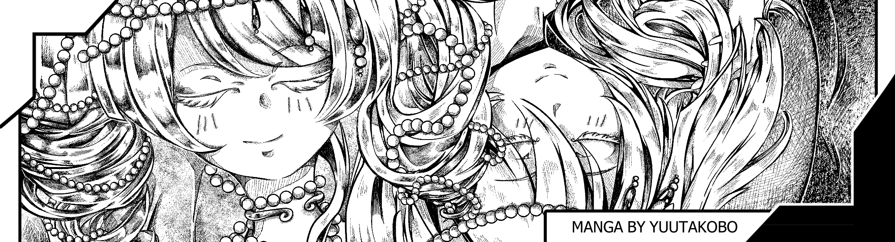
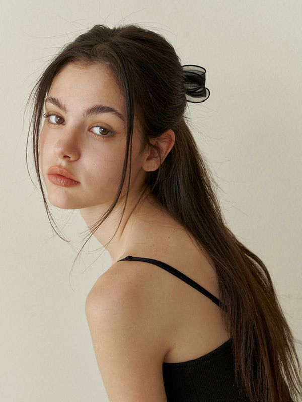
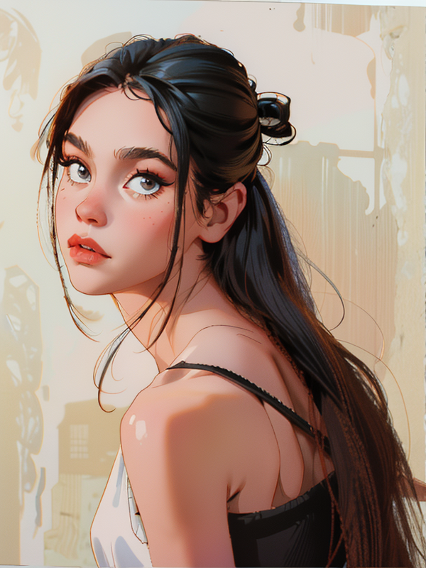
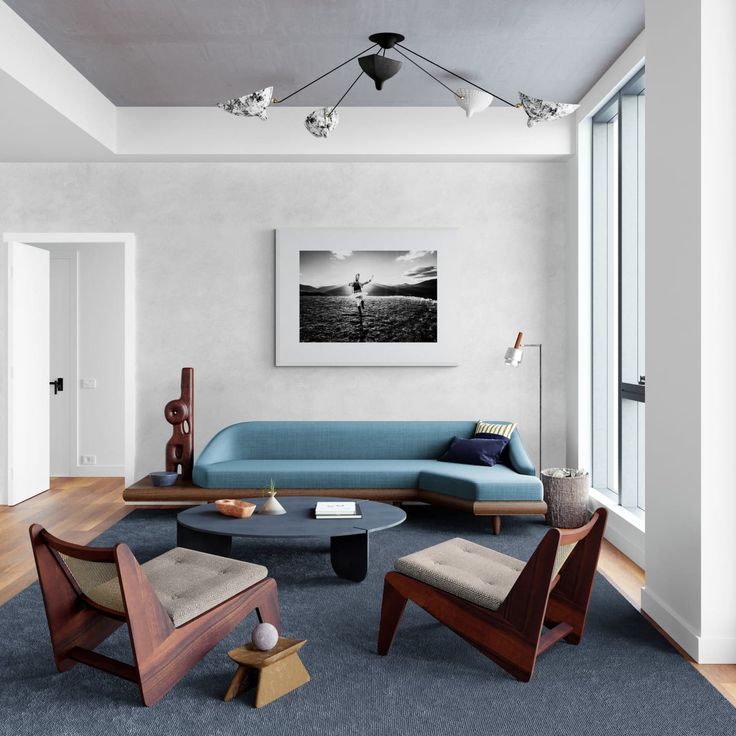
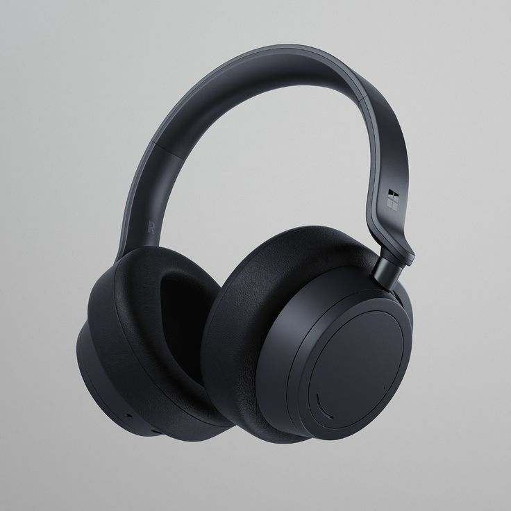

# 2-1.webui与comfyui差异化的ControlNet使用方式

[workflow controlnet final.json](workflow_controlnet_final.json)

# 开头

有过webui基础的小伙伴都知道，stable diffusion比midjourney更加有优势的地方就在于可控性更强，而可控性中，占最大功劳的就是controlnet，

ControlNet是一种神经网络架构，可以与规模庞大的预训练 模型（如Stable Diffusion）无缝集成。

ControlNet是利用了这些，在数十亿张图像上，训练的模型 **将空间条件 引入图像创建过程**。

目的是增强了文本到图像 扩散模型的能力，实现了前所未有的图像生成 空间控制。

这些条件的控制范围很广，包含了线条控制、深度控制、法线控制、语义控制、姿势控制等等。

每种控制方式都有，能满足我们不同场景的使用。

所以这节课我们结合案例 来学习：

什么场景下使用什么预处理器？

哪款预处理器表现效果最强的？

什么情况下需要结合多个预处理器？

# 内容

在开始之前请大家及时更新一下controlnet，因为controlnet最近有 新出的预处理器，我们在课程中会讲到。

更新方式在manager管理中，进入install custom nodes，在搜索栏输入controlnet， 点击try update更新版本。

等待更新完成后，点击restart后，等待重新连接

最后需要重新加载页面

[https://github.com/Fannovel16/comfyui_controlnet_aux](https://github.com/Fannovel16/comfyui_controlnet_aux)

## 1 从照片到卡通：轻松转换风格(lineart,canny,softedge)

在风格转绘中，通常我们想要保持整体形象、布局，不产生大的变化，最常用的方法是线条控制，控制线条的预处理器分别有：canny，lineart，softedge，m-lsd、binary

| canny | Canny Edge            |  |  |  |  |
| --- | --- | --- | --- | --- | --- |
| lineart | Standard Lineart | Realistic Lineart | Anime Lineart | Manga Lineart | **AnyLine Lineart** |
| softedge | HED Soft-Edge Lines | PiDiNet Soft-Edge Lines | TEED Soft-Edge Lines |  |  |
| mlsd | M-LSD Lines |  |  |  |  |
| scribble line | Scribble Lines | Scribble XDoG Lines | Fake Scribble Lines | Scribble PiDiNet Lines |  |
| Binary Lines |  |  |  |  |  |

根据官网的分类，我们可以看到不同于webui的预处理器，comfyui预处理器比webui更多，名称感觉也更复杂，

没关系，跟着我的步伐一步步走，

我会把所有的控制线条的预处理都调出来，并上传图片，看看他们线条处理效果有什么区别。这样会让大家看得更直观一些。

**Canny**是通过canny模型，应用Canny边缘检测算法，这是一个多阶段过程，用于检测图像中的各种边缘。

这个模型有利于在，简化视觉组成的同时，保留图像的结构方面，

使得它适用于，程式化艺术或进一步图像处理前的预处理。

它的线条特征是，可以明显的看出，有点像是像素图的线条

**Lineart**是通过模型，把图像转换为程式化的线条绘图，

主要应用在，艺术渲染或作为进一步创作工作的基础：

不同的预处理器效果应用的不同的场景，其中

- **Standard Lineart**：这是个标准模型，比较通用
- **realistic Lineart** ：生成的是更加更写实风格的线条绘图，它可以捕捉主体本质的更多细节，非常适合需要逼真表现的项目。
- **anime Lineart**：专注于生成动漫风格的线条绘图，以干净、精确的线条为特征，适合追求动漫美学的项目。
- **manga Lineart：manga指的是日本漫画，特征是手繪水墨風格，不能制作非常细的线条，**
    
    
    
- **anyline lineart**：是最近新出的预处理器，特点是线条清晰赶紧，流畅丝滑，可以看到水印的部分也很清晰。

整体对比canny和lineart出的线条，lineart会更加丝滑流畅，边缘也比较顺滑。

**Soft Edge** 旨在生成边缘更柔和的图像，侧重于细节控制和自然外观。它使用先进的神经网络技术进行精确的图像处理，提供更大的创作自由和无缝混合能力。

稳健性：PIDI_safe > HED_safe>> PIDI > HED

最大结果质量：HED > PIDI > HED_safe > PIDI_safe

考虑到这种权衡，我们建议默认使用PIDI。在大多数情况下，它的效果非常好。

softedge的线条，除了丝滑、流畅的特点外，线条会比lineart粗一些，导致了刘海和眼睛的线条都黏在一起了。

**M-LSD**（Mobile Line Segment Detection）专用于检测直线，非常适合具有强烈建筑元素、室内和几何形式的图像。

它将场景简化为，其结构本质，

所以我们看到生成的图片，只在肩膀和脖子处， 生成了直线条，其他识别不了，

**Scribble**是通过模型，把图像转换为类似涂鸦，模拟手绘草图的外观。它们特别适用于艺术重塑、漫画、草图等：其中

- **Scribble lines**：就是简单把图像转换成，模拟手绘涂鸦或草图的线条。
- **Scribble xdog**：采用，扩展差分高斯（xDoG）方法进行边缘检测。可以强化边缘，同时它允许调整threshould阈值设置，来微调涂鸦效果，在使用的时候就能够，控制艺术作品中的细节水平。xDoG非常通用，表现效果整体比较好。
- **fake Scribble** ：和 **scribble_hed 一样**
- **Scribble Pidinet**：专注于检测像素差异，以生成更清晰的线条，减少细节，非常适合更抽象的表现。

**binary lines**（黑白稿提取）：中Binary 是指二进制，作用就是把图像变成只有黑白两色（没有灰）

### 

了解线条特点之后，我们可以来试着搭建一个风格转绘的工作流，把真人写实图片转化成卡通2d的形象。

首先，先搭建一个图生图的基础工作流。输入图片

并设置好模型、参数。

底模：toonyou

正向：

Masterpiece,best quality,super details,intricate details,cartoon,hyper cute,
an attractive young girl,long hair in the back,black hair,a low ponytail with a hair clip,
wearing a black tank top,looking over her shoulder at the camera,a simple beige background,

反向：

nsfw,ng_deepnegative_v1_75t,badhandv4,(worst quality:2),(low quality:2),(normal quality:2),lowres,watermark,monochrome,(3d:1.5),(painting:1.5),

种子：739744849029595

denoise：0.5

点击生成，看看是否能跑通，同时帮助我们检查一下是否有漏掉的节点没有连完。

接着调出apply controlnet, 其中strength是强度，此参数决定了ControlNet对ComfyUI生成图像的影响强度。1.0意味着完全强度，即ControlNet的引导，将对，扩散模型的输出产生最大影响。相反，0.0表示没有影响，基本上禁用了ControlNet对图像生成过程的影响。

常用范围是0-2之间，

如果你使用的是advance高级版，会多两个参数，分别是：

**start_percent**：是指定ControlNet开始影响生成的起始点，以扩散过程的百分比表示。

假如，我设置20%的起始百分比，意味着ControlNet的引导将从扩散过程的20%开始影响图像生成。

**end_percent**：则是ControlNet的影响停止的点。

假如，80%的结束百分比意味着ControlNet的引导在扩散过程完成80%时停止影响图像生成，最后阶段不受影响。

我们按照顺序连接conditioning、模型、和图片。

我们首先选择canny模型，

在连接图片的过程中，需要调出canny edge的预处理器，预处理器中的low threshold和high threshold用来强调局部线条的强弱，我简单搭建一个工作流看看

可以看到low threshold数值越低，线条细节就越多，

high threshold数值越高，线条越少，

resolution代表分辨率，分辨率越高, 画面细节反而越少。

回到工作流，连好线条，点击生成就可以了，怎么样效果还可以把

我们可以多复制3个工作流，修改controlnet模型 和 预处理器，看看哪个效果是你最喜欢的.

我这边选择Standard Lineart 、 HED Soft-Edge Lines、Fake Scribble Lines，其他模型和预处理器，大家可以多多尝试使用

我们可以对比分析一下：
Standard Lineart 线条发丝表现的比较细，所以生成的图片头发状态更像原图。

HED Soft-Edge Lines 轮廓比较明确，同时线条比较粗，和原图比较一致，脖子和发丝有外扩一点的现象。
Fake Scribble 线条变现为涂鸦形式，让comfyui发挥的空间更大，所以五官的表现形式会更加像底模的风格。

## 2 设计的艺术：室内外场景生成(depth,mlsd,normalmap)及工业设计

在设计行业中，尤其是建筑设计、室内设计、景观设计、工业设计等行业中，

传统表现方式是3d建模，3d空间关系是最重要的，对应到controlnet中最常用到的就是depth+normalmap 深度和法线贴图，加上上一节内容提到的msld，特别适用在直线条建筑和室内设计的表达。

现在，我把所有的depth深度，和 normalmap 法线贴图 的预处理都调出来，通过同一张图片，看看他们处理效果有什么区别。

在这里，我们还可以调出depth viewer，这个插件是让大家更加直观看到深度图的空间关系，可视化的效果非常好，但是没什么其他作用，就是看着酷一点。

大家可以不需要安装这个插件，如果你想安装的话可以在manager管理，install custom nodes安装，插件名称叫做comfyui-depth-visualization，具体安装步骤就不再重复了。

点击生成，等待一段时间。

[GitHub - gokayfem/ComfyUI-Depth-Visualization: Depth map applied Image viewer inside ComfyUI](https://github.com/gokayfem/ComfyUI-Depth-Visualization?tab=readme-ov-file)

.jpg)

**Depth是通过**模型，从2D图像推断深度信息，将感知距离，转化为灰度深度图。不同预处理器，在细节捕捉和背景强调之间，有不同的重点。

其中

- **MiDaS Depth Map**：提供经典的深度估计，在细节和背景渲染之间取得平衡。
- **LeReS Depth Map：**侧重于增强细节，倾向于包含更多背景元素。对比midas的深度，可以看到腰部的效果leres depth表现的更好
- **Zoe Depth Map：**在细节层次方面，是Midas和Leres模型之间取得平衡。
- **MeshGraphormer Hand Refiner：**专门设计用于改善深度图中的手部细节，适用于手部定位至关重要的场景。
- **Depth Anything**：一种新的、改进的深度估计模型，专为各种场景而设计。表现力还不错
- **Zoe Depth Anything** (Basically Zoe but the encoder is replaced with DepthAnything)：和zoe差不多，但是解码器用的是depth anything的
- **Metric3D Depth：**表现力一般，用的比较少
- **Depth Leres++**：为深度信息提供高级别的细节，非常适合复杂场景。

Normalmaps是通过模拟视觉场景中，表面的方向，而不是仅依赖颜色数据，来模拟复杂的光照和纹理效果。

这对于3D建模和模拟任务很重要，通常用的工业设计中，当然在人像上也适用，尤其是脸部细节有光影的情况下。

- **MiDaS Normal Map：**利用Midas模型生成的，可以准确估计法线贴图。这种方法允许基于，场景的深度信息对表面纹理 和 光照，进行细微模拟，从而满足3D模型的视觉复杂性。
- **BAE Normal Map：**这种方法通过利用法线不确定性的方法生成法线贴图。它提供了一种创新的技术来描绘表面的方向，增强了基于场景的物理几何，而不是传统的基于颜色的方法，来进行光照效果模拟。
- **normal dsine：**
- **metric3d normal：**

我们来一个室内案例试试效果，

复制上一步的lineart的工作流，修改 模型和预处理器为 depth / zoe depth anything,可以看到zoe depth anything 可以选择室内外的环境，非常适合用在建筑和室内领域。

输入一张图片，固定种子：531440950820881，修改denoise为1

并修改模型和关键词

模型：麦橘

正向：

Masterpiece,best quality,super details,intricate details,realistic, photography,
modern New York apartment, living room, a blue sofa, wooden chairs, wall art on the walls, large white walls, grey carpet floor, interior design photography, in the style of Architectural Digest, plain blank walls

反向：

nsfw,ng_deepnegative_v1_75t,badhandv4,(worst quality:2),(low quality:2),(normal quality:2),lowres,watermark,monochrome,(3d:1.5),(painting:1.5),(human:1.5),(people:1.5)

最后再增加一个image comparer作为对比。

我们看到家具的表现力还是不错的，沙发细节比原图更多，

但是感受一下空间关系，来看看大家的空间感好不好的，你能感觉到原图空间 比 生成图片的空间 小一点，不知道大家看的出来吗，大家可以暂停一下，对比两者空间的大小是否有区别啊？

原因是在天花的线条，对比看到生成的图片吊顶高一点点，而且 吊顶和天花的衔接也不是特别明确，导致高度上面有点不一样。

我们可以回到深度图，看到了吧，深度图对于吊顶的细节并没有体现出来。这就是原因所在。

所以我们可以在此基础上增加一个线条的控制。这里可以选择canny。

连好线条后，可以降低low threshold的数值，这样细节就会多一些，

修改种子：127664451483938

直接生成，可以看到吊顶的部分很贴合了，这样空间就会更加符合原图一点了。

我们以后在制作自己项目工作流的时候，也是这样一点一点根据具体需求，进行图片的分析、对比，并在此基础上，慢慢增加一些细节，来满足我们最终的需求的。

所以我们现在就要建立，分析图片，并找到问题所在，的这种能力。

接下来我们来尝试用一下normalbea，来做一个工业设计的案例。

复制以上室内设计的工作流，修改模型为Normalbae，预处理器为 bae normal map，

重新输入一张图片

固定种子：344034018916236，修改denoise为1

并修改模型和关键词

模型：麦橘

正向：

Masterpiece,best quality,super details,intricate details,realistic, photography,
modern New York apartment, living room, a blue sofa, wooden chairs, wall art on the walls, large white walls, grey carpet floor, interior design photography, in the style of Architectural Digest, plain blank walls

反向：

nsfw,ng_deepnegative_v1_75t,badhandv4,(worst quality:2),(low quality:2),(normal quality:2),lowres,watermark,monochrome,(3d:1.5),(painting:1.5),(human:1.5),(people:1.5)

最后再增加一个image comparer作为对比。

# 结束

怎么样，经过这节课的理解大家应该对 线条控制、深度控制、法线控制比较熟悉了，

在下节课我们还将学习姿势控制，同时学会多种controlnet一起使用的场景，

帮助大家在具体工作中，学会如何分析controlnet问题，如何通过controlnet解决每一步的问题。

# 开头

artifical intelligence 生图的优势在于天马行空的想象力

但同时在可控性方面通常会让人诟病

但有了ControlNet 对于图片的可控性也是更上一层楼

上节课我们学习了线条控制、深度控制 和 法线控制，除了以上控制之外，我们最常用的还有人物控制，openpose 和 3d pose editer

我们先学习open pose，简单搭建一下对比图，看看不同的预处理器的表现效果如何。

## 3 姿态捕捉：3D姿势编辑的魔力(openpose、3d open editer）

- **DWPose Estimator**：对原先OpenPose模型进行了增强，结合了额外的改进，实现更详细和准确的姿势检测。多测测试下来，dwpose是最好用，识别率最高的。
- **OpenPose ：**ControlNet内的基础模型，识别眼睛、鼻子、脖子、肩膀、肘部、手腕、膝盖和脚踝等基本身体关键点。它非常适合基本的人体姿势复制。
- **MediaPipe Face Mesh：**一个专门用于面部细节的模型，省略身体关键点，专注于捕捉表情和面部方向。这个ControlNet内的模型专门关注面部特征。但是如果画面人脸占比比较小，那可能会出现识别不了的情况。
- **Animal Estimator：**专门检测动物姿势，使用频率比较低，不是特别的好用

接下来我们来做一下案例，
复制以上室内设计的工作流，修改模型为openpose，预处理器为 dwpose estimator，

重新输入一张图片

固定种子：344034018916236，修改denoise为1

并修改模型和关键词

模型：麦橘

正向：

Masterpiece,best quality,super details,intricate details,realistic, photography,
1 gril, standing,grey clothes, black short, black shoes,indoor, white background,studio lights,

反向：

nsfw,ng_deepnegative_v1_75t,badhandv4,(worst quality:2),(low quality:2),(normal quality:2),lowres,watermark,monochrome,(3d:1.5),(painting:1.5),

最后再增加一个image comparer作为对比。

点击生成，可以看到姿势保存的很好，背景也根据提示词改成了indoor室内，脸部稍微有点崩，因为图片尺寸不大，脸的占比又比较小，崩是正常的。

我们可以用face detailer来修一下脸部细节，同学如果忘记了怎么修脸，可以复习一下第一章第八课：修脸的2中方法。

那这里我简单用face detailer来处理脸部，

首先调出facedetailer, 调出ultralytics detector provider 和 sam loader 模型，并连好所有的线条，

最后调出image comparor做对比。

点击生成，这样脸部的细节就丰富了。

除了openpose，还有 3d pose editior，我们需要自己安装一下，

manager中安装插件，搜索3d， 找到3d pose editior

[https://github.com/hinablue/ComfyUI_3dPoseEditor](https://github.com/hinablue/ComfyUI_3dPoseEditor)

复制之前的工作流，这个时候记得把种子选为randomize随机，因为后面要生成很多不同姿势的图片，

模型无需修改，预处理器改成3d pose editior，

在文件中，我们找到从图片中检测，输入图片，点击生成，会自动识别图片中的姿势。

最后生成图片就好了。

这个时候我们可以打开 extra options额外选项 和 auto queue 自动排队，条件改成change，意思就是每次变化就会自动生成一张图片

我们随机变动胳膊或腿，他都能生成一张图片，无需手动。

这个手动调整姿势的虽然很灵活，但是如果我们没有学习过人体结构姿势，对人体结构把握不好，所以用的比较少。

如果你有是数字媒体专业，做过动画、或者会用zbrush雕刻人体结构，那么这个插件会比较适用。

## 4 组合**使用多个ComfyUI ControlNet**

那么在实际的工作中，我们将面临很多需要微调的细节，那就要涉及使用多个ControlNet，以通过对姿势、形状、风格和颜色等各个方面的更精确控制来图像生成。

因此，我们通常，通过应用一个ControlNet（例如OpenPose）并将其输出到另一个ControlNet（例如Canny）来构建工作流。

这种分层应用允许对图像进行详细定制，每个ControlNet有其应用的，特定的转换或控制。

这个过程允许对最终输出进行细化控制，整合由不同ControlNet引导的多个方面。

所以接下来，我们再讲一个实际的案例，一步一步分析并增加细节，来帮助同学们更好的理解。

复制一个openpose工作流，重新输入图片

修改关键词:

Masterpiece,best quality,super details,intricate details,
a girl, lying down,

种子：799738323462373

点击生成

我们对生成的图片进行分析，可以看到，姿势保存的很好，说明openpose起到了作用，

但是前景的产品没有了，如果我是这个产品的卖家，我肯定觉得图片不合格，

而且模特的脸型有非常明显变窄，因为我使用的是麦橘的模型，目前市面上，针对亚裔人物的模型，它的审美比较偏网红，整体偏白幼瘦，

而我们原图模特的脸型偏圆一点，所以会出现这种问题。

包括背部的线条也是与原图有所差别。

那结合这张图片的特点，产品和人物有前后关系明显，人物本身也有纵深的空间关系，头在镜头最前面，腿在后面，我会优先考虑增加一个depth深度。

我们调出zoe depth map 的预处理器，复制前面的controlnet，修改模型，并进行连线。

还可以增加一个image comparer做对比，

点击生成。

根据结果我们可以看到，前景的产品已经出来了，脸型也圆一点了，

但是脸型和原图还是有细微的差别，

那么就可以再加一个线条lineart来固定一下脸型。

重复以上步骤，

复制controlnet，修改模型为lineart，调出standart lineart 预处理器，再增加一个image comparer，点击生成

怎么样，经过了层层优化，效果是不是越来越贴近原图了。

网红感也弱了。

# 结束

到此为止 我们最常用的ControlNet 基本都在这里了

当然 ControlNet 控件远远不止这些，将来也会发布更多 ControlNet

ControlNet对于生图方面的控制和玩法也远远不止这些

下节课我们将讲到 IPadapter，他在一定程度上代替了lora，这也是我最开始课程中一直没怎么提到lora，因为ipadapter足够强大。

期待开启下一节课的内容吧。