# 2-2.IP-Adapter

> [https://stable-diffusion-art.com/ip-adapter/](https://stable-diffusion-art.com/ip-adapter/)
> 

[workflowipadapter (1).json](workflowipadapter_(1).json)

# 开头

大家想一想，在webui中想要把一个人像变成卡通风格，我们会怎么做？

我们会通过controlnet控制人物，再把底模换成卡通模型，比如anything 模型，

同时还会修改提示词，比如说anime、 Janpanese style 日本动漫的风格，或者增加艺术家的名字，使得风格更加准确，

并且会在此基础上找到相应风格的lora，

如果市面上没有符合你要求的lora，提示词也增加了权重，依旧没有用怎么办？

对stable diffusion 有一定了解的同学会说 自己训练一个人物的风格LoRA就可以解决了

现在我可以告诉大家 不用Lora这么麻烦

学完这节课，你将知道IP-Adapter的强大

接下来我们花些时间来认识一下 ipadapter，了解它的原理，并**对比**它和lora的区别，从底层明白为什么ipadapter比lora更强大。（当然lora也有自己的优势，和应用场景，并不是摒弃的意思）

提醒：这节课的内容很硬核，牵扯到一点数学上的概念，如果没有听懂，没关系，我们先记住结论，实操练习一段时间后，再回来看一遍，也许能够更好的理解

# 内容

- IP-Adapter 是什么？
    
    [2308.06721v1.pdf](2308.06721v1.pdf)
    
    首先，IP-adapter 全称是 Image Prompt adapter 图像提示适配器。从名字可以看出 ，它是使用image图片，像prompt提示词输入给机器，或者说以 图片形式的 提示词 输入给机器。
    
    简单地说，它能够参考 给定图像的 风格和内容，从而生产出新的图片，受到 给定图片的影响。
    
    
    
    ipadpter为什么具备这样的特性？
    
    从基础理论上看，在1.5的模型当中，当我们在stable diffusion输入提示词的时候，比如我输入 a fat cat on the grass, 那么a fat cat 会被文本编码器拆分出来作为一个token，类似于一个标记。这个token 对应这一个 embedding，它是一个长度为768的vector向量，每个token都有自己的embedding，他们是一一对应的。
    
    
    
    
    
    
    
    把embeddings 作为参数 进入 Unet ，这一步可以简单理解成，神经网络提高了 与提示词 相关节点的 权重，这就是stable diffusion文生图 实现的 基本方法。
    
    
    
    
    
    既然文字可以编码成embedding，那图片可不可以？
    
    通过**语言图片对比训练**，可以把文字编码的embedding和图片embedding一一对齐，（图片反推提示词的功能就是使用这种方法）。
    
    回到ipadapter你会发现，蓝色部分就是stable diffusion原理图，而ipadapter是在此基础上增加了两个部分：
    
    - 图像编码器 用于从图像提示中提取图像特征；
    - 具有解耦的cross-attention的适配模块，用于将图像特征嵌入预训练的 文本到图像扩散模型中
    
    IP-Adapter将图片单独提出作为一种提示特征，相当于stable diffusion模型 把图像特征和文本特征 抽取后 拼接在一起的方法，
    
    IP-Adapter通过带有 解耦交叉注意力，cross attention 的适配模块，将文本特征的Cross-Attention 和图像特征的Cross-Attention区分开来，在Unet的模块中新增了一路Cross-Attention模块，用于引入图像特征。
    
    
    
    在 图片embedding经过一次cross attention 之前，还有 提示词embedding 和 unet 做了次cross attention，可以简单理解成，神经网络提前注入了参考图片的特征，这发生在接入提示词、lora、controlnet之前，相当于提前 加了一个 单图片定制化的lora。
    
    ~~这样做的优势在于，保留了stable diffusion 的原生结构和参数，需要训练的模型参数量非常小，训练和推理都非常高效。比训练一个lora更快。~~
    
    ~~当前adapter很难达到微调图像提示模型或从头训练的模型性能，主要原因是图像特征无法有效的嵌入预训练模型中。大多数方法只是将拼接的特征输入到冻结的cross-attention中，阻止了扩散模型捕捉图像图像提示的细粒度特征。~~
    
    [IP-Adapter：用于文本到图像扩散模型的文本兼容图像提示适配器-CSDN博客](https://blog.csdn.net/weixin_47748259/article/details/135563134)
    
- IP-Adapter 和图生图的区别是什么？
    
    它和图生图的区别在于，图生图是，直接盖在参考图上开始临摹。
    
    在原理上是直接将参考图传入unet，去替换了原始的随机噪音，这样所有的 生成结果 都是建立在它的基础上，所以有时候会出现混杂、效果不好，有一些奇奇怪怪的情况。
    
    而IP-Adapter是根据 文本和图像提示 生成的图片：IP-Adapter不是临摹，而是真正的自己去画，将参考图与原图融和一体
    
    
    
    
    
    
    
- IP-Adapter 与 lora 的区别是什么？
    
    [lora.pdf](lora.pdf)
    
    lora 全称是 low rank adaption的缩写，低秩适配。什么是秩呢？
    
    它是一个数学概念，一个矩阵的秩越大，他的信息含量就越大。
    
    几个小矩阵 相乘可以得到一个大矩阵，反过来，一个大矩阵也可以通过矩阵乘法变成小矩阵。‘ 
    
    
    
    
    
    
    
    根据相关论文 的 原理描述，可以看到
    
    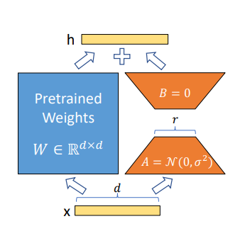
    
    下面黄色 ****X 代表输入**向量X**，他的维度是d，也就是 x是一个 包含d个元素的向量。
    
    上面是输出**向量 h**，它的维度也是d。
    
    **左边蓝色pretrained weights** 代表 预训练权重 矩阵w，他的维度是d*d，意思就是矩阵W的形状是d行d列，
    
    **右边橙色的就是 lora** 中使用的低秩分解。r 就是rank，代表秩，
    
    **A矩阵**的维度是 d*r，*A*=N(0,*σ*2) 这个公式代表矩阵 A 的元素是从 正态分布中 随机初始化的。
    
    上面的是**矩阵B**，他的维度是r*d，B=0代表初始值为0.
    
    假设d是100，r=5
    
     
    
    **在regular_forward_matrix multiplication** 标准的 前向矩阵乘法 函数中，
    
    输出向量h = x @ W， **`@`**是矩阵乘法运算符
    
    权重举证 W 的维度是 d*d=100*100=1万
    
    
    
    结算结果为
    
    
    
    你可以把它简单理解成：
    
    你有一个大柜子，里面有 100 行 100 列的格子，总共有 10,000 个格子。
    
    每次你想要从这个大柜子中找到一个**特定的组合**，你需要检查每一个格子，这样会涉及很多次操作。
    
    **在lora_forward_matrix multiplication** 标准的 前向矩阵乘法 函数中
    
    h+ 输出加法 = x @ （Wa*Wb）* alpha*（alpha可自定义，默认为1）* ，
    
    其中𝑊𝐴 的维度为100×5，*WB*100×5
    
    
    
    计算结果：
    
    
    
    简单理解成：
    
    你有两个较小的柜子，第一个柜子有 100 行 5 列，第二个柜子有 5 行 100 列。
    
    - **第一个柜子**（矩阵 *A*）：100 行 5 列，总共 500 个格子。
    - **第二个柜子**（矩阵 *B*）：5 行 100 列，总共 500 个格子。
    
    每次你想要找到一个特定的组合，你只需要从两个较小的柜子中分别找出 5 行，然后进行简单的组合，这样会涉及的操作次数大大减少。
    
    所以为了规避大模型的反向传播，lora的目的是 节约 显存的消耗、算力资源的消耗，减少推理的开销
    
    lora 与 ip-adapter相比，
    
    lora 在和大模型训练相比，能有效地减少训练和推理的计算量， 但在适应新的风格或任务时，可能需要对更多的参数进行调整，导致训练时间增加。另外，LoRA的泛化能力相对有限。
    
    ip-adapter 可以在不改变原始模型参数的情况下，调整模型以适应新的任务。
    
    这样的话，它在处理风格迁移等任务的时候，能够更快地收敛，同时保持原模型的性能。
    
    ~~另外他的训练速度更快，资源消耗也更小。~~
    
    ~~同时还降低了过拟合的风险，~~在处理不同风格迁移任务时具有更强的泛化能力，不容易受限于某种特定风格。
    
    
    
    相信通过上面的讲解，大家对ipadapter已经有了一定的认识，并了解了其优势。
    
    lora部分的内容和参数我们会在后面的lora训练课程进行详细讲解。
    
- comfyui上使用
    
    了解了原理之后，我们打开comfyui，开始搭建我们的工作流。
    
    先调出一个文生图，
    
    修改模型和提示词
    
    模型：dreamshaper
    
    正向：a fat cat, landscape,grass,
    
    反向：bad quality,
    
    
    
    接着在原有文生图工作流上，再增加一个ipadapter，
    
    调出apply ipadapter, 
    
    
    
    可以看到ipadapter和clip vision，这两个都是连接模型的，
    
    其中不同模型的特征分别是：
    
    ipadapter_sd1.5_vit-G模型更大，也很吃显存，有需要的同学可以自行下载，日常使用选vit-h 也就是 plaus
    
    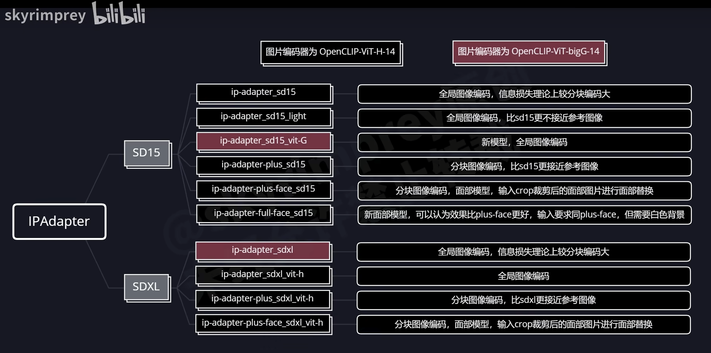
    
    
    
    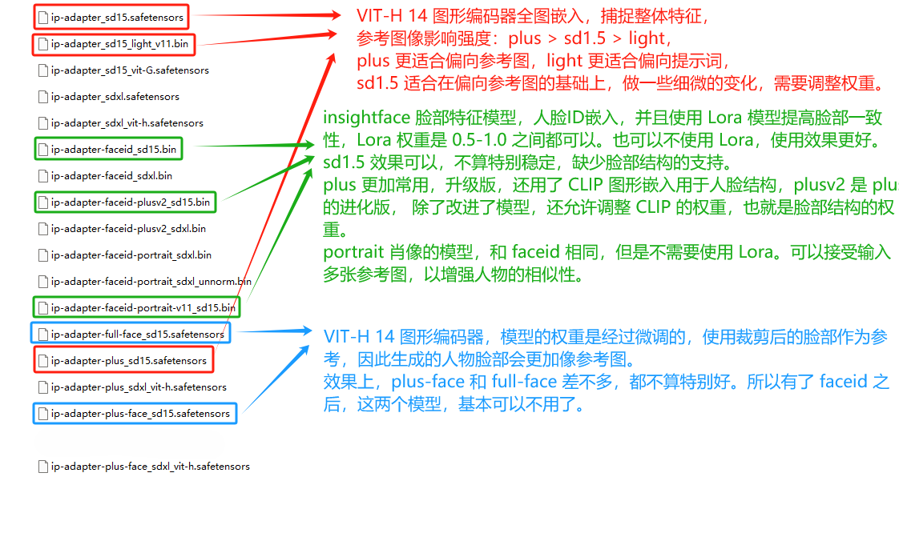
    
    
    
    image 连接，我们想要参考的图片，比如说，我想要这个猫像梵高画的，那我就可以引用一张梵高的图片，
    
    
    
    model是连接模型的，所以模型和参考的图片是要同一类型的，比如说我输入一张写实的图片，模型用的是二次元的，那么图片的风格引用就不能很好的被利用了。
    
    attn-mask功能强大 ，通过遮罩来控制ipadapter的区域，和controlnet中attention mask机制是一样的，在下节课我们会详细讲解
    
    weight代表ipadapter的权重，作者建议是在0.8以内
    
    weight-type权重类型可以选择：
    
    original 原始方法——权重大小与对结果的影响程度正相关
    
    linear 线性方法——对比原始方法，权重小于1时，对结果的影响更弱；权重高于1时，对结果的影响更强；权重为1时，等于原始方法
    
    channel penalty 通道惩罚，实验性方法——该方法源自于midjourney fooocus上的，有时候会产出更加锐化的图像（或者说细节更多更好的图像），权重高于1时候也能有不错的表现
    
    noise噪声参数，ipadapter需要一个正向提示和一个反向提示，正向提示就是我们提供的图片，反向条件是一张黑色图像，comfyui ipadapter plus做的一个优化，是用不同程度的噪声图像，代替给到反向条件的空白图像，噪声参数值越小，加噪程度越高，
    
    比起空白图像，适当增加一些遭噪声，可以在保留目标图像特征的同时获得更高的自由度，就会显得没有那么僵硬，画面细节也会跟随底模有多一点的细节和创意。
    
    那使用噪声图像 和 直接降低 weight权重 有什么区别？
    
    权重直接影响 结果与原图的 特征相似度，
    
    增加noise，是以较小的特征损失，换取相对较大的底模倾向，更利于获得更好的生成。
    
    **顺序是：先调weight权重，再调整noise噪声**
    
    start_at 和 end_at 代表ipadapter在生图过程中开始作用时间和结束作用时间，更起始的步骤可以控制图像的高阶特征，比如构图；更结尾的步骤 可以控制图像的低级特征，比如细节。
    
    unfold_batch：在需要输入多张图片时候打开，关闭时多张图片会以相同权重融合为一张图片；打开时候会按照次序每次输入模型的一张图片。在后面的学习animediff的课程中会详细讲解。他会使得生成的动画更加顺滑
    
    
    
    多出几张图，
    
    发现效果不理想啊，很多时候猫没有出来，出来了效果也不好。
    
    大家可以自行思考一下，可以怎么来解决它。
    
    可以看到背景的图和引用的梵高图片每次变化都不大，那这时候我们可以把猫的权重调大到1.5，
    
    把ipadapter的权重调小到0.5，
    
    点击生成，
    
    怎么样，符合我们的效果了吧。
    
    那我换一个山水画的风格，看看效果
    
    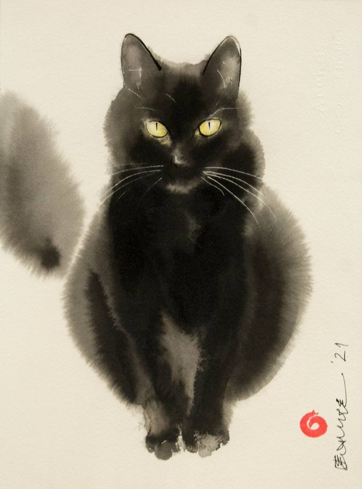
    

# 结尾

看到这里想必大家对IPadapter 有一定的了解，那么如何结合ControlNet 玩转 IPAdapter 呢

详细的内容我会再下节课结合实操演示给大家

# 开头

上节课我们讲到了IpAdapter 的原理以及简单的搭建，相信大家应该有所了解了，

如果还没有完全了解，可以返回再一遍听一节课，

原理讲解确实比较难懂，但是一旦了解了原理，很多参数你就明白了为什么要调整他，什么情况调整什么参数是最优解。

那么这节课呢，我们就稍微玩一点高级的花样

我们结合一下之前的课程，包括controlnet、mask遮罩等，这样可以固定我们的画面信息，再此基础上增加ipadater风格应用，来组合使用一下。

- 结合controlnet工作
    
    我们可以看到官方结合controlnet中的线稿、深度、openpose等信息的表现力都不错呀。
    
    
    
    
    
    
    
    我们试着来搭建一下
    
    首先调出图生图的基础工作流，记得调出seed，
    
    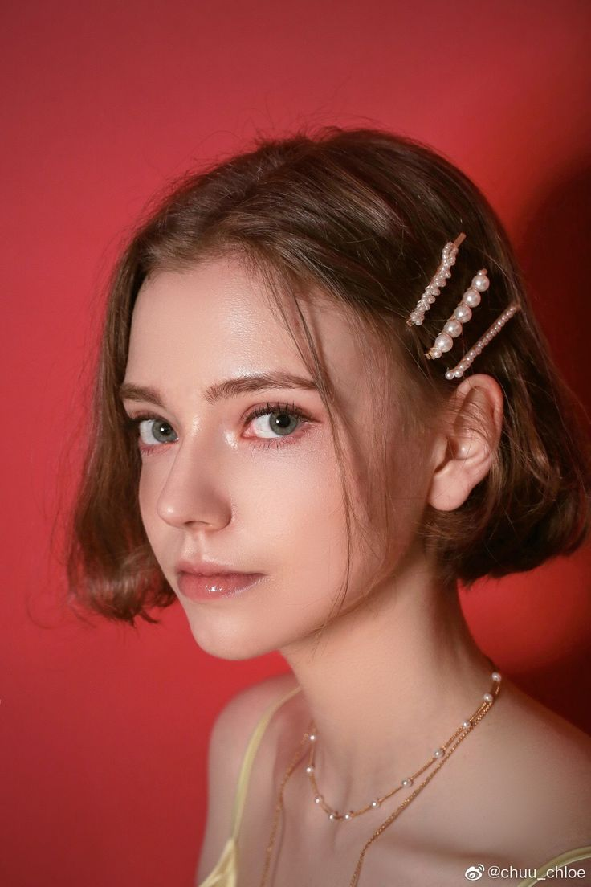
    
    
    
    这里有个小tips，如果模型没有你想要的，
    
    可以下载插件HFdownload，它可以帮你直接下载模型，
    
    
    
    下载好插件之后，记得刷新，
    
    然后调出HF download，model path连接一个show text，
    
    [wuyebei/all · Hugging Face](https://huggingface.co/wuyebei/all)
    
    进入模型地址，并输入模型地址等信息
    
    
    
    同一个模型第一次下载慢一点，后面就会很快，
    
    速度可以到日志里面去查看,\
    
    下载好了记得跟新一下页面
    
    
    
    然后根据下载的模型，修改一下模型和参数，模型选择toonyou，
    
    固定种子：56193772184722
    
    
    
    接着搭建一个lineart的controlnet，调出lineart模型和预处理器
    
    图片是真人头像，所以预处理器就选写实的realistic lineart，
    
    group一下后，调整一下线条,
    
    可以在此基础上点击一下生成，看看能不能跑通，能跑通就ok，我们继续下一步
    
    
    
    最后调出 ipadapter，apply ipadapter, 
    
    选择ipadapter模型sd-light，clip vision模型选clip vision，
    
    weight调小一点，小于0.8，我输入0.5
    
    我把ipadapter图片换成宫崎骏风格图片，点击生成。
    
    
    
    .png)
    
    效果还可以，我们尝试一下换一张ipadapter引用图，换成一张图片，炫彩的图片，
    
    种子：683453551981130
    
    在其他参数不变的情况下，看看生成的图片能否有炫彩的感觉，
    
    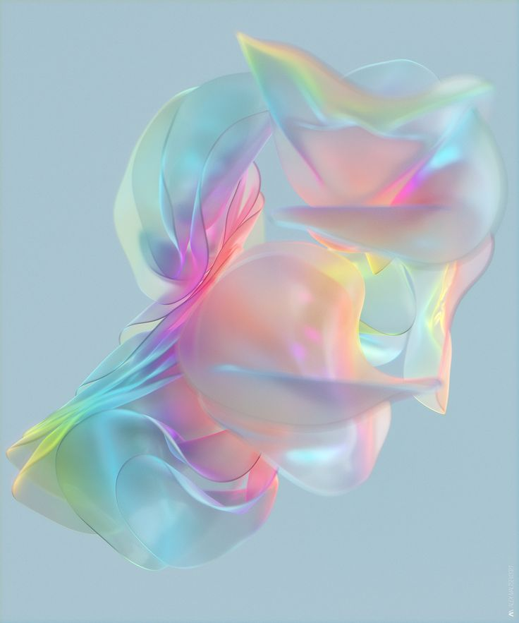
    
    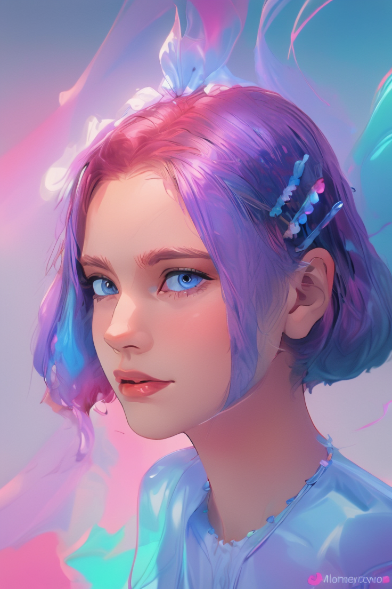
    

- **IP-Adapter Face ID**
    
    除此之外，我们还可以把模型切换成face id，这样就会只会应用脸部,
    
    先删除apply ipadapter，换成apply ipadapter faceid，可以看到在原基础上还增加了一个insightface模型连接，
    
    ipadapter model 模型修改成faceid plus，**lora**
    
    重新输入一张图片，调整weight权重0.8，
    
    
    
    
    
    因为输入的这张图片是个白人，所以选择一个写实模型，（不要选麦橘的，麦橘的对亚洲人效果会比较好，不适用其他人种），我选择realisticvision，没有这个模型的同学需要按照刚刚提供的方法下载一下啊。
    
    种子：932593191983580
    
    
    
    重新输入照片，回到controlnet，把线稿修改成Normalbea，
    
    
    
    
    
    点击生成，对比一下ipadapter的输入图片，效果还可以。
    
    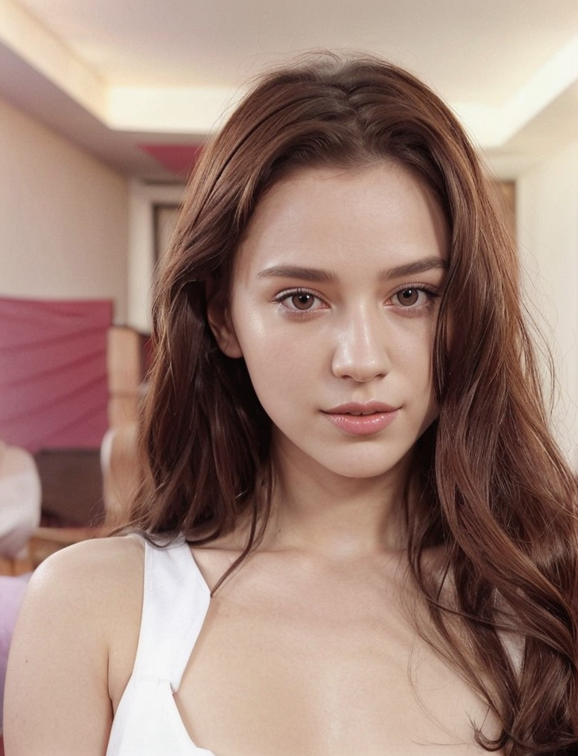
    
    加face id lora，整体融合更好
    
    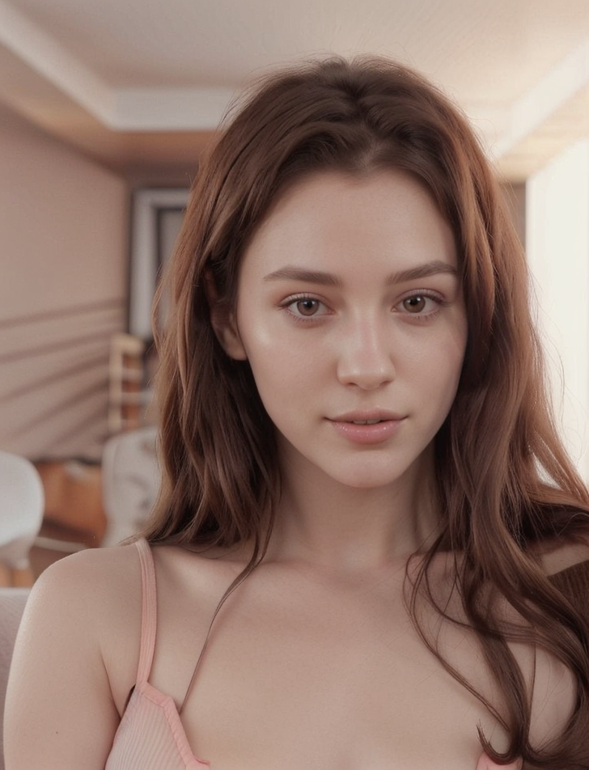
    
    我们再试着换个人种，换个黑人，看看效果怎么样
    
    种子：932593191983580
    
    
    
    还不错，对比肤色，不仅是头部，包括肩膀和脖子的肤色整体都和脸部统一了肤色，效果不错。
    
    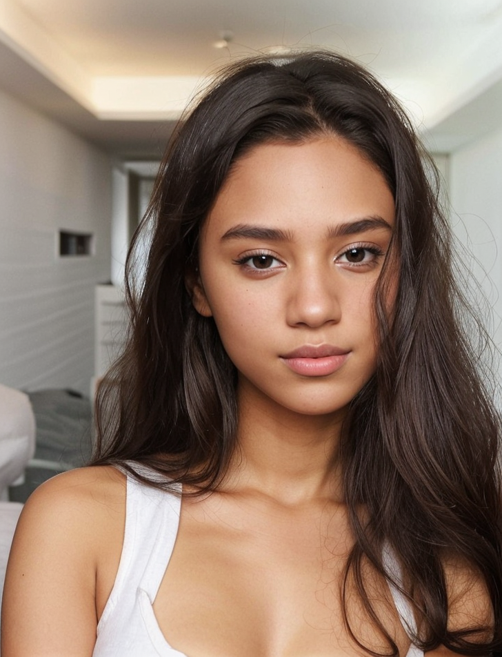
    
    加了lora效果
    
    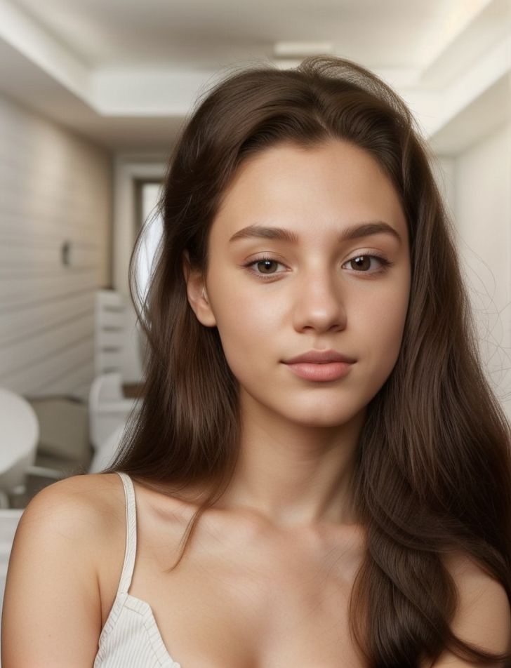
    

- 混合遮罩mask composite + IP-Adapter + controlnet
    
    接下来我们尝试结合mask来选中特定区域 进行ipadapter 的案例
    
    首先搭建以恶图生图工作流，
    
    输入图片，
    
    修改一下模型和参数，
    
    
    
    
    

因为输入的图片是2个女孩，所以controlnet选择openpose，调出模型和预处理器，连好线条

下一步调出ipadapter，输入意向图参考图片，

我只想把左边这个人引用ipdapter，另一边的人不想引用，

那这个时候，就需要增加一个蒙版，这个蒙版只作用于左侧，

这就需要调出 maskcomposite 进行混合遮罩，

调出solidmask 纯块遮罩，

可以看到value是指 明度，当数值为1 时候，遮罩为白色，

相反，复制一个solid mask ， 明度 value 为0 的时候，遮罩是黑色，那我只希望遮一般，就是在原来尺寸修改一半

那他们分别代表什么呢？

白色为需要 ipadpter 的范围，黑色部分是 遮挡不受影响 的范围，

我们 把前面的内容ctrl+m关掉，导出mask遮罩范围，再生成看一下，看看遮罩结果怎么样的？

可以看到左边是黑色，右边是白色，

那我是像修改 左边的人 用ipadapter引用，所以我需要移动一下黑色的区域，

我们可以在x轴调整调整距离，改成256，再点击生成一次，可以看到黑色遮罩部分就往右走了，

最后我们把 混合遮罩 产生的结果mask，连接到上一步的ipadapter，

种子：204329387035999

点击生成，可以看到人物形态依旧保持不变，发型和服装，包括一些细节的地方，都受到了ipadapter参考图片的影响，右边的人物则没有

我们可以试着把 ipadaper bypass掉，意思就是说comfyui在跑这个工作流的时候，跳过这一步，继续下面的内容。

所以我只需要 bypass ipadapter，与他连接的这些都会跳过。

这个功能通常会在我们搭建工作流的时候，检查相关的问题，排除相关问题使用的。

bypass之后，点击生成，明显可以看到ipadapter关掉了，没起作用，

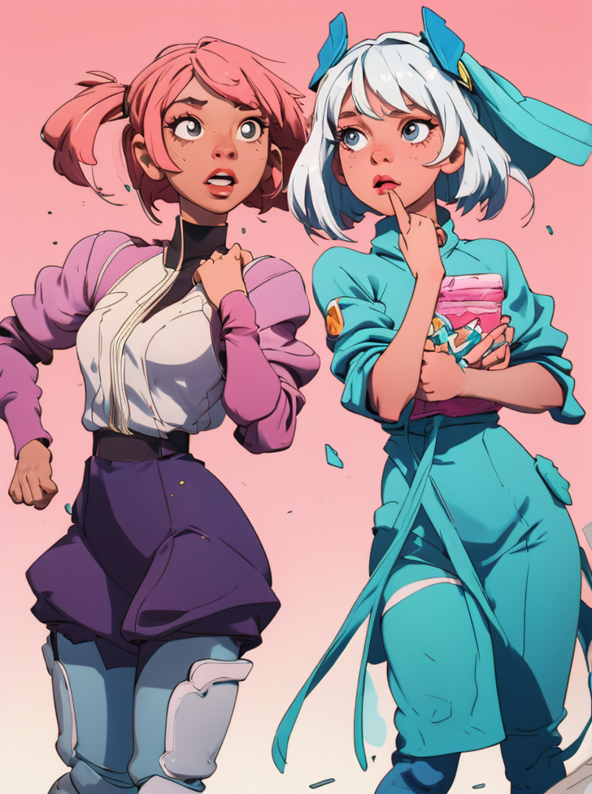

如果我们想把右边的人也用图片引用，只需要复制左侧的ipadapter 和 mask，

修改遮罩的位置，只需要把x轴调整到0就行了，

ipadapter部分连接到上一步的ipadapter，连好线条，输入一张新的图片，

种子：946971251140086

点击生成，可以看到右边的人物也受到了影响，很明显的看到服装的颜色都匹配上了绿色

reference+i2i

# 结尾

怎么样，回看我们刚刚搭建的工作流，是不是逐渐复杂庞大了起来，别担心，每节课我都会分解工作流，使之更好理解。

之后的课程请放慢节奏，下节课我们会 通过搭建更加复杂的工作流，复习之前的课程，如果期间遇见问题无法自行解决，不用慌，你可在破壳丹塔社区提出你的问题。

# 新功能

> [https://www.bilibili.com/video/BV1gz421z7yE/?t=2.05149&spm_id_from=333.1350.jump_directly&vd_source=41b48bc8a934d7b30423d3af0f849a7c](https://www.bilibili.com/video/BV1gz421z7yE/?t=2.05149&spm_id_from=333.1350.jump_directly&vd_source=41b48bc8a934d7b30423d3af0f849a7c)
> 

[workflow (42).json](workflow_(42).json)

- Light - SD1.5 Only (low strength): 此型号非常适合进行最小限度的调整，并且仅与 SD1.5 型号兼容
- Standard (medium strength): 该模型实现中等强度的修改，适用于广泛的应用，平衡细微和明显的改变
- VIT-G (medium strength): 在提供与标准类似的中等调整的同时，VIT-G 模型针对更复杂或更加多样化的图像数据进行了定制，从而有可能在特定场景中提高性能。
- PLUS (high strength): 对于需要进行大规模修改的用户，PLUS 型号提供了强大的创造能力，可以进行重大的改动。
- PLUS FACE (portraits): PLUS FACE 专为增强肖像而设计，专注于改善面部特征，非常适合肖像摄影和艺术品。
- Full FACE - SD1.5 Only (portraits stronger): Full FACE 是 PLUS FACE 的更强烈版本，专为肖像中的戏剧性转变而设计，但仅与 SD1.5 型号兼容。

- Linear: 从pipeline管道的开始到结束均匀地应用权重，确保始终保持一致的影响，而无需调节强度。
- Ease In: 从一开始就逐渐增加权重，以便在pipeline进展过程中顺利引入效果。
- Ease Out: 开始时影响强烈，然后逐渐减弱，在处理结束时有效地减弱效果
- Ease In-Out: 缓入和缓出效果的组合；它以较温和的影响开始和结束，在中间达到峰值以获得最大影响
- Weak Input: 具体减少处理链开始时效果的影响，使得初始元素不那么明显。
- Weak Output: 减少对处理链末端的影响，软化图像的最终方面。
- Weak Middle: 最大限度地减少处理链中点的效果影响，通常是为了保持清晰度或关注开始和结束方面。
- Strong Middle: 放大处理链中心部分的效果，强化对图像核心元素的影响。
- Style Transfer (SDXL): 专为 SDXL 模型设计，此选项专注于将参考图像的风格适应目标图像，利用 SDXL 的功能实现细致入微的风格转换
- Composition (SDXL):针对 SDXL 模型量身定制，旨在合并参考图像和目标图像的构图元素，强调空间内元素的排列和交互。

ipadapter 混合等其他功能

[ComfyUI IPAdapter Plus Deep Dive Tutorial](https://www.runcomfy.com/tutorials/comfyui-ipadapter-plus-deep-dive-tutorial)

## cross attention

**Self Attention**

- 在编码器（Encoder）和解码器（Decoder）中都存在。
- 编码器中的 self attention 处理输入数据中的各元素之间的关系。
- 解码器中的 self attention 处理生成序列中各元素之间的关系。

**Cross Attention**

- 仅在解码器（Decoder）中存在。
- Cross attention 在解码器中用于处理解码器的输入与编码器的输出之间的关系。这使得解码器能够生成与输入数据相关的输出。

### 各层的作用

1. **Layer 1-4**:**数值越大越好**
    - 初始几层主要用于捕捉输入数据和条件输入之间的基本关系。这些层通常会捕捉到一些局部的特征和简单的模式。
2. **Layer 5-8**:**数值越小越好**
    - 中间几层开始捕捉更复杂的关系和特征。这些层次会整合更多的上下文信息，处理更复杂的依赖关系。
3. **Layer 9-12**: **数值越大越精细**
    - 最后一部分的层次主要用于精细化处理和生成最终的输出。这些层次会结合前面所有层次的信息，生成高质量的输出。
    
    
    

1:1—1:1.5—1:2

2:1—2:1.5—2:2

**3:1—3:1.5—3:2——构图层**

4:1—4:1.5—4:2

5:1—5:1.5—5:2

**6:1-6:1.5-6:2—风格层**

7:1—7:1.5—7:2

8:1—8:2—8:3

9:1—9:1.5—9:2

**10:1—10:1.5—10:2**

11:1—11:1.5—11:2

12:1—12:1.5—12:2

