# 2-3. 材质替换

[workflow (9).json](workflow_(9).json)

# 开始

假如你有一个ip形象

你想把这个IP落地，给这个IP在不同场合替换上不同的材质和颜色，怎么办呢

comfyui帮助你满足这个需求，它可以实现，

shopping mall 门口不锈钢材质巨型潮玩 ip、

饰品店/玩具店里面的，可爱 毛茸茸玩偶ip，

精品店里的精致优雅的陶瓷 ip，

最近流行的粘土风格照片，

或者是首饰店里的，金、银、玉石 ip 等等，

这节课程的内容就是ip的材质替换。

# 内容

首先搭建一个图生图的基础工作流，记得把种子调出来。

.jpg)

模型选择写实的就可以了，

lora可以选择一个add-datails增加细节的，这样可以帮助我们增加多一些细节，这样整体质感会好很多。

weight-interprelation：a1111

其他参数默认即可

输入图片，输出图片，

作为一个工作流，每次输入的图片尺寸可能都会有差异，所以我们可以同一 一下尺寸，防止出现过大的尺寸，影响后面的运行速度和表现效果，所以调出upscale latent，

长款为512*768，如果需要裁剪就可以在选择crop，center指的是从中间开始计算上下左右的尺寸，裁剪掉边缘。

搭建好图生图之后，肯定需要controlnet控图，

那么调出apply controlnet，连上模型和预处理器，

这里分别用到的是线条控制lineart 和 depth，

我们可以看到apply controlnet 和 controlnet 这两个节点是重复的，在这个工作流中重复一步还是可以接受的，但是后面有更加复杂的工作流，需要调取最少3个controlnet的情况，就会显得很繁琐，那有没有比较好的方法呢

这里介绍一下可以集合contrlnet模型的小方法，调出multi-controlnet stack，可以看到可以输入3个controlnet，记得打开switch 才能被应用，在controlnet输入对应的模型，外接对应的预处理器，一一匹配就可以

接着我们可以使用一个IPadapter来引用不同材质的图片，因为只通过提示词的描述不够精准，ipadapter会更加直接一些。

整理一下线条

这样整个工作流已经搭建完了，怎么样，是不是比你想的简单多了。

这有个小tips，如果我们想要在最后查看对比图，每次都要拉过来，如果这个工作流特别特别长的话，拉过来就比较麻烦，当然我们之前会适用reroute来帮助我们，但是还是不够便捷，

这里介绍一个新的小节点，叫做anything everywhere，只需要把它接到输入图片的位置，

那么在image comparer中，图片b就可以不用连了。

这个小技巧可用可不用，看个人的习惯。

现在我们开始实践一下整个工作流。

### 1

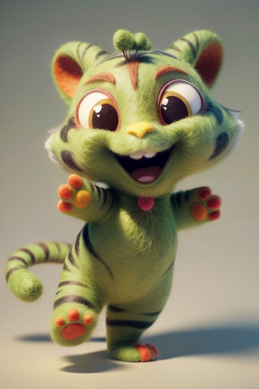

开始我们的案例一：

我想把这个小老虎变成毛茸茸的感觉，所以我找了一张这样的图片，可以清晰看到毛茸茸的质感

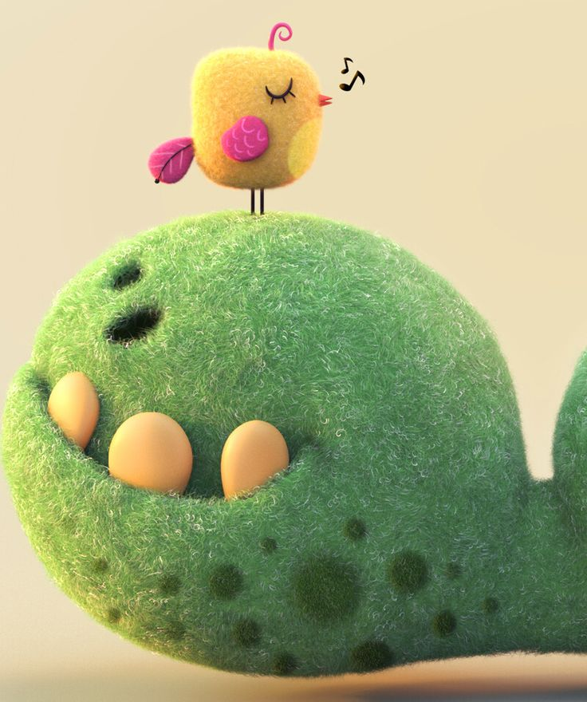

种子：668188940009877

输入提示词，大家可以跟着一起，输入同样的提示词看看效果

正向：a tiger, fluffy and cuddly appearance,Pixar using C4D software,soft lighting techniques, high definition, felt material,

一只老虎，毛茸茸的，可爱的外观，皮克斯使用C4D软件，柔和的照明技术，高清晰度，毛毡材料，

反向：

nsfw,text ,watermark,(worst quality:2),(low quality:2),(normal quality:2),lowres,watermark,monochrome, face,(hand, hands:1.5),(figure:1.5),

点击生成，怎么样，很可爱把

### 2

我们换一张引用图片看看，

我找了一张颜色很丰富的粘土风格的图片

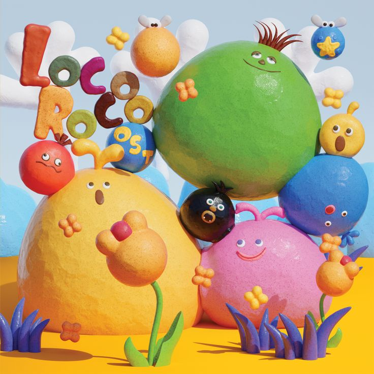

种子：427969483811755

修改提示词，

正向：a white tiger,black eyeballs, colorful cartoon characters,claymation,clay model,in detailed clay texture,cute,

白虎，黑眼珠，彩色卡通人物，粘土，粘土模型，在详细的粘土纹理，可爱，

反向提示词不用修改，点击生成

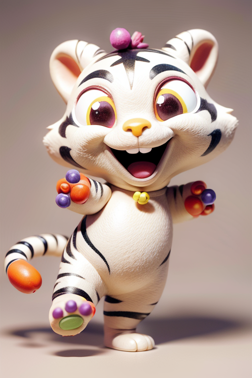

看到风格立马有变化了把。

### 3

再来试试很酷的炫彩，

种子：376123363737838

正向：a tiger,iridescent holographic background, pastel color, pastels, grainy, 90s style, by Kentaro Miura, 3d render, abstract, wavy shape, white and silver,

一只老虎，彩虹全息背景，柔和的颜色，粉彩，颗粒状，90年代风格，三浦健太郎，3d渲染，抽象，波浪状，白色和银色，

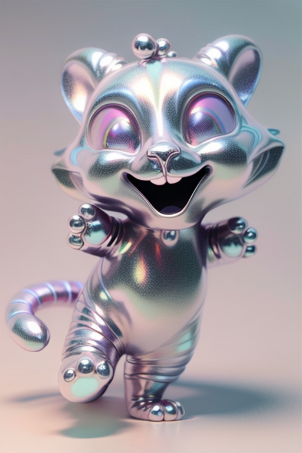

是不是很潮

### 5

我现在想要把它变成一个挂坠，我就找了一张金色的图片

种子：54662554146605

修改提示词

a tiger,liquid gold,3d rendering, high resolution, professional photograph, HDR, highly detailed and intricate, clean sharp focus

一只老虎，液体黄金，3d渲染，高分辨率，专业照片，HDR，非常详细和复杂，干净锐利的焦点

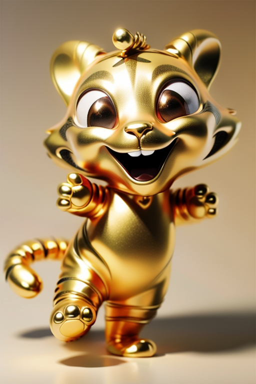

### 6

我现在不想要金的挂坠，我想要玉石的挂坠，

换一张这样的意向图，

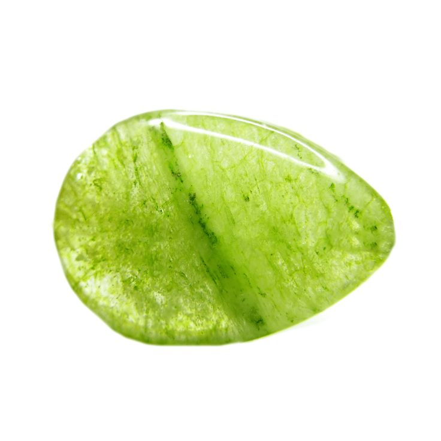

种子：235788539231827

修改提示词

a tiger,light green stone,delicate veins inside,translucent, sparkling， intricate patterns，green quartzite gemstone，polished finish,

一丝丝，淡绿色的石头，里面有精致的纹路，半透明，闪闪发光，图案错综复杂，绿色的石英岩宝石，抛光抛光，

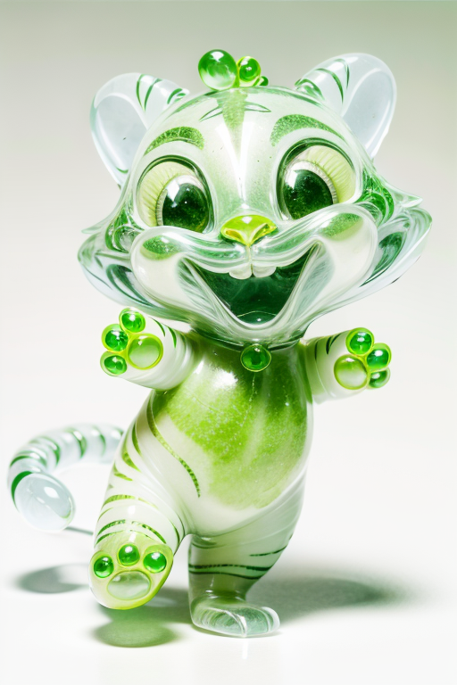

### 7

再换一个毛线材质的，

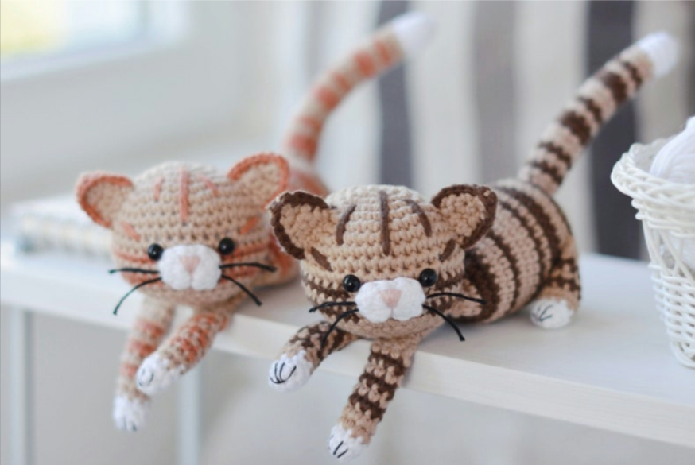

922237525355004

a tiger, made with crochet, featuring stripes and tabby patterns in light brown and white colors,

一只用钩针编织的老虎，上面有浅棕色和白色的条纹和虎斑图案，

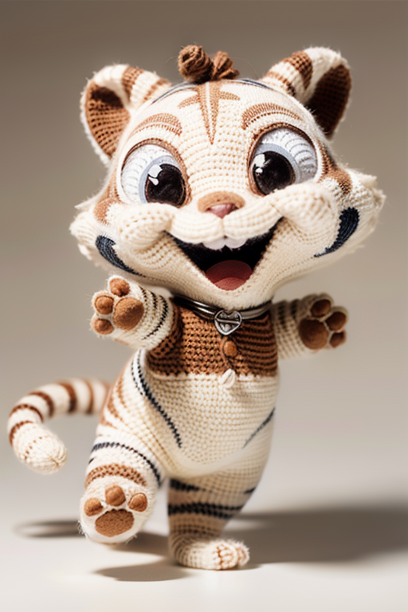

### 8

再换一个陶瓷材质的，

1004961584330626

a tiger, blue and white porcelain,exquisite patterns of flower designs on its body,in the style of Chinese art,

一只老虎，青花瓷，身上有精美的花朵图案，具有中国艺术风格，

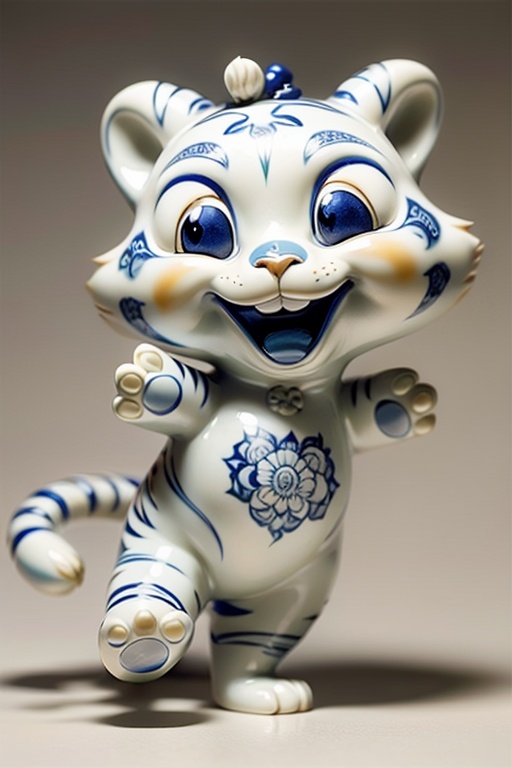

是不是效果都很不错，大家都可以尝试一些意想不到的材质试试看效果。

# 结束

ComfyUI里这种类型的应用工作流特别多

材质转换属于比较简单的工作流，那么下节课我们将学习相对复发的工作流