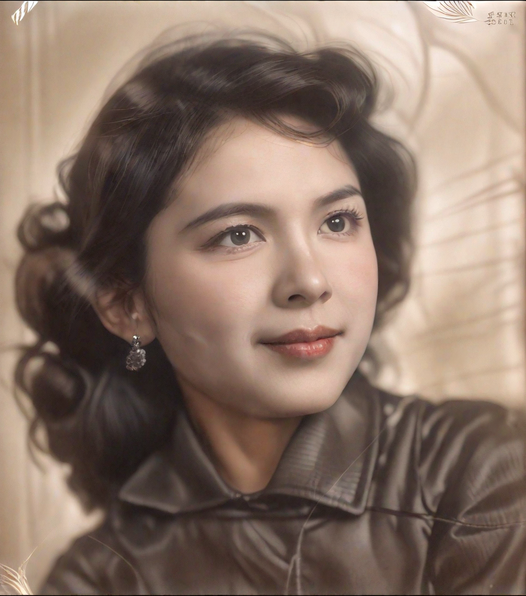
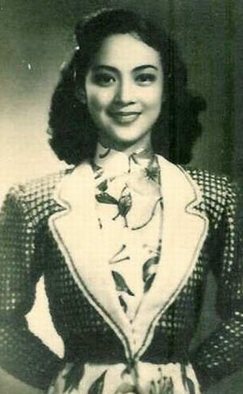
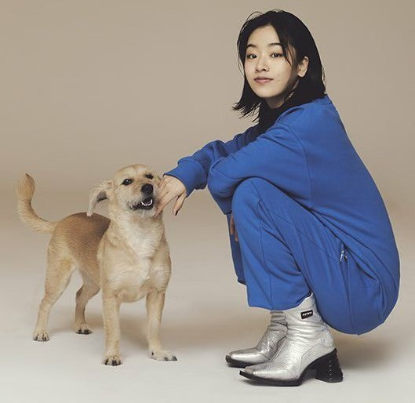
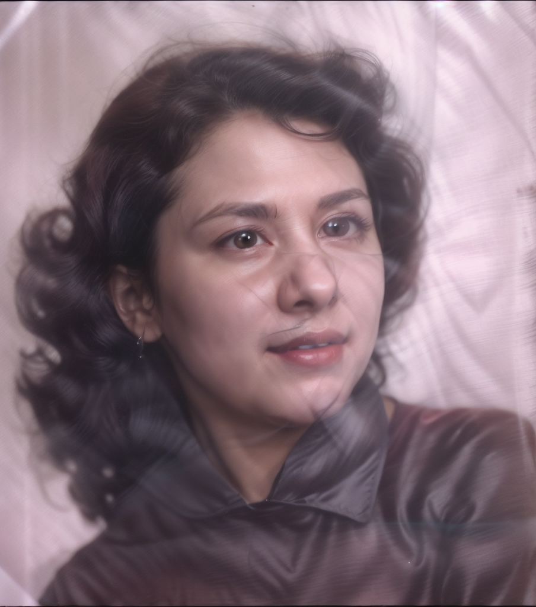
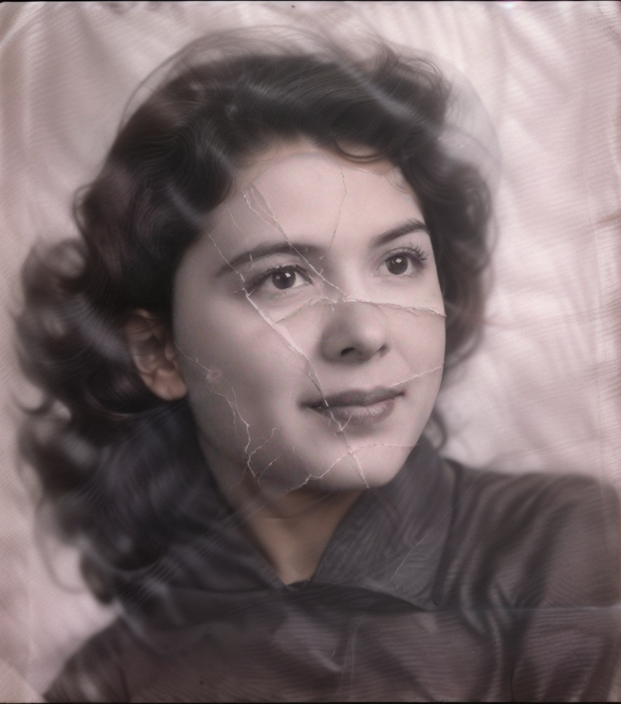

# 2-4. 老照片修复

# 开头

相信大家都听过或者看过老照片修复吧

可以去某宝上看看，修复还原一张老照片市场还是不小的

在stable diffusion 生图之前，想要一张失真的老照片修复，那ps步骤可谓十分复杂

现在有了stable diffusion 老照片修复的复杂程度明显降低了不少，

而有了ComfyUI工作流，老照片修复的效率更是以指数的提高

那么这节课程内容就是，搭建一个老照片修复工作流

这也是我们面对的，第一个比较复杂的工作流

# 内容

第一步——修改尺寸+放大高清

拿到一张老照片，我想要修复他，第一步应该做什么？肯定是先放大高清一点。

那我们需要输入我们的老照片，然后调出放大的supir upscale，

supir model 和sdxl 模型记得选择，

scale_by放大倍数 1，我们只要在原照片基础上，高清一点，尺寸保持一致即可，不需要放大很多，因为图片越大，后面速度就越慢。

color fix type颜色类型，修正

根据我们之前的课程讲到放大的原理，是把图片进行裁切，裁切的尺寸是可以设置的，默认是512.

如果这时候我老照片的尺寸远小于512怎么办？

这时候可以调整一下尺寸，因为后面分块放大的时候通常都按照512的比例，所以我们可以把图片尺寸调整到1024

另外考虑到，有时候老照片是带有边框的，像是这样的，就可以根据具体的需要，裁剪一下

这里给大家介绍一个功能很多的插件https://github.com/chflame163/ComfyUI_LayerStyle，其中调整尺寸的节点 image scale by aspect ratio，是该插件的一小部分，我们后面会介绍这个插接的其他常用节点。

我们先调出 image scale by aspect ratio，可以看到其中：

- aspect_ratio：调整图片的帧比例。original是保留原始比例，custom自定义比例。
- percentage_width：当aspect ratio为自定义的时候，可以在这输入宽度。
- percentage_height：自定义的时候设置高度
- fit：缩放宽高比模式。当原始图片的宽高比与缩放后的尺寸不匹配时，有三种模式可供选择，
    
    letterbox：保留完整的边框，用黑色填充空白处；
    
    crop：保留完整的短边，长边的多余部分将被剪掉；
    
    fill：不保持边框比例，按宽度和高度填充屏幕。
    
- 方法：缩放采样方法，之前讲过了，我们一般选 Lanczos，效果和速度综合最好。
- round_to_multiple：四舍五入倍数。例如，将其设置为 8 将强制宽度和高度为 8 的倍数。
- scale_by：允许按最长、最短、宽度或高度的指定尺寸进行缩放。
- scale_by_length：这里的值用于`scale_by，`指定边的长度。

这样就调整好了，

把它与输入的图片进行连接，还可以在此基础上增加一个image comparer作为效果对比。

点击生成，可以看到图片最长边的尺寸被调整到了1024

在此基础上我们进行一步高清放大， 目的是使图片更加清晰，同时也方面后面使用controlnet识别。

点击生成

我们可以看到虽然脸部是放大清晰了，但是照片上有很多的折痕/划痕，非常的明显，这么处理呢？

这里需要介绍一个新的工具,它是通过mask遮罩来移除一些东西，然后自动补充，遮罩的部分。

[https://github.com/Layer-norm/comfyui-lama-remover](https://github.com/Layer-norm/comfyui-lama-remover)

我们可以来试一下，调出lama remove object， 输入一张图片，比如说这张，我想把狗去掉，我手动涂抹狗，

当然这里我们可以选择自动蒙版，但是，我们的目的是涂抹老照片的划痕，每张照片划痕的位置、范围都不一样，所以这一步只能选择手动，

简单的对狗进行涂抹，点击生成，我们可以看到狗消失了，并且自动在狗的位置补充了内容。

不需要输入关键词告诉他生成什么内容。如果你需要在此基础上生成其他内容，比如说一直猫，那可以参考第一章节的局部重绘的课程。

我们回到工作流，把生成的图片与 lama remove object 进行连线，这时候就出现一个问题了，上一步生成的图片会直接导入remove的话，在生成过程中，怎么手动增加蒙版呢？

我们可以增加一个 image sender 图片发送 和 image receiver 图片接收器，这样就可以断开工作流了。

我们调出 image sender，设置他的id为0，连接上一步放大后的结果。

再调出image reveiver ， 修改id与sender 相同即可，并与 lama remove object 连在一起

点击生成，

出现报错是正常的，因为我们没有输入mask蒙版的内容，

关掉报错，手动涂抹蒙版，

如果图片没有折痕破损的话，可以在其他，不影响画面的地方，点一下就行。

点击生成，看看是否成功运行。

那这一步处理照片褶皱，就被解决了。

接下来的照片就可以让ai帮我们重新生成了，生成图片的过程中，我们还需要通过controlnet来控制一下画面信息，

人像照片，首先想到的就是用 openpose 和 depth，需要保留脸部光影的话，还可以增加normalbae，

那我们把他们都一一调出来，

可以看到 除了预处理器，

controlnet model 和 apply controlnet 都是重复的，那有没有什么插件可以把这些重复的内容集合一下，我们只需要做一步就好了呢？

有的，有个插件叫做 comfyroll custom nodes ，

[https://github.com/Suzie1/ComfyUI_Comfyroll_CustomNodes](https://github.com/Suzie1/ComfyUI_Comfyroll_CustomNodes)

其中有一个功能就可以把模型集合起来，不仅是集合controlnet的模型，还可以集合checkpoint模型，lora模型，

而且不仅可以把多个1.5的模型结合起来，还可以集合1.5和xl模型可以把模型，帮我们省去了很多重复调出节点的步骤。

所以这里我们可以，调出 muti-controlnet stack ，看名字就知道它是把多个controlnet组合放在一起。

每个 switch 都可以连接一个controlnet模型，switch代表开关，1、2、3的开关分别控制三个不同的controlnet，

正常情况下三个controlnet是够用的，你要是觉得还不够用呢，可以再controlnet stack再加一个一个multi-controlnet stack，他可以一直无限叠加的。

打开开关之后，再controlnet栏可以选择你想要的controlnet模型，下面分别是模型的权重，开始和结束 代表controlnet 模型 在生图过程中的，开始作用时间和结束作用时间。

输入的分别是 由 相关 controlnet 预处理器生成的图片。

所以我现在调出我想要的三个controlnet预处理器，分别是dwpose、dsine normal map、zoe depth anything。并分别连接到图片1.2.3，并根据顺序调出相应的模型。

这样，controlnet的部分就处理好了。

接下来需要把controlnet和图生图基础工作流，进行组合。

调出图生图工作流。记得调出种子：416549118351813

我们发现原先的controlnet是连接的conditioning，现在的换成multi-controlnet stack后，输入端和输出端，没有conditioning了，

那我们看看有没有其他的连接方式，

可以看到multi-controlnet输出的是controlnet stack，而efficient loader输入端口有一个c net stack，我们拉一条线，看看是否可以连接上，果然连接上了，看来 c net就是controlnet的意思。

由此可见，上面的lora stack 也是可有 连接 lora 组合节点的。

接下来我需要考虑在生图的过程中，我们需要调整上面。

首先是底模、lora、关键词、参数等信息。

首先**模型**可以选择麦橘、realistic vision 等写实人物，这张老照片式看起来并不是亚洲人，所以我会选择realistic vision，lora可以不选，或者可以选择上节课我们学到的 ipadapter faceid，如果使用这个lora的话，我们就需要增加ipadapter faceid节点，那么我们就需要一张引用的图片，我们当然不能另外照一张图片引用，这样的话就不像本人了，所以我们可以引用他自己。

关键词我们可以简单一些，1gril就可以了，

反向提示词：easy negative,

怎么调出easy negative呢， 在webui中我们是几点选择就可以了，comfyui中我们需要在前面输入embedding，就会自动跳出来让你选择。

为了让没有webui基础的同学听懂，我这边解释一下：easy negative 就是一些常用的写实人物的反向案例，的集合, 我们可以把好看的图片训练成一个模型，放在正向提示词中，那么我们也可以训练一批丑的、缺胳膊少腿的，然后把他放在反向提示词当中。

[EasyNegative - EasyNegative | Stable Diffusion Embedding | Civitai](https://civitai.com/models/7808/easynegative)

然后选择采样器 euler a，karras，

最后可以把重回幅度 调整到0.5左右，太大的话会导致与原图不像，所以最好在0.5以下，但是太小的话，会导致变化不大，那就等于没有修复，所以0.5左右比较合适

最后调出图片，增加一个image comparer与原图做对比。

最后组织一下线条，分类组块。

点击生成，

对于生成好的图片我们进行分析，

可以看到虽然姿势是保持了一致，但是脸型没有控制住，还有眼珠子的细节有点偏差，鼻头也有点不一样，额头的发型也有点变化，嘴唇的部分也有轻微的变化。并且颜色整体也不和谐。

有那么多的问题，我们把问题总结分类以下：1.是颜色问题；2.是五官和脸型的细节问题

我们解决问题的思路是：1.寻找生产问题的地方，并查看能否通过修改参数解决 ； 2.前面解决不了的，看看能否往后增加节点来解决

我们把问题一个个捋清楚，并分类。

- **颜色问题，我们往回找原因，可以控制颜色有关的参数有三点，**

1.是提示词，我们给的提示词过于简单，没有任何的颜色参考，我们可以在此基础上增加一些细节，比如说 black hair, red clothes, red lips, brown eyeball, white simple background,

2.是底模，有些底模颜色只有黑白灰，那么画面颜色就会收到影响，或者选成了二次元动漫的模型，也会有影响。这里我们使用的是realistic vision的模型，应该是没有问题的。

3.denoise重绘幅度，重绘幅度开小了，开大一点的话色彩可能会更加丰富一点，但是人也会更加不像，所以不能调整。

- **颜色问题，我们往后增加节点，看看能否解决，**

这里给大家介绍一个节点叫做color adapter，是属于layer style插件的，

他的作用是，自动调整图像的色调 以类似于参考图像。

[https://github.com/chflame163/ComfyUI_LayerStyle](https://github.com/chflame163/ComfyUI_LayerStyle)

我们来试试看使用方式和效果，

调出color adapter，其中
• opacity是不透明度：用于调整图像 色调后的，不透明度。100是指完全不透明。

输入端  分别输入需要调整的图片image，以及意向参考颜色的图片，

我们简单搭建一下试试效果，

用彩虹作为意向图，透明度为100，

点击生成可以看到颜色分布并不是根据原有颜色分布来的，

而是选择颜色明度来的，原图的浅色背景，对应了彩虹中的粉色、黄色，

原图重色是头发，相对应的彩虹的蓝色、紫色

回到原来的工作流，调出coloradapter，

原图就连接修改瑕疵之后的图片，参考图片呢，就选择刚刚生成的图片，

这样生成的图片就能保持原图人物的形态了，同时也有了颜色，

通过了第一个问题的解决，顺带把第二个五官和脸型的问题解决了

如果你觉得不够，觉得颜色对比上面直接生成的图片弱了点，想要取两者的中间值，可以在这个基础上增加一个blend，当然这一步是可做可不做的，大家在实际操作中根据自己的需求灵活使用。

这里介绍一个好用的混合节点，image blend by mask，

可以看到它在输入端，需要输入2张图片和一张mask，这里的mask必须是图片类型的，所以相当在输入端输入了3张图片，

.png)

我们来随机输入3张图片，第三章图片需要通过layermask：segment anything ultra v2来选择蒙版的范围，在最后prompt输入蒙版范围，比如说选择2 girls，最后点击生成

可以看到第一张图片是作为底图，放在最下面的图层，

第二张图片与第三章图片进行了混合，混合的范围是，以第三张图作为蒙版的形态，

抠除了第二张图，并透出最底层的图片。

如果我把prompt 改成 background，再生成一下，可以看到蒙版的范围就反过来了。

那回到工作流，我们需要好好想想每张图的摆放顺序。

首先看到直接生成这张图，它的脸型和五官是有点点问题的，所以不能放在最底层，照片可取的地方是背景和衣服，所以我们，把它放在第二层，并通过抠除原始图片的background，hair，cloth，来把黑白的背景放在mask的位置，

最后把通过color adapte的图片放在第一层，这样生成看一下

我们可以看到生成的结果，脸部五官和脸型保留了，衣服和头发、背景的细节也多了一些，

但是额头有稍微一点没有衔接的自然。

那我们可以通过图生图，并降低重绘幅度denoise到0.3左右，再生成应该就会在此基础上优化一点，我们来试试看

如果这一步效果不好的话，我们可以选择controlnet tile试试效果，

生成的结果还行，那我们可以进行最后一步了，高清放大，

调出supir upscale， 记得这里是xl模型，不能选1.5的模型，

点击生成，怎么样，是不是很不错，我们还可以多尝试其他老照片，看看效果是不是一样好

672651955921609

几个小tips：

- anything everywhere:默认对比图就是这张，image compare 就只需要拉一个新生成的图片就行，对比的原图那就可以不同，从老远的地方拉过来了。
- 最后save to workflow保存为工作流，注意名字不要用中午，

      下次使用就可以从load中调取出来了。

# 结尾

经过这节课，相信大家对于一个复杂工作流的搭建、分析、解决问题有一定的了解了，

之后我们将学习更多复杂的工作流

[workflow_old photo.json](workflow_old_photo.json)