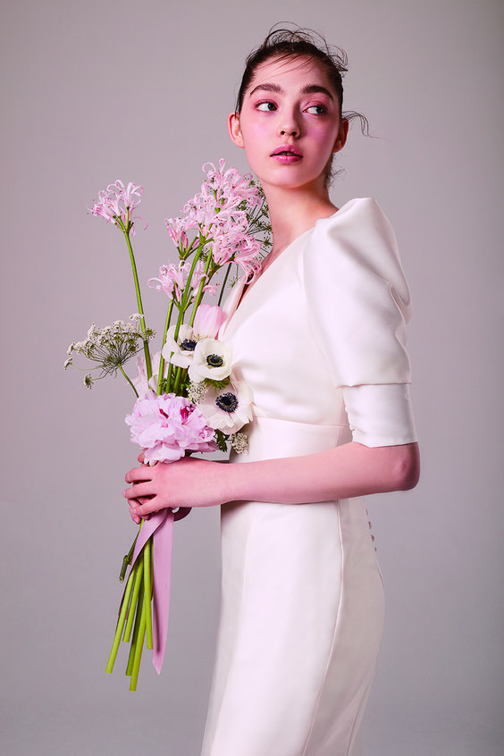
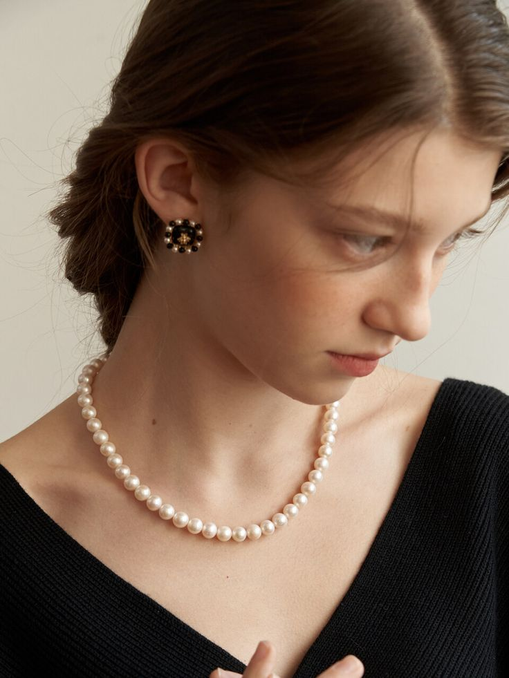
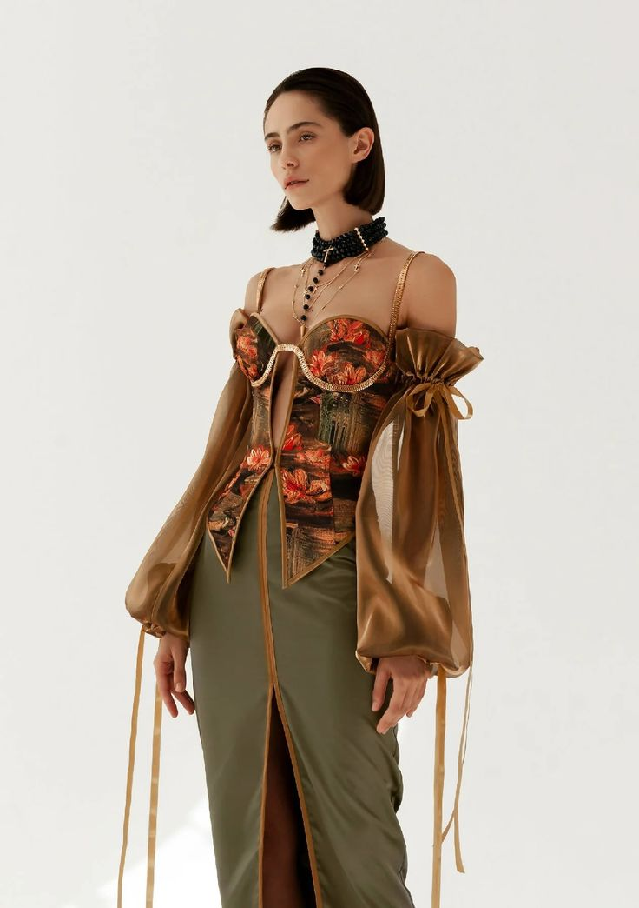

# 2-5.精准抠图与蒙板的多样组合

[workflow_mask final.json](workflow_mask_final.json)

# 开头

还记得第一章中我们提到的Mask节点吗

如果没有印象可以返回再看看

那节课的内容主要还是初级的蒙版，

在真正的实践中，还是远远不够用的，

所以这节课，我们会把重点放在，蒙版的高阶用法 和组合使用当中

# 内容

### sam segment(segment anything)之前课程方法

之前我们常用的自动蒙版插件是segment anything，

一般应用在简单的图片的时候，是非常够用的，

但是在面对复杂图片，需要细致抠图的时候是稍微有点不够的，

比如说：我们在扣人物的时候，这个时候人物有很多零碎的头发，那这个时候segment anything的表现效果就很不够了。

我们来看看输入一张图片看看 segment anything 的表现效果。

调出 sam segment , 调出相应的模型，分别是 sam model 和 grounding dino model,

再prompt输入 需要抠除的内容： girl, flowers

输入图片，输出分别为 image 图片 和 mask ，

以前我们输出mask 为图片的时候，需要 调出 mask to image 节点，

这里给大家推荐一个可以节省这一步的节点， 叫做 mask preview，

这个节点有2个，分别属于不同的插件，功能和表现效果是一样的，大家随意选取。

最后加一个image comparer作为对比。

最后点击生成看看效果。

我们可以看到，最明显的是头发丝的部分，耳朵旁边的发丝没有识别出来。

最上面的零碎发丝虽然识别出来了，但是没有扣的很细，导致了一部分背景也包括进来了。

如果这时候，你是想把这个模特换个 背景颜色，那么颅顶发丝部分的背景，就会影响最终效果表现。

还有，当我们放大这个蒙版图片的时候，可以清楚的看到边缘的锯齿状，这个情况不利于后期，人物与新背景的融合，可能会导致人物是p上去的感觉，不融合。

所以，我们需要更高阶的、表现力更好的自动扣蒙版的插件。

### layermask: segment anything ultra v2

之前课程介绍的过一个功能强大的插件，叫做layer style，

[https://github.com/chflame163/ComfyUI_LayerStyle](https://github.com/chflame163/ComfyUI_LayerStyle)

其中对于mask的处理有很多，这节课我们主要介绍

bi ref net ultra、mask grow、person mask ultra v2、segment anything ultra v2、

其中后面带v2就是迭代版本，我们一般用迭代版本。

其他mask的应用，使用频率没有那么高，

如果使用到的话， 我们会在后面的课程再讲。

我们首先，调出segment anything ultra 2 ，和sam segment anthing 节点对比看看有什么区别，

可以明显看到ultra 2 的前2个参数就是 sam segment anything的2个外接模型，所以我们就可以省略接入模型这一步骤了，

然后看到threshold 阈值，和promp 和上面也是一样的，其中prompt 自带了个 subject主体，所以我可以不用输入提示词，直接生成，这个画面的主体，如果你想要更加精确一点，可以修改成girl, flowers，和上面一样，控制参数。

除此之外，还多了很多其他的可调节参数：

- sam_model：选择 SAM 模型。
- ground_dino_model：选择接地 DINO 模型。
- 阈值：SAM的阈值。阈值越低，扣的内容就越多，阈值越高，扣的就越少。
- detail_method：边缘处理方法。提供VITMatte、VITMatte(local)、PyMatting、GuidedFilter。VITMatte是新增的 边缘处理方法，效果比较好，但是大于2K的图片使用此方法会消耗大量内存。

      如果在第一次使用VITMatte后已经下载了模型，则可以随后使用VITMatte (local)。

- detail_erode：从边缘向内mask侵蚀的范围。值越大，向内修复的范围越大。
- detail_dilate：mask边缘向外扩展，值越大，向外修复的范围越广。
- detail_range：边缘细节范围。
- black_point：边缘黑色采样阈值。
- white_point：边缘白色采样阈值。
- process_detail：此处设置为 false 将跳过边缘处理以节省运行时间。

了解了参数之后呢，我们连接图片，

复制上面的 图片查看，

创建group，

再增加一个image comparer 作为对比，

点击生成，

来比较一下效果，

可以清楚的看到颅顶的发丝的效果， segment anything ultra v2 的效果好很多，耳朵边缘也处理的更好，

另外蒙版边缘的锯齿状已经消失了，扣的算是很干净了。

### layermask: bi ref  net ultra

接下来我们讲一下 bi ref net ultra, 调出该节点。

可以看到它的边远处理方法和上面 segment anything ultra v2是一样的。

除此之外的参数都一样的。

有区别的是它没有 sam和 dino的模型，也无需输入prompt提示词。

因为它的原理是使用 BiRefNet 的模型去移除背景的。

- detail_method：边缘处理方法。提供VITMatte、VITMatte(local)、PyMatting、GuidedFilter。如果在第一次使用VITMatte后已经下载了模型，则可以随后使用VITMatte (local)。
- detail_erode：从边缘向内掩盖侵蚀范围。值越大，向内修复的范围越大。
- detail_dilate：mask边缘向外扩展，值越大，向外修复的范围越广。
- black_point：边缘黑色采样阈值。
- white_point：边缘白色采样阈值。
- process_detail：此处设置为 false 将跳过边缘处理以节省运行时间。

根据官网的介绍 ，使用这个节点，需要在此基础上下载相关的模型，

目前我们云端缺失了2个模型，需要同学们自己下载一下。

下载的具体方式需要打开hugging face 的模型地址

[https://huggingface.co/ViperYX/BiRefNet/tree/main](https://huggingface.co/ViperYX/BiRefNet/tree/main)

需要下载的是这两个模型，

调出 hf download, 输入相关信息。

记得把其他内容关掉，点击运行就行了。

模型准备完毕之后，复制上面的图片、mask 和对比图，

左边的mask可以选择不连接，因为在输入的图片中有一个anything everywhere，所以没有输入连线的图片，会默认连到这张图。

组好group，最后加一个image comparer，

点击运行就可以了。

可以看到和上一张是有一些区别的，比如说头发的细节，颅顶的碎发全没有了，

脖子后的碎发也少了一些，

花的范围更加清晰了，清晰的同时少了一朵花。

所以 bi ref net ultra 的特征是：有更好的识别能力，以及 超高的边缘细节

### layermask:person mask ultra v2

接下来再介绍一下 person mask ultra v2, 这是专门用在人物上的mask，调出节点，

可以看到上，上半部分参数都是关于具体部位的，包括脸部、头发、身体、衣服、配饰（首饰、背包的识别）、背景，这些参数打开就是enabled，关掉就是disable。

其他参数都和上面一样，其中confidence就相当于 threshold阈值，

- confidence：识别阈值，值越低，输出的mask范围越多。
- detail_range：边缘细节范围。
- black_point：边缘黑色采样阈值。
- white_point：边缘白色采样阈值。
- process_detail：此处设置为 false 将跳过边缘处理以节省运行时间。
- detail_method：边缘处理方法。提供VITMatte、VITMatte(local)、PyMatting、GuidedFilter。如果在第一次使用VITMatte后已经下载了模型，则可以随后使用VITMatte (local)。
- detail_erode：从边缘向内掩盖侵蚀范围。值越大，向内修复的范围越大。
- detail_dilate：mask边缘向外扩展，值越大，向外修复的范围越广。

复制上面的图片输出，

接着复制5个，看看每一个可控制蒙版的效果怎么样。

可以看到 颅顶的头发的 效果还不错。

衣服的识别缺了2个角。

配饰没有识别到，因为原图也没有配饰。

最后把花也识别成背景了。

我们再复制一个，除了背景，其他都打开，看看与bi ref net 的区别，最后加一个image comparer作为对比。

点击生成，image b  应该没有颅顶的头发的，怎么对比图会有呢？

因为生成的图片是rgba格式的，我们需要把rgba格式调整到 rgb，这样没有透明图层影响，就会正常了。

调出image remove alpha，并打开fill background，意思就是有个颜色会填充到背景，颜色可以通过下面参数调整，连好线，再次点击生成。

可以看到原先是透明的背景，现在已经填充了颜色，图片对应也是正确的。

再看看这个图片的对比，身体和服装的部分， bi ref ultra 比 person mask更好。

头发部分，因为 bi ref ultra 没有颅顶碎发，所以我再连一个 person mask 和 segment anything ultra v2 的对比。

可以看到 颅顶头发的部分， person mask 对发丝的表现力更好。

### layer mask： mask grow

接下来再给大家介绍一下mask grow，常用于处理mask的边缘。

其中 ：

增大和缩小边缘并模糊蒙版

- invert_mask：是否反转mask。
- 增长：正值向外扩展，而负值向内收缩。
- 模糊：模糊边缘。

我们分别复制三个，修改不同的参数看看效果。

其中grow可以设置负数。

### marigold depth estimation

除了以上的layer style的插件的蒙版使用方法以外，

还有可以通过depth 深度来控制蒙版范围的。插件名称叫做marigold。

[https://github.com/kijai/ComfyUI-Marigold](https://github.com/kijai/ComfyUI-Marigold)

我们可以调出相关节点，marigold depth estimation, 

`seed`: 种子数

`control after generate`：生成后控制模式，可以选择randomize 随机，或fix固定种子，和采样器的种子控制方法一样的。

`denoise_steps`：每个深度图的步数，步数越多，准确性越高，但也不是越高越好。

`n_repeat`：需要组合成，单个深度图的迭代次数，步数越多，准确性越高，但也不是越高越好。

`n_repeat`：重复次数

`regularizer strength` 

`reduction method` 

`max iter` 

`tol` ：（容差），是集成过程的设置，

`invert`：默认情况下，marigold 会生成深度图，其中黑色是正面，对于控制网等，我们想要相反的效果 **（打开）**

`keep model loaded`：确保模型是加载状态

`n_repeat_batch_size`：n_repeats 中有多少个是作为一批处理的，如果你有 VRAM，这可以匹配 n_repeats 以实现更快的处理速度，于电脑配置有关，一般默认就行，跑不动的话，可以调低。

`use fp16`： fp16 可将内存使用量减半。

`scheduler`：

`normalize`：

Marigold 的运行分辨率约为 768p，因此建议调整大小，在更高分辨率下，您的里程可能会有所降低。我添加了一个重新映射节点以更好地查看整个范围，并添加了 OpenEXR 节点以保存整个范围，与 VFX/3D 建模软件中使用的默认 png 相比，效果非常好。

接下来我们连一个image 看看效果是怎么样，点击生成

生成的图片是深度图，怎么转成mask那种只有黑白色的图片呢？

这里需要把 图片转成 mask， 调出 image to mask，channel是颜色通道，保持默认就行，

再把mask转成二次的蒙版，就是只有黑白色的，

调出 binary mask，这个threshold 阈值，数值越高，范围就越大。

这里我设置成150.

点击生成，可以看到我们的深度图，就变成了mask

最后把我们的mask 转成 image， 然后对比上面的扣的最细 bi ref net ，可以看到头发和花瓣的部分扣的很细，

除了花茎之外，depth 扣的比 bi ref net 细一些，

但是有一个问题是，depth 抠出来的图片，边缘有锯齿。

另外图片尺寸也会变。尺寸会变成8的倍数。

### bira rmbg

最后介绍一个蒙版叫做 bria rmbg, 用于抠除背景的，我们调出该节点， bria rmbg

可以看到输入端，除了输入图片之外，还需要输入一个rmbg 的模型，连接好之后，

点击生成。

效果还行，可以看到耳朵边上的碎发也生成出来了，花朵也很完整，扣的还行。

可以再来个图片对比，把图片移除alpha 通道，连接segment anything的图片。

点击生成。

效果比segment anything 好一些，

再连一个和 bi ref net 的对比，可以看到 bi ref net的效果整体比 bria rmbg效果好。

# 结尾

由此可见，每个mask都有它优势的地方，和劣势的地方，没有一个方法是最好的，取决于在什么场景下使用。

下节课的重点会在实操方面把这节课讲到的蒙版组合使用

# 开头

通常在一个复杂的工作流中，我们会用到各种蒙版的 组合使用。

组合的方法有 加、减、相交 三种方法。

# 内容

## 减

现在我们来挑战一下如何把这朵花 比较完整的扣下来。

首先我们第一个会考虑的肯定是 segment anything ultra2，因为它可以通过提示词直接，抠除 flower 花 的蒙版。我们来试试看

发现效果一般，没有扣的很细。主要问题出现在花瓣的部分，有一部分的背景没有扣干净。

那我们就要换种方法了，可以用bi ref net ultra 吗， 它只能抠除背景，怎么样才能得到我想要的花呢？

这里就需要引入 mask 相减的功能了。

调出 bitwise mask-mask 节点，从名字就可以看到，意思可以通过连接2个 mask 相减，得到最终的mask。

我们来实践一下。

mask1 连接到 bi ref net ultra ，mask2 需要连接一个 原图中模特的 蒙版，根据上节课的内容，person mask 是专门针对人物的蒙版，

所以可以调出它，除了background， 都开启，点击生成，

发现蒙版是反的，所以可以增加一步 反转蒙版,

反转蒙版的方法可以用我们常规的 invertmask，也可以使用上节课我们学到的mask grow。

开启mask grow的反转，把grow和blur都设置成0，

可以看到，两个的效果是一样的。

把mask 连接到 mask2，点击生成。

发现人物的部分没有扣干净怎么办，这个时候通过maskgrow反转的内容就有优势了，

可以通过调整grow的范围，我们是希望人物的范围是扩大的，所以需要调大grow的数值，我调到5，发现腰部2块还是没有办法消除，面积太大了。

那我们可以换一个节点来试试看，能单独控制人物的，除了person mask ，和我们已经用了的bi ref net，还有一个 sam segment anything，prompt输入girl，

连好线条，点击生成。

可以看到模特的外轮廓还有一圈，没有扣干净，

那我们可以跳出maskgrow， 关掉反转、grow范围3左右，模糊为0，

点击生成，

模特扣的差不多了。

调出一个image comparer，与segment anything ultra直接扣的蒙版 对比，

这一步需要把mask 转成image。

点击生成，可以看到效果好了非常多，

我们看看其他方案生成会不会更好。

我们试一下，marigold depth 的效果，并连接到mask-mask，点击生成看看。

发现没有用，什么原因呢？

我们打开原图+深度图，发现图片尺寸有所变化，经过深度之后的图片尺寸是按照8的倍数，

重新形成新图片，所以我们需要再次基础上，修改一下尺寸。

最后重新连线，点击生成。

发现模特边缘与上面有一样的问题，一样的解决方案，增加maskgrow，

关掉反转，grow 8，模糊0，

最后增加一个image comparer，对比上一步生成花的效果

点击生成

11111111

我们试一下，bria rmbg 的效果，并连接到mask-mask，点击生成看看，

新增一个maskgrow ，grow 8， 

再接一个image comparer，对比上一个生成的效果。

点击生成

这个生成效果还是可以的，对比上一个生成结果，花瓣会更完整，带了一点点背景。

## 加、减、相交

加

减

相交

## 组合使用(加、减）

接下来我们来综合使用一下，比如这张图片，我需要把模特抠出来，

最简单方法应该是通过扣衣服和背景，然后反选就是模特的蒙版，

因为扣衣服会比扣人简单一些。

扣衣服的话，首先我会想到person mask 它专门有个扣衣服的选择，还有segment anything ultra，它可以通过prompt来进行选择，那我们把它选出来。

接下来我们调出这两个节点，看看效果怎么样。

从结果上看，person mask 表现的不好，segment anything ultra 抠出来上半部分，下半部分没有抠出来，

我修改一下prompt，增加一个 green trousers，点击生成，

这样就生成了, 衣服的部分

接下来我们可以调出bi ref net，抠除背景，

我们可以观察到，扣衣服的时候，这个衣服飘带没有扣进来，那么这个时候，

可以通过手动增加蒙版的方法，单独把飘带选出来。

手动的蒙版与 原蒙版 进行相交，重合的部分就是飘带本身了

接着，再把飘带与衣服进行 相加，调出 bit wise mask+ mask，

点击生成，这样就把衣服完整的抠出来了，

接下来我们需要把模特扣出来，也就是把 这张有主图的蒙版 和 这张完整衣服的蒙版 相减 ，

点击生成，发现有边缘，

我们增加一个maskgrow，调整 grow -2，再连接起来，生成

这样模特，包括头部，肩膀，还有手部的位置都扣完整了。

这时候我还想给模特加一个包，那我输入包的图片， 

简单用 bi ref net 抠一下，并于模特蒙版进行相加，

点击生成，最后的结果就是这样了。

# 结束

蒙版的多样组合方式在后面的复杂工作流中，发挥很重要的作用，大家要勤于练习，为后面课程打好基础。