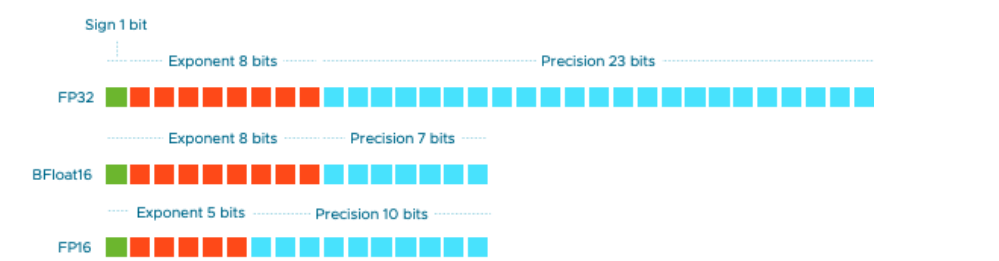

# 2-6.brushnet(搭配xl）+powerpaint

[https://github.com/nullquant/ComfyUI-BrushNet](https://github.com/nullquant/ComfyUI-BrushNet)

优点：局部重绘效果好、功能简洁单一，

基于语义分割的功能，所以可以通过鼠标来点选

[workflow (47).json](workflow_(47).json)

# 开头

前面的课程已经讲过很多局部重绘的方法了，现在需要更新一下新的、更好用的 插件brushnet，

一般新出来的插件，我们也都会马上测试，觉得效果好的，也会另外增加一些课程福利给到大家。

这节课呢， 会讲怎么换模特，这在实际的商业案例中是非常重要的一环，

别担心，搭建的难度并不大。

# 内容

## 搭建过程

### 传统方法

根据我们之前学习过的controlnet 和 高阶蒙版 内容，如果需要搭建一个，

保持服装不变，换模特的工作流， 应该很简单了吧。

我们来搭建一下，顺便复习一下之前的内容，这样才能熟练掌握。

首先输入我们需要加载的图片。

接着统一一下图片的尺寸，

因为我们做的是工作流，不仅仅只为一张图片考虑，还要考虑一点，我要是输入的是其他尺寸的图片怎么办。所以这一步一定要统一好尺寸，否则会影响后面工作流的。

调出 upscale image 放大图片节点，

放大方法选择 lanczos，这个函数我测试过效果是最好的。

图片是竖构图，所以尺寸改为 768*1024，

crop裁剪方式， 选择center，从中间裁剪。

下一步我们就要抠除我们的产品，也就是选取蒙版的范围。

选取的方法有很多，根据 高阶蒙版的课程内容，我们介绍了6中抠除蒙版的方法。

这里用什么呢？其实只要选择可以输入 prompt 的蒙版都可以啊。

按我个人的习惯，优先会选择 segment anything ultra v2，

如果这个方法 不满足我的需求，我就会选择其他的蒙版都尝试一下。

同学们作为新手，也可像我一样，等你熟练到一定程度了，

你就可以达到，看一眼图片的类型，就能知道什么蒙版节点最合适。

这就需要同学们不断的练习了。

那我调出 segment anything ultra v2 节点，其他参数模型无需设置，

连接到我们调整好尺寸的图片。

输出端连接 preview image 图片查看，和 mask preview 蒙版查看，

点击生成。

可以看到产品的蒙版已经非常完美的抠出来了。

但是我们想要替换的是模特，所以这里需要把蒙版反转一下，

使用到的节点是 invert mask。

并点击开始，查看一下结果是否反转了。

在制作工作流的过程中，我们需要养成这样做一步检验一步的情况。

否则你工作流都搭完了，过程一步都没有审核过，那这个时候生成结果不如意的话，你就很难再返回去检验哪一步做错了。

所以一定要做一步审核一步。

到现在需要的蒙版范围已经确定了，接下去很简单，就要生成新的模特了。

就是搭建一个图生图的工作流的过程。

调出efficient loader 和 efficient ksampler，

把该连的线条都连起来，

选取一下模型，这次呢，我们来尝试用一下xl 的模型，表现比1.5模型更好。

选择xl 的官方基础模型 sdxl，

这里记得vae 也需要修改成xl的，否则会报错

正向提示词输入：

jiaonei, 1girl, grey underwear，solo, black hair, navel, short hair,(Positive display:1.2), studio lighting,Tall and slender figure,simple background

反向：bad quality,shirt

weight interpretation 一定要修改成a1111，否则出来的图片都很丑。

采样这边的参数可以不修改，想要效果好一点还是修改一下。

step 步数30，采样器 dpmmpp-2m-sde-gpu，调节器选择 karras，denoise 重绘幅度1.

种子：203935549824183

latent image 需要连到 我们的原始图片，中间需要vae编码，

vae 这里使用的是 vae inpainting，因为有蒙版，连接mask蒙版。

调整好图生图节点之后，就可以点击生成了，但是对于生成的模特结果不可控，

所以通常我们会再加一个depth 和 openpose 来解决这个问题,

调出 controlnet  的 模型和预处理器，

选择openpose 和 zoe depth, 调整一下参数。

调整好之后，点击生成。

效果还可以，裤子的细节保留的很好，模特的姿态也一样。

这就是我们传统 换模特 的生成方式。

### brushnet

为什么说是传统方法呢？

因为现在有新的插件出来了，可以满足更多的需求和场景。

叫做brushnet，从原理上解读一下，我们就能知道为什么brushnet 效果会更加好。

传统的遮罩重绘是通过把 遮罩的部分 单独选出来，然后再遮罩蒙版的位置通过描述词，生成图片，生图方式是稳定扩散。

生图方式是稳定扩散的。

[https://drive.google.com/file/d/1IkEBWcd2Fui2WHcckap4QFPcCI0gkHBh/view?t=39](https://drive.google.com/file/d/1IkEBWcd2Fui2WHcckap4QFPcCI0gkHBh/view?t=39)

这种方法叫做sampling strategy modification 采样策略修改，

它通过从预训练的扩散模型中采样，masked regions掩蔽区域，来修改标准去噪过程。
在每个去噪步骤中，没有蒙版的范围，只是从原图直接复制粘贴。

虽然这样可以用于，任意一个 diffusion backbones 扩散骨架，但由于对蒙版边界 和 没有蒙版的区域，上下文的容易理解不到位，会导致绘制结果不连贯。

而Brushnet 他就不一样了，它主要是对局部模型进行改进。、

它通过**增加**基本扩散模型（base diffusion models）的输入通道，来对特定设计的图像进行调整，这样可以包含，损坏的图像和蒙版。这样一来，扩散模型就可以利用内容感知和形状感知的能力，生成更加令人满意的结果。

让我们用一个简单的例子来说明这个原理。想象一下，你在一本涂色书中涂色。传统的方法是你先用铅笔画出一个轮廓（这就是遮罩），然后再用不同的颜色填充轮廓内的部分（这是扩散过程）。但是，因为你只是在填充一个孤立的部分，而没有考虑到整幅画的整体效果。有时候，你就会涂出界或者颜色搭配不协调。

而Brushnet的方式更像是你在涂色前先用透明的薄纸覆盖整幅画，然后在薄纸上画出轮廓并进行涂色。

这样，你不仅能看到整个画面的布局，还能确保涂色部分与周围的部分协调一致。

最终的画面看起来就会更加连贯和自然。

### brush结构

brush结构1：使用vae编码器，去替代无序的 **初始化的卷积层 convolution layers**  去处理蒙版的图片范围

**改进图像特征的提取以适应UNet分布**

结构2：在预训练之前

**启用密集的每像素控制**

**我们采用分层方法，逐步逐层融入完整的 UNet 功能**

结构3：从 unet 中移除文本的交叉注意，

这样的设计从更深层提供了 即插即用 的功能，使得没有蒙版的范围会更加的灵活可控

BrushNet 是一种基于扩散的文本引导图像修复模型，可以即插即用地加入任何预训练的扩散模型中。我们的架构设计融合了两个关键见解：(1) 划分蒙版图像特征和噪声隐含特征可减少模型的学习负担，(2) 利用对整个预训练模型的密集逐像素控制可增强其对图像修复任务的适用性。

传统方法与controlnet 结合是，他会

1. 混合提示词特征
2. 稀疏控制
3. 额外的特征

brushnet+controlnet

理解了原理之后，我们来复制以下上一个工作流，修改以下 种子与上面统一做测试。

接着调出 brushnet 节点，

看一下输入端需要连接的东西很多，

输入端和输出端都需要连接到 model 模型 和 positive 、negative 正反向提示词

那么就很明确了他应该放在哪个位置，他应该放在图生图中间，和controlnet一样。

另外需要把 controlnet 关掉，因为刚刚说了brushnet要根据上下文来推理 生成的内容怎么样更合理。

如果有一个controlnet在这里呆着，就会影响brushnet 的发挥。

所以我们删掉controlnet。

这里brushnet的参数，第一个是：

- `scale`默认为 1.0：BrushNet 的“强度”。

BrushNet 的输出在添加到原始 unet 中的残差之前会先乘以。

- `start_at`默认为 0：BrushNet 开始应用的步骤。
- `end_at`默认为 10000：BrushNet 停止应用的步骤。

接着调出brushnet 的模型进行连线。

在模型上可选择的有4个，那他分别代表什么意思呢？

其中带有`random` ：更有想象力，random模型在训练时是基于随机蒙版来进行的。它是综合你的图片以及提示词，然后用它认为合理的方式来填充蒙版。

带有`segmentation` ：生成会考虑原图的风格、整体方向。倾向于填充整个蒙版区域，他会根据你给出的提示词，判断在蒙版区域应该出现什么内容，然后用这部分内容以尽量合理的方式来填充整个蒙版区域

我这里选择random。

没有哪个更好，哪个更差，它是根据你蒙版来的。

如果你希望生成的内容与蒙版形状对齐，用segmentation 好一些。

如果你是手动涂抹的蒙版，比较随意，希望随机，有更多可能性的，那就使用random。

[BrushNet: A Plug-and-Play Image Inpainting Model with Decomposed Dual-Branch Diffusion](https://tencentarc.github.io/BrushNet/)

• `dtype`，不同的浮点数据类型：float32、float16、bfloat16等，可以称之为精度，

而模型大小 = 模型参数量x精度。

数字越大精度越高，bfloat精度比float低。

**通常（深度学习）算法并不需要64位，甚至32位的浮点数精度。**

**精度越低，内存中存放更多数据越多，并且减少在内存中移动进出数据的时间。**

**低精度浮点数的电路也会更加简单。**

**总的来说：精度越低，计算速度越快。默认bfloat16 就行**

以下是不同精度之间的区别：

Float32 ：又称FP32(float point 32)，是具有32位的浮点数，其中有1个符号位，8位表示指数，23位表示尾数。是标准的数据类型。
Float16：又称FP16，其位数只有FP32的一半，指数保留5位，尾数保留10位。FP16所能表示的最大的数字是64k，存在上溢和下溢的风险。
Bfloat16：又称BF16，其指数位数与FP32相同，都是8位，因此表示的数据范围更广，但是精度比FP16要差。

如果你有旧 GPU 或 NVIDIA 16 系列卡，请尝试切换到`torch.float32`。

连接好线条，这边 输出端有 latent，就可以把之前的vae删掉了。

图片和蒙版也连好。

直接点击生成

可以清楚的看到，因为没有controlnet，模特姿势完全变了，

但是姿势非常合理。这就是random的表现力。

这里需要让大家注意一下，brushnet ，它是比较依赖底模的效果，所以在使用brushnet 的时候，底模需要进行挑选。另外brushnet非常使用搭配xl模型使用。

### 焦内案例

那我们接下来再复制一个工作流，然后出一张商业质感的效果，

增加lora，这个lora 已经更新在镜像里面了，不需要大家自己下载。

lora 强度0.7. 其他无需修改。

种子：897559498160787

直接点击生成。怎么样，效果很好把。

画面质量还有点欠缺。

我们可以增加一个脸部的修复，

调出face detailer，连接好 ultralytics detector provider 和 sam 模型。

连接到efficient loader，

这里需要注意，不要接到ksampler后面，因为有可能会引发一些报错。

最后呢，增加一个 supir upscale 进行高清放大，

选好模型，第一个是supir 模型，第二个是xl模型，记得不要搞错了。

重绘幅度1.001就行了，太大会变形。

点击生成。

最后通过简单的ps排版，表现效果就是这样啦

## 特征+模型讲解

brushnet2个版本

ra-unet: 正常情况下，大尺寸的图片容易多手多脚，但是加入ra unet就会正常很多

ra unet有很好的兼容性

## brushnet与powerpaint对比

> [https://www.bilibili.com/video/BV1Qf421D7fK/?spm_id_from=333.337.search-card.all.click&vd_source=41b48bc8a934d7b30423d3af0f849a7c](https://www.bilibili.com/video/BV1Qf421D7fK/?spm_id_from=333.337.search-card.all.click&vd_source=41b48bc8a934d7b30423d3af0f849a7c)
> 

结论：用擦除功能——powerpaint

提示词为短句——brushnet

提示词为词组——powerpaint

## powepaint 的 fitting参数和 function参数

[PowerPaint](https://powerpaint.github.io/)

text guided: 上下文感知

shape guided:  形状引导

- `CLIP`：应从 PowerPaintCLIPLoader 节点传递的 PowerPaint CLIP。
- `fitting`：PowerPaint贴合度。
- `function`：PowerPaint功能，详情请参阅其
- `save_memoryError: total bytes of NDArray > 2**32max`：如果设置了此选项，注意力模块会将输入张量拆分成多个片段，以分几步计算注意力。这对于节省一些内存很有用，但速度会有所降低。如果您的 VRAM 不足或使用Mac，请尝试将此选项设置为
    
    

## 涂抹前景遮罩，可使产品融入更加真实

# 结果

最后大家一定要多多实操，多多练习，有问题就在DC社区提问，会有专门的老师来解答。