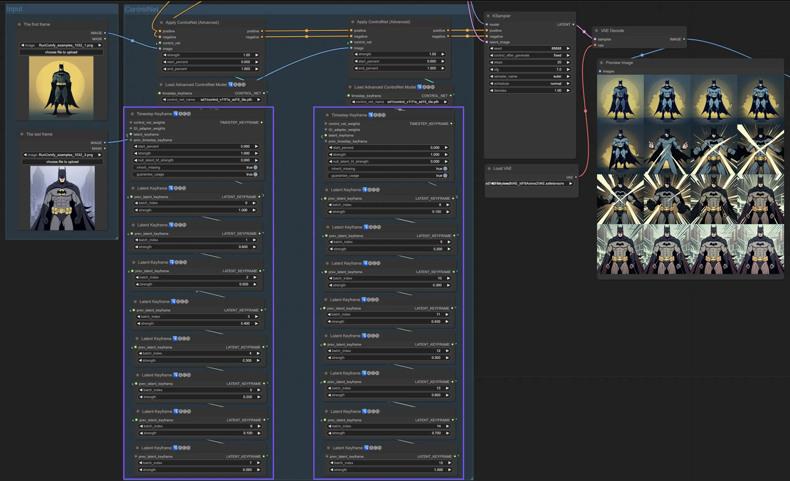

# 2-8. 动画魔法：AnimateDIff和SVD 轻松实现动态效果

ControlNet中的时间步关键帧在AI生成内容的行为控制方面提供了复杂的控制，特别是在时间和进展至关重要的情况下，如动画或不断发展的视觉效果。以下是关键参数的详细分解，以帮助你有效且直观地使用它们：

**prev_timestep_kf**：可以将prev_timestep_kf视为与序列中之前的关键帧连接。通过连接关键帧，你可以创建一个平滑过渡或分镜板，引导AI逐步完成生成过程，确保每个阶段都合乎逻辑地流入下一个阶段。

**cn_weights**：cn_weights有助于通过在生成过程的不同阶段调整ControlNet内的特定特征来微调输出。

**latent_keyframe**：latent_keyframe允许你在生成过程的特定阶段调整AI模型的每个部分对最终结果的影响强度。例如，如果你要生成一个图像，其中前景在过程演变中应变得更加细节化，你可以在后面的关键帧中增加负责前景细节的模型方面（潜在因素）的强度。相反，如果某些特征应随时间逐渐淡入背景，你可以在后续关键帧中降低它们的强度。这种控制级别在创建动态、不断发展的视觉效果或精确时间和进展至关重要的项目中特别有用。

**mask_optional**：使用注意力遮罩作为聚光灯，将ControlNet的影响集中在图像的特定区域。无论是突出场景中的角色还是强调背景元素，这些遮罩可以统一应用，也可以改变强度，精确地将AI的注意力引导到你想要的地方。

**start_percent**：start_percent标记你的关键帧开始发挥作用的时间点，以整个生成过程的百分比来衡量。设置这个就像安排演员在舞台上的登场时间，确保他们在表演中恰到好处地出现。

**strength**：strength提供对ControlNet整体影响的高级控制。

**null_latent_kf_strength**：对于在此场景（关键帧）中没有明确指示的任何演员（潜在因素），null_latent_kf_strength作为默认指令，告诉他们如何在背景中表现。它确保生成的任何部分都不会没有指导，即使在你没有具体提到的区域也能保持连贯的输出。

**inherit_missing**：激活inherit_missing允许你的当前关键帧采用其前身未指定的任何设置，就像弟弟妹妹继承衣服一样。它是一个有用的快捷方式，可以在不需要重复指令的情况下确保连续性和一致性。

**guarantee_usage**：guarantee_usage是你的保证，无论如何，当前关键帧在过程中都会有发挥作用的时刻，即使只是短暂的一瞬间。它确保你设置的每个关键帧都会产生影响，尊重你在引导AI创作过程中的详细规划。

时间步关键帧提供了精确引导AI创作过程所需的精度，使你能够完全按照自己的设想来编排视觉的演变，特别是在动画中，从开场到结尾。下面我们将更仔细地看时间步关键帧如何战略性地应用于管理动画的进展，确保从初始帧到最后一帧的无缝过渡，与你的艺术目标完美契合。

[https://github.com/ForeignGods/ComfyUI-Mana-Nodes](https://github.com/ForeignGods/ComfyUI-Mana-Nodes)

[https://github.com/Kosinkadink/ComfyUI-AnimateDiff-Evolved](https://github.com/Kosinkadink/ComfyUI-AnimateDiff-Evolved)

假设学员已经有了搭建基础文生图工作流的能力，

这节课学习的是如何使用ai制作电影。

1. 调出文生图的基础工作流，输入efficient kdampler，和 effcient loader，并连好线条。这样一个文生图的工作流就搭建好了