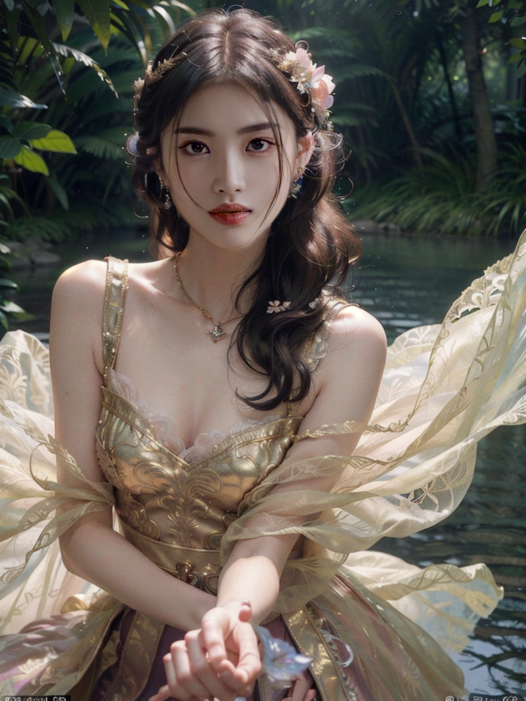

# 3-1.创意摄影

[workflow_photography (1).json](workflow_photography_(1).json)

# 开头

当你想保持脸部特征不变的情况下， 给人物换场景和服装，

节约，摄影时候，场景搭建的时间，如何通过工作流解决呢？

这节课将教授你如何搭建一个创意摄影的工作流。

# 内容

## 第一步：图生图，照片变成创意摄影照片

先创建一个图生图的基础工作流。记得种子输出

输入图片

修改一下模型和参数，底模是麦橘的，lora我选择 五彩斑斓的古风 ，

设置好lora之后，下面会跳出控制lora的参数，lora 权重 0.8.

输入关键词，

正向：

Masterpiece,best quality,super details,intricate details,realistic,photography,
1girl\(Eyes\(Deep amber,crystal clear,long and delicate eyelashes\),Nose\(Elevated,a slightly upturned nose tip\),Lips\(Rosy color,defined lip line\),Hairstyle\(Black hair,smooth and shiny,slightly wavy at the ends\),Skin\(Fair,blemish-free,as delicate as porcelain\),Clothing\((gold long feathered dress,intricate floral filigree,gorgeous):1.5,walking,(look at viewer,floating hair,outdoor,upper body):1.53\), Background\((full moon,grassland):1.5,sky,forest,lake\),light on face,

反向：

White clothes,paintings,sketches,(worst quality:2),(low quality:2),(normal quality:2),dot,mole,lowres,normal quality,monochrome,grayscale,lowres,text,error,cropped,worst quality,low quality,jpeg artifacts,ugly,duplicate,morbid,mutilated,out of frame,extra fingers,mutated hands,poorly drawn hands,poorly drawn face,mutation,deformed,blurry,dehydrated,bad anatomy,bad proportions,extra limbs,cloned face,disfigured,gross proportions,malformed limbs,missing arms,missing legs,extra arms,extra legs,fused fingers,too many fingers,long neck,username,watermark,signature,(mole:1.4),NSFW,watermark,

weight interpretation：a1111

采样：dpmpp-sde-gpu， + karras

denoise：1

Stable Diffusion 提供了一些特殊的符号来帮助您更精确地控制图像生成过程。以下是这些符号的使用方式：

 **“+” 和 “ AND ”**：这两个符号都用于连接短关键字，以表示您希望同时满足这些条件。使用 “AND” 时，需要在两端加上空格。例如『beach + sun glasses』 或 『beach AND sun glasses』。

 **“|”**：这是循环绘制符号（融合符号），用于在多个 Prompt 之间创建循环绘制效果。例如『(green hair：1.1) | (black hair：1.4)”』，stable diffusion 会根据这些权重，在 green hair 和 black hair 之间循环绘制，你就能得到黑绿渐层的发色啦。 

如果你想要使用字符 `()[]` 请使用反斜杠 `anime_\(character\)`

在输入图片这个地方，考虑到后面每个输入照片的尺寸会不一样，所以一这步，我们需要统一我们的 尺寸，调出 upscale image，设置一下参数，宽768， 长1024，crop为center，

在生成新的图片之前，我们还需要增加controlnet在控制图片的姿势，那我们增加dw pose，

除此之外，我们想一想还需要增加其他的controlnet吗？

depth和normal 可以很好的控制 模特的 深度 和 光影，但是也会影响后面背景的生成，所以可以不用加，只要一个openpose就可以了。

这里我们可以增加一个ipadapter，主要解决的是有时候生成的图片与原图肤色差异过大，方便后面的脸部微调，这里记得要把权重调低一点 0.3，不然lora就不能发挥作用了。

这一步做好之后，我们点击生成，看看效果怎么样

效果不错的话，我们可以固定一下种子，接着往下走。

## 第二步：控制脸型

上一步直接生成的图片 与我们 的原图长相，完全没有一点关系，

所以这一步我们要她的脸型、和五官分布，与原图 保持一致，这样方便我们后续的融合。

怎么样使得脸部保持像原图呢？那就需要控制脸部 五官的细节，最简单的是使用lineart，也可以尝试用normalmap，或者 depth，我们的目的是控制脸部，

接下来我们分别来测试一下哪个效果最好。

首先调出realistic lineart预处理器768，强度1

线连完整，包括vae

图片对比连原图，

点击生成，看看能否运行成功。

能跑出图片就算运行成功了。

我们看到，2个 ksampler 之间的连线非常多，如果再连2个ksampler 的话，那线条就会巨多，

这里就介绍一个小tips，

调出context（rgthree），可以看到他就是一个集合器，把我们常连线的内容组成一个节点。

只需要在输入端连接它，model、vae、positive、negative、latent、seed，

并复制一个context，把context 与 base context 连接起来，

拉出context到 ksampler节点，可以看到他就自动拖入了，

点击生成一下看看是否运行成功。

成功了，

我们接入controlnet，把上面的positive断开，再接入lineart，

再运行一下，顺利出图就算成功。

接着复制这部分的内容，修改controlnet 模型 和 预处理器，

### 1111

按住control，选择后一个context 和 ksampler，

在节点，右键单击，选择 convert to group node，并命名

这时候可以看到，2个节点组合成一个了，

如果有同学出现这种情况，context 连线了 base context 

选择节点，单击右键，选择manage group node，

关掉 base context，选择保存后，关掉

这时候就没有base context了，我们直接把context 连线到这个组合节点，可以看到，所有线条都过来了，

取消一些不需要的内容：latent 取消掉，原因我们后面再讲。

在把controlnet连接到positive，再次点击生成，看看能够运行成功。

运行成功就说明ok了。

分别调出，zoe depth 和 normalbae，resolution  都是768，环境是outdoor，

并连好conditioning，

最后统一把context连下来，

点击生成，测试一下这三个controlnet 对 模特 脸型的控制，哪款效果最好。

从结果上来看，normalbae 对脸型 的控制效果最好。

但是五官的控制还不够，所以这一步我考虑 把normalbae 和 lineart 进行叠加。

把lineart 的conditioning 修改连线，接在normalbae前面，修改controlnet 权重1.5，

整理好后，把depth，control+m，并组件调整一下线条。

点击生成，看看这次的脸型和五官效果

运行成功之后，我们可以看到，虽然脸型控制住了，但是衣服完全变了，和前面不一样了。

原因是在normalbae 控制的是原图，导致背景和服装有变化。

目前我们只想要脸型控制住，所以我们应该增加一个蒙版，只控制脸型。

所以下一步是增加脸部蒙版。

## 第三步：脸部蒙版

首先我们要抠除脸部，扣脸的方法有很多种，

最简单的方法就是，上节课我们提到的，用person mask ultra 节点，选择face就可以了，非常简单。

第二种方法是调出segm detector，

threshold：阈值

dilation：扩张的像素，调到2

crop factor：

drop size: 小于这个数值的，不显示目标，

删除prompt 内容， 或者 输入face

并连上face mesh detector 模型，

segment 输出的信息 需要转成 mask，调出segs to mask ,三种类型都可以，

调出 mask preview 查看即可。点击生成，

可以看到 这种方法 抠出来的脸型和 用 person mask 的效果是不一样的，因为他们用的不是用一个segment 的模型。

第三种方法呢，和第二种原理差不多 ，表现方式略有区别，

调出face mesh to segs，调整 crop min size 裁剪最小尺寸 50，并把dilation 2，

前面连接 face mesh，修改 resolution 768，
后面连接 segs to mask，后面可以连接 image comparer，对比第二种方案，看看有上面区别

点击生成

从结果上看，第二种方法和第三种方法完全一样，是因为他们使用segment的模型是一样的，所以参数一样的话，结果就是一样的。

接着我们选择一种方法连接入 前面的 ksampler，

我选择person mask

调出带有 inpainting 的 vae encode ，

点击生成，

从结果上，可以看到衣服被保留了，脸型也已经调整了。

## 第四步：脸部融合_1

接着我们就要放大蒙版的范围，然后把原图的脸 融回去。

调出 inpaint segments, 类型换成rgb。

把image 和 mask 与 person mask连接，其中mask无法直接连接，因为接入的mask 必须是要 图片式的mask，所以这里**可以直接接入image**。

输出为裁剪图片和mask。

如果觉得放大后的脸部细节不够，可以在person mask 之前加一个放大。

**supir upscale 需要连接到 修改尺寸后的图**

调出 supir upscale，修改模型，放大图片尺寸到1.5，

输入提示词，并修改 提示词 相关度 到7.5，

提示词 相关度 的影响从0开始，

并关掉keep model loaded，会释放显存，可以关掉,

high quality, detailed,Finger texture details,gemstone luster，(shining emerald:1.5),(red skin:1.5),(oblique light:1.5),(skin texture:1.5),(red bloodshot:1.5) ,(sidelighting:1.5), stunningly long shadows,(Crepuscular rays:1.5),light_rays, 

点击生成

接着调出combine and paste，把脸部融合回去。

其中original image 需要和 之前生成的图片进行连接，在连接之前，我们可以把图片放大1.5倍。

其他需要和 inpaint segments连线，

修改op为 multiply alpha，输出结果，并增加一个image comparer，点击生成

效果还行，但是脸部和身体的肤色稍微有些差异。

这时候我们可以通过放大，来融合一下肤色，使得更加和谐。

在放大之前，需要把alpha通道关掉。

这样就结束了，但是，如果你觉得还是不满意，我们可以回到之前的步骤进行融合。

## 第四步：脸部融合_2

回到inpaint segments的位置，我们再增加一个 生成图片的inpaint segments，

image连接生成的图片，mask连接person mask 的蒙版，

kind：rgb，点击生成

然后通过color adapter 进行肤色的融合，

可以把opacity不透明度调到最大，这样肤色最靠近生成的颜色，

我们可以拉过去对比一下。

还可以再此基础上把图片进行融合，

a图片 连到 混色之后的结果，

b图片连接之前生成的图片，

点击生成，结果就是两者的混合。

接着连接combine and paste,点击生成，

怎么样，肤色是不是比之前自然，

最后我们还可以增加一个upscale，再加一个image comparer对比。

组织一下线条，这样我们工作流就做完了。

最后我们换张图片，来测试一下这个工作流，

效果非常不错。

## 小tips

inpaint segments 可以换成 inpaint crop and stitch

[GitHub - lquesada/ComfyUI-Inpaint-CropAndStitch: ComfyUI nodes to crop before sampling and stitch back after sampling that speed up inpainting](https://github.com/lquesada/ComfyUI-Inpaint-CropAndStitch?tab=readme-ov-file)

# 结尾

最后你有任何问题，可以在社群提问，会有专门的老师为你解答