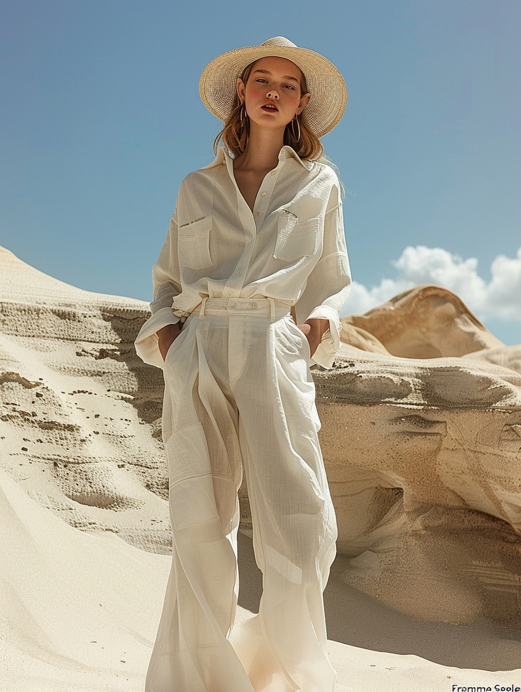
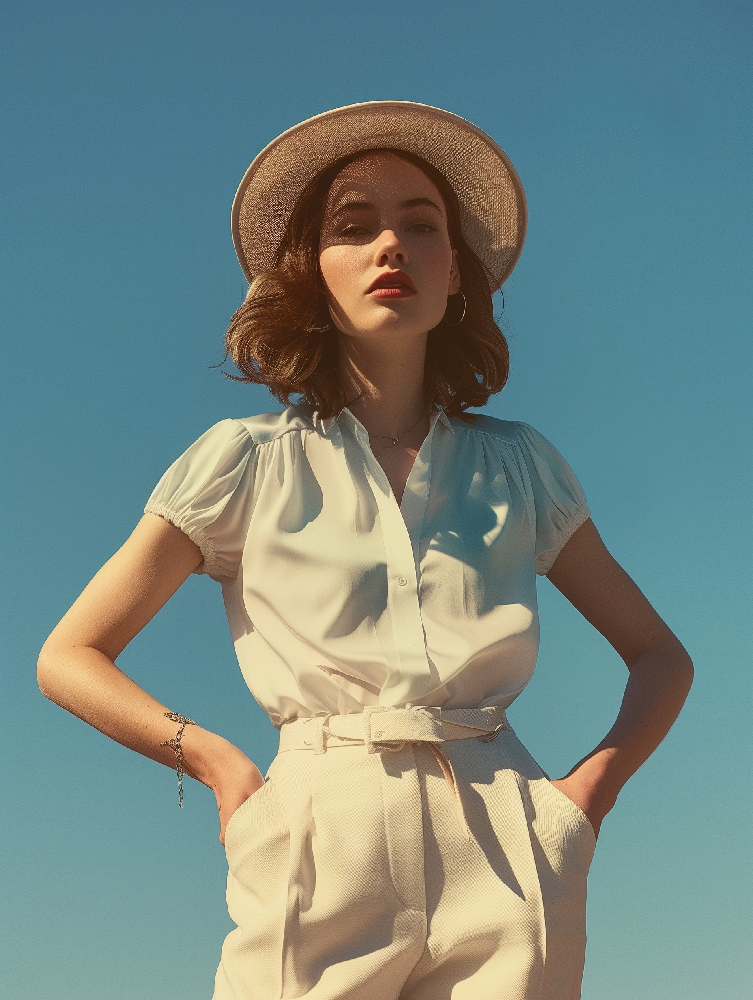
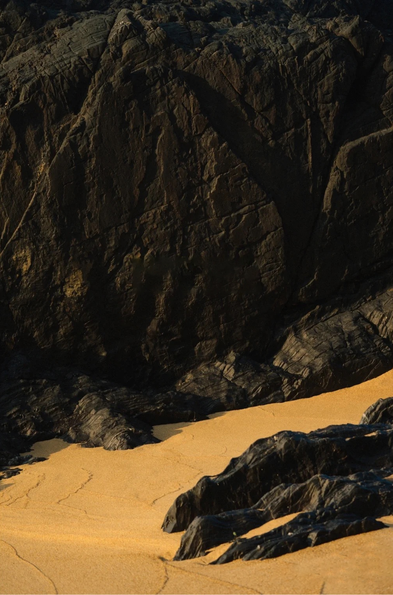
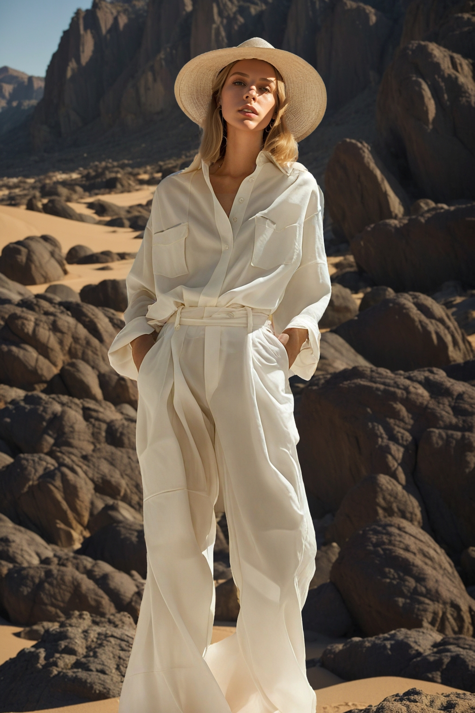

# 4-1.模特焕新：面部替换与背景优化

[workflow (34).json](workflow_(34).json)

[workflow final.json](workflow_final.json)

# 开始

从这节课开始，我们开始各种案例学习。

课程我会尽量讲的很细，确保每个单独的知识点拎出来给大家讲都能听的明白

# 内容

## 步骤1

首先输入我们需要替换的模特图片，并调整图片尺寸为1024*1536，

为什么这个尺寸调那么大呢？因为模特换新的图片通常涉及到全身图，而脸部在画面的占比会很小，所以我们会尽量把图片尺寸设置大一点。

当然这个对显卡的要求会更高一些，我们会建议在云端运行，这样的性价比更高一些。防止你在较差的机器中运行报错影响学习进度。

并在增加 anything everywhere{解释} ，来减少之后的连线步骤。

接着把脸部抠出来，方法有很多。我们依次尝试哪种效果最好。

扣脸我最常用的是 person mask，因为一个节点就能解决扣脸的问题，

所以我先调出 person mask 。再输出preview image 来方便查看图片

范围是 face 脸部。其他参数保持默认。

如果你对参数的内容不了解。请再详细查看第二章——精准抠图的课程内容

点击生成，发现识别出来的面部太小了，并且细节不完善，有残缺。

说明 person mask 在这里不适用。

那我们可以在输入图片的地方再增加一个 supir supscale 来进行整体放大，放大后这样脸部的细节会更多一些。

调出supir upscale，选择模型，一个是supir 的模型 它是固定的，一个是xl的模型 选择符合风格的 我个人选择 realistic，如果同学没有这个模型的话，可以来我们社区领取。

接下来设置放大倍数为1，主要为图片模特增加细节  这里参数不宜更改 保持 1 就可以了。

noise 重绘幅度 调小一些  默认1.003  这里调到 1.001，否则脸部会变形。

其他不需要做调整。

这里记得把seed everywhere 连接到放大后的结果。

点击生成，可以看到原先破损的脸部，这次能够识别准确了，这就是supir upscale 放大细节的好处。

我们对比看看另外的脸部识别 mask ops，

调出 mask ops。

并接入 bbox detector 和 ultra lytics detector provider 的脸部检测 。

这里需要调整一下 shrink grow，默认是0，

直接生成脸部蒙版的范围会像 person mask 一样小，所以我们需要调整这个参数。

该调整范围是0-128。

我们可以复制两个，分别设置成50 和128 .

分别看看他们的表现。

可以看到数值越大，脸部蒙版范围越大。

所以最后我们选择128的，这样的效果最好

## 步骤2_detect face and magnify

接下去调出inpaint segments 目的是放大脸部蒙版范围

前面是检测锁定人脸，后面再直接进行放大。

（详细的在第一章——脸部插件，详细讲过了，不记得的同学记得复习一下），

根据之前的图片尺寸，我们可以把蒙版的尺寸可以保持在 1024*1024。

kind 类型 选择 RGB，其他参数不用改，RGB是图片类型，如果不选这个结果会出不来。

输出 cut image 裁剪的图片，和 cut mask 裁剪的蒙版，

因为生成的图片是 box 方块状，

所以可以进一步调整出，把头发和脸部再进一步抠出来。不要衣服和肩膀的位置。

我们可以调出 person mask，需要把脸部和头发明确一下。

做这一步的目的是为了，到时候把脸贴回去的时候，不会很突兀。

如果是没有这一步，inpaint segments 的图贴回去 可能 会导致 肤色和背景色 不溶和，

有点衔接的问题，

虽然这个问题也有可能不会出现，或者我们通过后期调整来解决这个问题，

但是我们提供的是多种工作流搭建的方法。

大家可以根据自己的喜好和需求，来选择用哪种方法更高效便捷。

## 步骤3_swap face_面部一致性

接着就要通过图生图的基础工作流，来重新生成一张脸部的图片，

我们调出 图生图的 基础工作流。大家记得把种子调出来，来解决这个插件目前的Bug。

同时记得调出的encode 需要带有 for inpaint ，表示局部的意思。

图片连接到上一步生成的结果。

这里需要注意一点，

上一步生成出来的结果可以看到蒙版是带有透明度的，也就是说有alpha 通道。

那我们需要调出 remove alpha，也就是移除 alpha 通道，这样才能被潜空间识别跑通。

这一步还需要增加 openpose 来控制脸型的大小范围，不然生成的图片可能会造成，

头过大或过小，与身体不匹配的情况。

调出 controlnet，

调出 controlnet  模型，选择 media face

调出预处理器，mediapipe face mesh， 

并以conditioning 条件的方式输入给 采样器。

那直接生成的脸直接是会受到底模+提示词的影响。

如果你有想要的模特，但是你描述不出来，这个时候该怎么办？

根据之前的课程，我们都是，调出一个ipadapter作为参考引用的。

那我们来试一下，调出 ipadapter faceid，并连接好相关的 ipadapter 模型，

记得选择faceid，因为我们只针对脸部的引用。

调出clip vision,

除此之外呢，ipadapter faceid 会比 ipadapter 需要多连接一个 insightface。

最后输入我们的觉得合适的模特脸部，连接到 model 模型中，

点击生成就可以了。

除此之外，这边再给大家推荐一个插件，

叫做Portrait Master，它是专门用于生成人体肖像的。

[https://github.com/florestefano1975/comfyui-portrait-master](https://github.com/florestefano1975/comfyui-portrait-master)

调出Portrait Master，可以看到这个插件可以调节的面部参数非常多，

有性别、国籍可选择的非常多（国籍还可以选择2个代表混血），

体型的胖瘦也可以控制，

包括身体姿势、眼睛的颜色细节、面部表情情绪等等。

包括发型的选择，发色的选择，头发的蓬松程度等等。

有点像我们在玩游戏前期捏角色

下面就是一些皮肤细节的调控。

可以看到没有输入端口，输出端口是positive 和 negative ，

所以它是以 conditioning条件 使用的。

所以需要把 efficient loader 的 positive 正向提示，转移到输入端口。

右键单击，选择 convert positive to input，意思就是把posetive 转移到输入端。

接着就可以连接positive了

我们多复制几个来对比看看效果，主要选择是国籍、发型和发色

分别是中国籍、白俄罗斯籍、刚果人。

点击生成。

为什么我要展示这3个人，他们分别是黄黑白三个肤色的人。

根据我的经验，白俄罗斯是白人里头，生成效果最好的。黑人则是刚果。

大家可以课后去试试其他国籍的人，看看他们的表现力。

亚洲人的表现效果都不怎么样，我试过中国人、韩国人、日本人等等，效果都不理想。

所以我一般在跑亚洲人的时候使用 ipadapter 表现力会更好，

如果白人、黑人则可以引用 portrait master 。

回到工作流连接好portrait master。

这一步脸部生成就搭建结束了，

种子：40327303161571

点击生成，看起来效果还不错。

## 步骤4_combine face

调出 combine and paste,

记得把op选择 换成 multiply alpha，带有alpha 通道。

decoded vae 和 cut image 需要连接到，刚刚生成的图片，

cut mask 蒙版 和 region 范围， 需要连接到 inpaint segments。

并输出图片

可以看到生成的脸部就贴回原身体了。

这一步大家可以检查一下，脸型和身体贴不贴和，

不贴合的话可以重新再生成，或者去 portrait master 调整一下细节。

## 步骤5_select body and remove bg

接下来的一步就是需要重新生成一个背景了，在生成背景之前，

需要把背景进行抠除。

还记的第二章——高阶蒙版的内容，有好多种扣背景的方法。大家可以多多复习一下。

这个图片还是很好扣的，

直接调出bi ref net ultra，连接图片，点击生成。

注意：这一步抠出来的图片是人物，

我需要生成的是背景，所以蒙版的范围应该是需要反转一下。

调出 invert mask，点击生成反转图片

蒙版准备好之后，我们就需要把它输送到 图生图的基础工作流，进行背景的生成。

## 步骤6_swap bg + controlnet + ipadapter

搭建图生图的这个过程，和思考的逻辑是和前面，面部生成是一样的，

除了图生图之外，还需要controlnet来控制人物，所以需要最少2个controlnet， 分别是openpose 和 depth 深度。

另外还需要 ipadapter 引用背景图片。

好，接下来进行搭建。

图生图基础工作流。

这里需要注意一点，上一步抠除背景后的蒙版是带alpha通道的。

需要remove alpha 之后再接入encode

接着调出controlnet，我选择controlnet advanced代表它是高级版本，

与我们常用的controlnet 多了一些参数可以设置。

具体参数我们在使用的时候详细说明一下。

现在调出 openpose 和 depth 的模型和预处理器。

depth 的强度可以适当调低一些，因为强度太大的话，不利于背景生成复杂的图片。

我们还可以再增加一个lineart线稿的控制，（这一步是可做可不做的），

做了这一步的话，对画面的控制力会更强，

但是

预处理器的需要把 resolution分辨率 调大一点，到1024

接着调出 ipadapter 

连接 ipadapter model  模型，记得选择模型

连接clip vision，

并输入合适的背景图参考。

这一步也可以增加一个 image comparer 来对比一下图片

种子：954019854458489

点击生成

可以看到模特虽然整体没大的变动，但是肤色和边缘有一点不一样。

## 步骤7_blend

那接下来我们需要把生成的这张图片 和 抠除模特的 图片进行 blend 融合。

调出 image blend by mask，把blend的混合比例调到最大 1.

这样就相当于把 蒙版的模特图直接 贴到这个 背景里面了。

图片a 是底图，图片b 是 模特图，

mask 蒙版的范围是反转之后的范围。

并增加一个 image comparer 与上一步做对比。

这样产生的最终效果就很完美了。

如果你在这一步觉得还不够，可能边缘会有些小瑕疵，

那就可以把刚刚生成的图片，再与原图 进行 blend 混合。

再增加一个image comparer做对比

点击生成

这一步生成的图片就很完美了，

最后还再增加一个supir upscale 来丰富一下画面的细节。

这样这个的工作流就搭建结束了。

我们可以换一张图片来验证一下这个工作流的效果。

# 结尾

[AI换脸技术大比拼：PuLID vs InstantID vs FaceID - 我的AI力量](https://myaiforce.com.cn/pulid-vs-instantid-vs-faceid/)

instantid必须使用xl模型

crop and stitich 插件