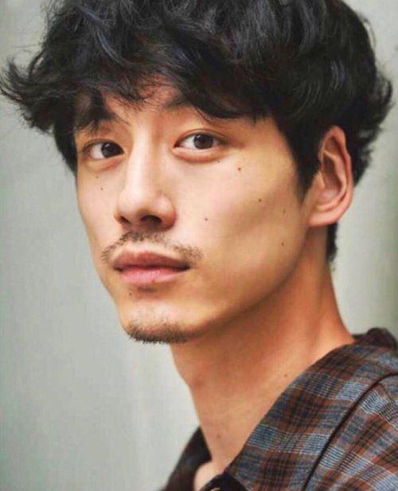
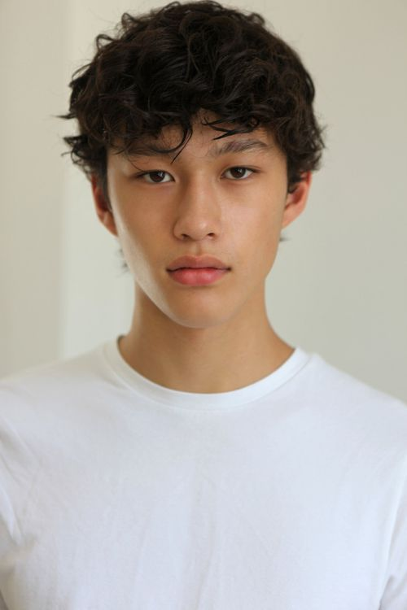

# 4-2.指定眉毛形状和眼神

# 开始

相信大家前面的基础技能已经很熟练了，

现在我们需要更进一步，培养我们的搭建思路。

思路培养起来了，就很容易举一反三，这样才能真正的学懂，会用。

# 内容

如果现在有一个美瞳品牌，希望可以通过comfyui来替换模特的眼睛瞳孔颜色怎么办？

大家先暂停视频5秒钟，思考一下，你会怎么做，

不考虑技术问题，理论上

**1.统一尺寸**

**2.首先把眼珠的位置抠出来，打上蒙版，**

**3.然后把蒙版区域，通过图生图工作流，修改瞳孔颜色等关键词，生成图片。**

**4.最后把图片进行高清放大。**

但是到具体操作上，第二步就会遇到问题，因为瞳孔的范围太小了，

有很大的概率是识别不到的。

那根据之前的高阶蒙版内容，当我们遇到抠蒙版的时候，

遇到难扣的内容有四种方法来解决他

[workflow (51).json](workflow_(51).json)

1，保证输入的prompt关键词的，用词准确。比如说 我遇到过产品是裤子，当我输入pants 无法抠除裤子，但是我把关键词换成  trousers 就能够识别并抠除。

或者有时候是识别裙子，输入dress，识别不到，但是你改成 trousers 可能就能识别到了。

2，修改 threshold 阈值，识别不到，就调小阈值，默认一般都是0.3，

比如说这张图片，当0.3阈值的时候，识别的是2只眼睛，

当阈值为0.2时候，识别的范围就扩大了。

.jpg)

3，手动涂抹范围，虽然不能实现全自动了，还是需要一部分的手动操作，但是在实际案例里面

比如说老照片修复划痕，因为每张图片的划痕位置都不一样，

机器很难识别，所以只能手动涂抹。

如果说之后有新的模型，或者新的技术出来了，说不定就能实现全自动了。

但是目前的技术只能手动涂抹。

像这张男生的照片，就无法识别出来，即使我把 阈值改成0.01，依旧无法识别。

那这样就只能手动涂抹了。

4，通过加减、相交蒙版来实现该内容。

所以在具体搭建工作流，在蒙版的选择上最少需要设置2种方法，来面对不同的情况，

可以看到这里使用的是 segment anything ultra v2，自动抠除，

下面使用到的是 手动蒙版， 但是直接连修改尺寸后的话，输出端没有mask，怎么办呢？

这就需要把图片的尺寸发给 mask resize，这样输出的蒙版就是手动涂抹的蒙版了。

然后两者蒙版进行相加，来保证最后的输出结果一定有眼睛的蒙版。

下一步就是把生成好的蒙版和图片，输入给图生图，

加载好模型，这里使用到的是 dreamshaper，

vae：840000，

lora已经训练好了，这个我们会放在社区里面，进去下载就可以了，

下载好后，把lora模型放在，这个lora模型目录下

这个lora包含了一系列训练好的眼神和眉毛，触发词是 blueeyes，权重可以在0.5左右调整，

我这边选择 0.6，针对这张图是最合适的。

记得要把 weight_interpretation权重插值方式，调整到A1111，否则出来图片会很丑哈

另外可以在script 脚本这边，调出noise control 噪点控制，把控制噪波的方式换成gpu，效果会和webui产生噪点的方式相同，这一步可做可不做。

然后vae inpainting 连到之前生成的蒙版，图片连到，修改尺寸之后的这张图。

这一步不要连错了。

点击就可以生成了，

但是这样直接生成的眼睛位置可能发生偏移的现象，需要多次抽卡才能抽到一张好图，

所以我们可以增加一个脸部的骨骼点位来控制眼睛的位置。

所以调出controlnet，调整强度为0.8，

模型选择是 mediapipe face，

预处理器选择openpose pose，

这样我们就可以直接生成了，在生成之前我们还可以增加一步高清放大,

可以使用这个supir，记得模型选择，

第一个是supir，第二个是realism engine xl模型，

可以稍微调小一点重绘幅度，我这便是调小了0.001，

这样点击生成，可以看到效果很棒。

同理可以测试一下其他图片，看看效果。

输入这张图。

测试的时候，因为不能保证，自动蒙版可以抠出来， 

所以我们先把group bypasser, 后面生图的过程先关掉，

接着来生成蒙版，可以看到自动蒙版抠出来了，但是太小了.

那我试着把threshold调低到0.2后发现，整个人都出来了，说明自动蒙版对这张照片是无法处理的。

那就需要回到原图，手动选取眼睛眉毛的范围，点击保存

再次生成。发现蒙版范围是ok的

打开其他group，点击生成，看看效果。

.png)

最终效果不错。

# 结束

最后来总结一下工作流的步骤，

首先需要明确蒙版的范围，如果无法自动选取蒙版范围，那就只能手动了，

蒙版范围确定好就可以到图生图，生成结果了，

但是直接生成可能会导致效果不见，或者错位的情况，

那就再图生图里面增加了一个脸部的openpose，

最后高清放大。

怎么样，逻辑很清晰吧，

并且原理也简单，

当你明白这个原理之后，你就可以举一反三了。

如果大家想要下载这个工作流的话，需要大家可以把controlnet这个插件更新一下，

不然社区提供的这个工作流可能会导致报错

[https://github.com/Fannovel16/comfyui_controlnet_aux](https://github.com/Fannovel16/comfyui_controlnet_aux)

课后有问题的同学可以在discord上面提问，会有老师问你解答。